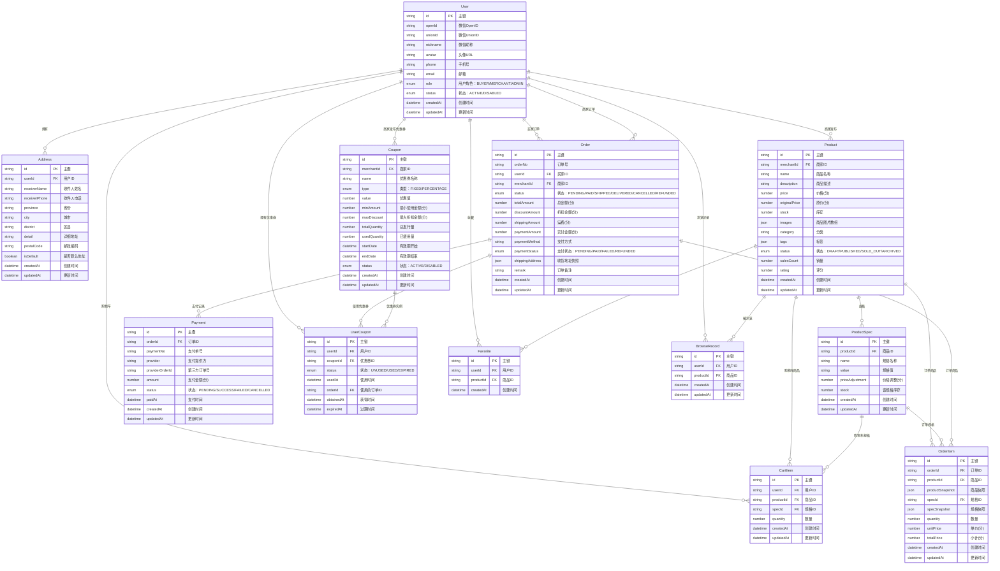

# 数据库 ER 图设计

## 概述

本文档描述了微信电商系统的数据库实体关系模型，基于 MVP 功能需求设计，涵盖用户管理、商品管理、订单流程、支付系统、优惠券系统等核心业务模块。

## 实体关系图

## 核心实体说明

### 1. 用户模块

#### User（用户表）
- **作用**：存储用户基本信息，支持买家、商家、管理员三种角色
- **特点**：
  - 使用微信 OpenID 作为唯一标识
  - 支持角色升级（买家→商家）
  - 包含用户状态管理

#### Address（地址表）
- **作用**：存储用户收货地址信息
- **特点**：
  - 支持多地址管理
  - 支持默认地址设置
  - 包含完整的地址层级结构

### 2. 商品模块

#### Product（商品表）
- **作用**：存储商品基本信息
- **特点**：
  - 支持商品状态管理（草稿、发布、缺货、归档）
  - 价格以分为单位，避免浮点精度问题
  - 支持多图片存储
  - 包含销量和评分统计

#### ProductSpec（商品规格表）
- **作用**：存储商品规格信息（如颜色、尺寸等）
- **特点**：
  - 支持规格价格调整
  - 独立的规格库存管理
  - 灵活的规格名称和值设计

### 3. 购物车模块

#### CartItem（购物车项表）
- **作用**：存储用户购物车中的商品
- **特点**：
  - 支持规格选择
  - 数量管理
  - 与商品和用户关联

### 4. 订单模块

#### Order（订单表）
- **作用**：存储订单主要信息
- **特点**：
  - 完整的订单状态流转
  - 支付状态独立管理
  - 地址信息快照存储
  - 支持跨店铺订单（通过 merchantId）

#### OrderItem（订单项表）
- **作用**：存储订单中的具体商品信息
- **特点**：
  - 商品信息快照存储，避免商品变更影响历史订单
  - 支持规格信息快照
  - 独立的价格计算

### 5. 支付模块

#### Payment（支付记录表）
- **作用**：存储支付相关信息
- **特点**：
  - 支持多种支付方式扩展
  - 第三方支付订单号关联
  - 完整的支付状态追踪

### 6. 优惠券模块

#### Coupon（优惠券模板表）
- **作用**：存储优惠券模板定义
- **特点**：
  - 支持固定金额和百分比折扣
  - 使用条件设置（最小金额、最大折扣）
  - 发行量控制

#### UserCoupon（用户优惠券表）
- **作用**：存储用户拥有的优惠券实例
- **特点**：
  - 优惠券状态管理
  - 使用记录追踪
  - 过期时间管理

### 7. 其他功能模块

#### Favorite（收藏表）
- **作用**：存储用户收藏的商品
- **特点**：
  - 简单的用户-商品关联
  - 支持收藏时间记录

#### BrowseRecord（浏览记录表）
- **作用**：存储用户浏览商品的历史记录
- **特点**：
  - 支持浏览时间更新
  - 便于推荐系统数据源

## 设计原则

1. **数据一致性**：使用外键约束确保数据关联的完整性
2. **历史数据保护**：订单相关数据使用快照模式，避免商品变更影响历史记录
3. **扩展性**：预留足够的扩展字段，支持未来功能迭代
4. **性能优化**：合理设计索引，支持常用查询场景
5. **数据精度**：金额相关字段使用整数存储（以分为单位）

## 索引建议

### 主要索引
- `User.openId` - 唯一索引，微信登录查询
- `Product.merchantId` - 商家商品查询
- `Product.category` - 分类查询
- `Product.status` - 状态查询
- `Order.userId` - 用户订单查询
- `Order.merchantId` - 商家订单查询
- `Order.orderNo` - 订单号查询
- `CartItem.userId` - 购物车查询
- `UserCoupon.userId` - 用户优惠券查询
- `BrowseRecord.userId` - 浏览记录查询

### 复合索引
- `(Product.status, Product.createdAt)` - 商品列表查询
- `(Order.userId, Order.status)` - 用户订单状态查询
- `(UserCoupon.userId, UserCoupon.status)` - 用户可用优惠券查询

## 数据迁移策略

1. **初始化脚本**：提供完整的数据库初始化 SQL
2. **种子数据**：提供测试用的种子数据脚本
3. **版本控制**：使用 Prisma 迁移管理数据库版本
4. **备份策略**：定期备份生产数据，支持数据恢复

## 相关文档

- [项目概述](./overview.md)
- [API 资源设计](./api-resources.md)
- [行动计划](./action-plan.md) 