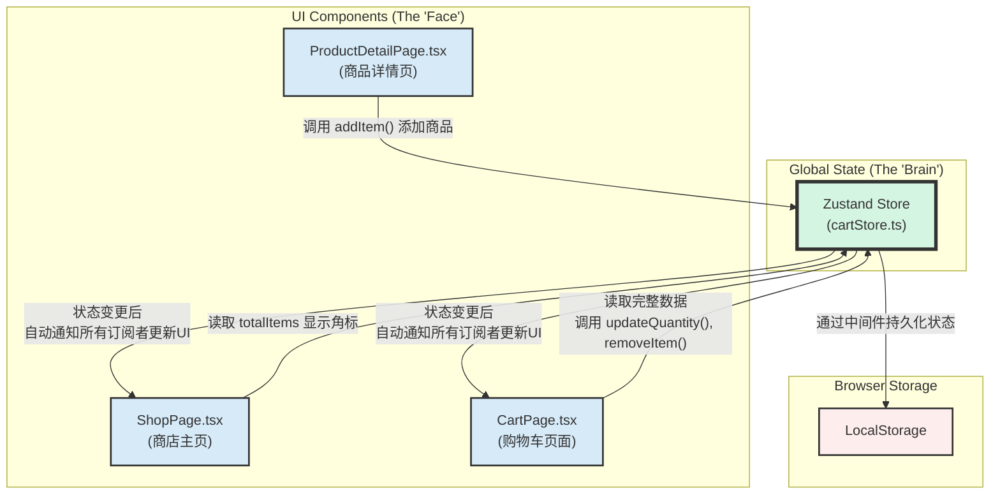

# 教程：解构购物车——状态管理与UI分离的最佳实践

欢迎来到本篇教程。在这里，我们将一起深入探索电商项目的核心功能之一——购物车的实现。这不仅仅是关于创建一个页面，更是关于如何优雅地管理跨越多个页面的"全局状态"。

## 1. 为什么需要"状态管理"？ (The "Why")

在我们的应用中，多个页面都需要知道购物车里有什么：

* **商品详情页**：需要能向购物车里"添加"商品。
* **商店主页**：需要在底部的购物车图标上显示商品"总数"。
* **购物车页面**：需要展示完整的商品列表，并能"修改"或"删除"它们。

如果每个页面都自己维护一份购物车数据，很快就会陷入混乱（比如，数据不一致）。因此，我们需要一个**全局的、唯一的、所有页面都能访问的"中央数据仓库"**。这就是"全局状态管理"的用武之地。

我们选择了 `Zustand` 这个库，因为它轻量、简单且性能出色。

## 2. 架构概览：大脑与脸的分离

在动手之前，让我们先看看设计的蓝图。我们遵循"逻辑与视图分离"的原则，将购物车功能拆分为两部分：



* **大脑 (`cartStore.ts`)**：这是我们的数据中心。它负责存储所有购物车数据，并定义了所有可以修改这些数据的方法。
* **脸 (UI Components)**：这些是用户能看到的页面。它们不自己存储数据，而是从"大脑"获取数据来展示，并将用户的操作指令回传给"大脑"。

## 3. 大脑的构建: `src/stores/cartStore.ts`

这是我们购物车的核心。让我们看看它的构成：

```typescript
// src/stores/cartStore.ts

import { create } from 'zustand';
import { persist } from 'zustand/middleware';

// 1. 定义数据结构 (State)
export interface CartItem { /* ... */ }
interface CartStore {
  items: CartItem[];
  totalItems: number;
  totalPrice: number;
  // ... 其他状态
  
  // 2. 定义操作方法 (Actions)
  addItem: (item: Omit<CartItem, 'id'>) => void;
  removeItem: (itemId: string) => void;
  updateQuantity: (itemId: string, quantity: number) => void;
  // ... 其他方法
}

// 3. 创建Store
export const useCartStore = create<CartStore>()(
  // 使用persist中间件，将状态自动同步到LocalStorage
  persist(
    (set, get) => ({
      // 初始状态
      items: [],
      totalItems: 0,
      totalPrice: 0,
  
      // 实现操作方法
      addItem: (newItem) => {
        // ... 添加商品的逻辑
        // 最后通过 set(...) 来更新状态
      },
      removeItem: (itemId) => {
        // ... 删除商品的逻辑
      },
      // ... 其他方法的实现
    }),
    {
      name: 'cart-storage', // localStorage中的key
    }
  )
);
```

这个文件创建了一个名为 `useCartStore` 的钩子 (Hook)，任何组件都可以通过调用它来接入购物车的数据和方法。

## 4. UI与大脑的协作

现在，我们来看看各个UI组件是如何与 `useCartStore` 协作的。

### 步骤一：添加商品 (在 `ProductDetailPage`)

在商品详情页，我们需要"写"数据到Store。

```typescript
// src/pages/product/ProductDetailPage.tsx

import { useCartStore } from '../../stores/cartStore';

const ProductDetailPage: React.FC = () => {
  // 1. 从Store中只获取需要的方法
  const { addItem } = useCartStore();

  const handleAddToCart = () => {
    // 2. 准备好要添加的商品数据
    const newItem = {
      productId: product.id,
      name: product.name,
      // ... 其他信息
    };
  
    // 3. 调用Store的方法，将商品信息传递过去
    addItem(newItem);
  
    alert('已添加到购物车');
  };

  // ...
};
```

### 步骤二：显示角标 (在 `ShopPage`)

在商店主页，我们只需要"读"一个简单的状态 (`totalItems`)。

```typescript
// src/pages/shop/ShopPage.tsx

import { useCartStore } from '../../stores/cartStore';

const ShopPage: React.FC = () => {
  // 1. 从Store中获取总数
  const { totalItems } = useCartStore();

  // 2. 在渲染时使用它
  return (
    // ...
    <div className="flex flex-col items-center ... relative" onClick={() => navigate('/cart')}>
      <span className="text-xs font-medium">Cart</span>
      {/* 如果总数大于0，就显示角标 */}
      {totalItems > 0 && (
        <div className="absolute ...">
          <span className="...">{totalItems}</span>
        </div>
      )}
    </div>
    // ...
  );
};
```

Zustand的魔力在于，当其他地方（如商品详情页）调用`addItem`导致`totalItems`改变时，这个组件会自动重新渲染，角标数字也会自动更新！

### 步骤三：管理购物车 (在 `CartPage`)

在购物车页面，我们需要"读"完整的数据，也需要"写"数据（修改数量、删除）。

```typescript
// src/pages/cart/CartPage.tsx

import { useCartStore } from '../../stores/cartStore';

const CartPage: React.FC = () => {
  // 1. 获取所有需要的数据和方法
  const { items, totalItems, totalPrice, updateQuantity, removeItem } = useCartStore();

  return (
    <div>
      {/* 2. 渲染商品列表 */}
      {items.map(item => (
        <div key={item.id}>
          <p>{item.name}</p>
          {/* 3. 绑定操作方法 */}
          <button onClick={() => updateQuantity(item.id, item.quantity - 1)}>
            -
          </button>
          <span>{item.quantity}</span>
          <button onClick={() => removeItem(item.id)}>
            删除
          </button>
        </div>
      ))}
    
      {/* 4. 渲染总价 */}
      <div>
        合计: ¥{totalPrice.toFixed(2)}
      </div>
    </div>
  );
};
```

## 5. 总结

通过 `Zustand`，我们成功地构建了一个健壮、解耦的购物车系统。

* **`cartStore.ts`** 成为了我们唯一的**数据真相源 (Single Source of Truth)**。
* 所有UI组件都只负责自己的本职工作：要么从Store获取数据进行展示，要么调用Store的方法来响应用户操作。

这种模式极大地提高了代码的可维护性和可扩展性。希望这篇教程能帮助您理解其工作原理！
