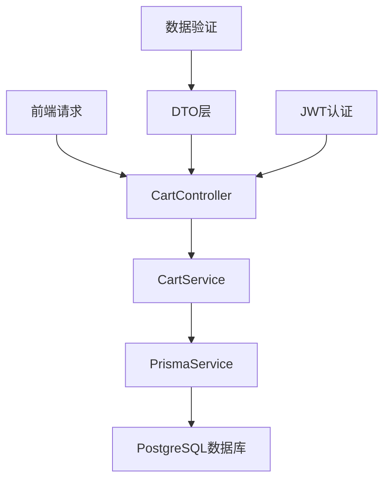

# 购物车模块实现教程

## 为什么需要购物车模块？

在电商系统中，购物车是用户购买流程的核心环节。用户需要能够：
- 将感兴趣的商品添加到购物车
- 查看购物车中的商品列表和总价
- 修改商品数量或删除不需要的商品
- 批量管理购物车中的商品

本教程将详细介绍如何在 NestJS 后端项目中实现一个完整的购物车模块。

## 整体架构设计

购物车模块采用经典的 MVC 架构模式：



### 核心组件说明

1. **CartController**: 处理 HTTP 请求，定义 API 端点
2. **CartService**: 实现业务逻辑，处理数据操作
3. **DTO (Data Transfer Object)**: 定义数据传输格式和验证规则
4. **CartModule**: 整合所有组件，管理依赖注入

## 数据模型设计

购物车功能基于 Prisma 数据模型：

```prisma
model CartItem {
  id        String   @id @default(cuid())
  userId    String
  productId String
  specId    String?
  quantity  Int      @default(1)
  createdAt DateTime @default(now())
  updatedAt DateTime @updatedAt

  user    User        @relation(fields: [userId], references: [id], onDelete: Cascade)
  product Product     @relation(fields: [productId], references: [id], onDelete: Cascade)
  spec    ProductSpec? @relation(fields: [specId], references: [id], onDelete: SetNull)

  @@unique([userId, productId, specId])
  @@map("cart_items")
}
```

### 关键设计决策

- **复合唯一索引**: `@@unique([userId, productId, specId])` 确保同一用户不会重复添加相同的商品规格
- **级联删除**: 当用户或商品被删除时，相关购物车项目自动清理
- **规格支持**: 通过 `specId` 支持商品的不同规格（如颜色、尺寸等）

## 实现步骤详解

### 步骤1: 创建 DTO 数据传输对象

#### 1.1 添加商品到购物车 DTO

```typescript
// backend/src/cart/dto/add-cart-item.dto.ts
export class AddCartItemDto {
  @IsString()
  @IsNotEmpty()
  @ApiProperty({ description: '商品ID' })
  productId: string;

  @IsInt()
  @Min(1)
  @ApiProperty({ description: '商品数量', minimum: 1 })
  quantity: number;

  @IsOptional()
  @IsString()
  @ApiProperty({ description: '商品规格ID', required: false })
  specId?: string;

  @IsOptional()
  @IsObject()
  @ApiProperty({ description: '选中的商品规格', required: false })
  selectedVariants?: Record<string, any>;
}
```

**设计要点**:
- 使用 `class-validator` 进行数据验证
- `@ApiProperty` 装饰器生成 Swagger 文档
- 支持可选的商品规格选择

#### 1.2 购物车响应 DTO

```typescript
// backend/src/cart/dto/cart-response.dto.ts
export class CartItemResponseDto {
  @ApiProperty({ description: '购物车项目ID' })
  id: string;

  @ApiProperty({ description: '商品ID' })
  productId: string;

  @ApiProperty({ description: '商品名称' })
  name: string;

  @ApiProperty({ description: '商品价格' })
  price: number;

  @ApiProperty({ description: '商品图片' })
  image: string;

  @ApiProperty({ description: '商品数量' })
  quantity: number;

  @ApiProperty({ description: '选中的规格', required: false })
  selectedVariants?: Record<string, any>;
}

export class CartResponseDto {
  @ApiProperty({ type: [CartItemResponseDto] })
  items: CartItemResponseDto[];

  @ApiProperty({ description: '购物车总金额' })
  totalAmount: number;

  @ApiProperty({ description: '商品总数量' })
  totalQuantity: number;
}
```

### 步骤2: 实现 CartService 业务逻辑

#### 2.1 核心服务方法

```typescript
// backend/src/cart/cart.service.ts
@Injectable()
export class CartService {
  constructor(private prisma: PrismaService) {}

  async getCart(userId: string): Promise<CartResponseDto> {
    const cartItems = await this.prisma.cartItem.findMany({
      where: { userId },
      include: {
        product: {
          select: {
            id: true,
            name: true,
            price: true,
            images: true,
            status: true,
            stock: true,
          },
        },
        spec: {
          select: {
            id: true,
            name: true,
            price: true,
            stock: true,
          },
        },
      },
      orderBy: { createdAt: 'desc' },
    });

    // 转换数据格式并计算总价
    const items = cartItems.map(item => ({
      id: item.id,
      productId: item.productId,
      name: item.product.name,
      price: item.spec?.price || item.product.price,
      image: item.product.images?.[0] || '',
      quantity: item.quantity,
      selectedVariants: item.selectedVariants,
    }));

    const totalAmount = items.reduce((sum, item) => sum + item.price * item.quantity, 0);
    const totalQuantity = items.reduce((sum, item) => sum + item.quantity, 0);

    return { items, totalAmount, totalQuantity };
  }
}
```

**关键实现细节**:
- 使用 Prisma 的 `include` 关联查询商品和规格信息
- 动态计算商品价格（优先使用规格价格）
- 实时计算购物车总金额和总数量

#### 2.2 添加商品逻辑

```typescript
async addItem(userId: string, dto: AddCartItemDto): Promise<CartItemResponseDto> {
  // 验证商品存在性和状态
  const product = await this.prisma.product.findUnique({
    where: { id: dto.productId },
    include: { specs: true },
  });

  if (!product) {
    throw new NotFoundException('商品不存在');
  }

  if (product.status !== 'ACTIVE') {
    throw new BadRequestException('商品已下架');
  }

  // 检查库存
  let availableStock = product.stock;
  let finalPrice = product.price;

  if (dto.specId) {
    const spec = product.specs.find(s => s.id === dto.specId);
    if (!spec) {
      throw new NotFoundException('商品规格不存在');
    }
    availableStock = spec.stock;
    finalPrice = spec.price;
  }

  if (availableStock < dto.quantity) {
    throw new BadRequestException('库存不足');
  }

  // 检查是否已存在相同商品规格
  const existingItem = await this.prisma.cartItem.findUnique({
    where: {
      userId_productId_specId: {
        userId,
        productId: dto.productId,
        specId: dto.specId || null,
      },
    },
  });

  if (existingItem) {
    // 更新数量
    const newQuantity = existingItem.quantity + dto.quantity;
    if (newQuantity > availableStock) {
      throw new BadRequestException('库存不足');
    }

    const updatedItem = await this.prisma.cartItem.update({
      where: { id: existingItem.id },
      data: { 
        quantity: newQuantity,
        selectedVariants: dto.selectedVariants,
      },
    });

    return this.formatCartItem(updatedItem, product, spec);
  } else {
    // 创建新项目
    const cartItem = await this.prisma.cartItem.create({
      data: {
        userId,
        productId: dto.productId,
        specId: dto.specId,
        quantity: dto.quantity,
        selectedVariants: dto.selectedVariants,
      },
    });

    return this.formatCartItem(cartItem, product, spec);
  }
}
```

**业务逻辑要点**:
1. **商品验证**: 检查商品存在性和状态
2. **库存验证**: 确保有足够库存
3. **去重处理**: 相同商品规格合并数量
4. **原子操作**: 使用数据库事务确保数据一致性

### 步骤3: 实现 CartController API 端点

```typescript
// backend/src/cart/cart.controller.ts
@Controller('cart')
@UseGuards(JwtAuthGuard)
@ApiTags('购物车')
export class CartController {
  constructor(private readonly cartService: CartService) {}

  @Get()
  @ApiOperation({ summary: '获取购物车内容' })
  @ApiResponse({ type: CartResponseDto })
  async getCart(@Request() req): Promise<CartResponseDto> {
    return this.cartService.getCart(req.user.userId);
  }

  @Post()
  @ApiOperation({ summary: '添加商品到购物车' })
  @ApiResponse({ type: CartItemResponseDto })
  async addItem(
    @Request() req,
    @Body() dto: AddCartItemDto,
  ): Promise<CartItemResponseDto> {
    return this.cartService.addItem(req.user.userId, dto);
  }

  @Put(':id')
  @ApiOperation({ summary: '更新购物车商品数量' })
  async updateItem(
    @Request() req,
    @Param('id') id: string,
    @Body() dto: UpdateCartItemDto,
  ): Promise<CartItemResponseDto> {
    return this.cartService.updateItem(req.user.userId, id, dto);
  }

  @Delete(':id')
  @ApiOperation({ summary: '从购物车删除商品' })
  async removeItem(
    @Request() req,
    @Param('id') id: string,
  ): Promise<{ message: string }> {
    await this.cartService.removeItem(req.user.userId, id);
    return { message: '商品已从购物车中删除' };
  }

  @Patch('batch')
  @ApiOperation({ summary: '批量更新购物车' })
  async batchUpdate(
    @Request() req,
    @Body() dto: BatchUpdateCartDto,
  ): Promise<CartResponseDto> {
    return this.cartService.batchUpdate(req.user.userId, dto);
  }

  @Delete()
  @ApiOperation({ summary: '清空购物车' })
  async clearCart(@Request() req): Promise<{ message: string }> {
    await this.cartService.clearCart(req.user.userId);
    return { message: '购物车已清空' };
  }
}
```

**API 设计原则**:
- **RESTful 风格**: 使用标准 HTTP 方法
- **统一认证**: 所有端点都需要 JWT 认证
- **完整文档**: 使用 Swagger 装饰器生成 API 文档
- **错误处理**: 统一的异常处理机制

### 步骤4: 模块集成

```typescript
// backend/src/cart/cart.module.ts
@Module({
  controllers: [CartController],
  providers: [CartService, PrismaService],
  exports: [CartService],
})
export class CartModule {}
```

```typescript
// backend/src/app.module.ts
@Module({
  imports: [
    // ... 其他模块
    CartModule,
  ],
  // ...
})
export class AppModule {}
```

## 测试策略

### 单元测试覆盖

项目包含完整的单元测试：

1. **CartService 测试** (12个测试用例)
   - 获取购物车内容
   - 添加商品（正常流程、库存不足、商品不存在）
   - 更新商品数量
   - 删除商品
   - 清空购物车

2. **CartController 测试** (7个测试用例)
   - API 端点调用
   - 参数验证
   - 认证检查

### 测试运行结果

```bash
$ npm test -- cart

Test Suites: 2 passed, 2 total
Tests:       19 passed, 19 total
Snapshots:   0 total
Time:        6.541 s
```

## API 使用示例

### 1. 获取购物车内容

```bash
GET /cart
Authorization: Bearer <jwt_token>

# 响应
{
  "items": [
    {
      "id": "cart_item_1",
      "productId": "product_1",
      "name": "iPhone 15 Pro",
      "price": 7999,
      "image": "https://example.com/iphone15.jpg",
      "quantity": 2,
      "selectedVariants": {
        "color": "深空黑色",
        "storage": "256GB"
      }
    }
  ],
  "totalAmount": 15998,
  "totalQuantity": 2
}
```

### 2. 添加商品到购物车

```bash
POST /cart
Authorization: Bearer <jwt_token>
Content-Type: application/json

{
  "productId": "product_1",
  "quantity": 1,
  "specId": "spec_1",
  "selectedVariants": {
    "color": "深空黑色",
    "storage": "256GB"
  }
}
```

### 3. 批量更新购物车

```bash
PATCH /cart/batch
Authorization: Bearer <jwt_token>
Content-Type: application/json

{
  "updates": [
    { "id": "cart_item_1", "quantity": 3 },
    { "id": "cart_item_2", "quantity": 1 }
  ]
}
```

## 性能优化考虑

### 1. 数据库优化

- **索引优化**: 在 `userId`, `productId`, `specId` 上建立复合索引
- **查询优化**: 使用 `include` 减少 N+1 查询问题
- **分页支持**: 对于大量购物车项目，可以添加分页功能

### 2. 缓存策略

```typescript
// 可以添加 Redis 缓存
@Injectable()
export class CartService {
  constructor(
    private prisma: PrismaService,
    private cacheManager: Cache, // 可选的缓存管理器
  ) {}

  async getCart(userId: string): Promise<CartResponseDto> {
    const cacheKey = `cart:${userId}`;
    const cached = await this.cacheManager.get(cacheKey);
    
    if (cached) {
      return cached;
    }

    const result = await this.fetchCartFromDatabase(userId);
    await this.cacheManager.set(cacheKey, result, 300); // 5分钟缓存
    
    return result;
  }
}
```

### 3. 并发处理

对于高并发场景，可以使用数据库事务和乐观锁：

```typescript
async addItem(userId: string, dto: AddCartItemDto): Promise<CartItemResponseDto> {
  return this.prisma.$transaction(async (tx) => {
    // 在事务中执行所有操作
    const product = await tx.product.findUnique({
      where: { id: dto.productId },
    });
    
    // ... 其他逻辑
  });
}
```

## 扩展功能建议

### 1. 购物车同步

- **跨设备同步**: 用户在不同设备上的购物车保持同步
- **离线支持**: 本地存储 + 在线同步机制

### 2. 智能推荐

- **相关商品推荐**: 基于购物车内容推荐相关商品
- **价格提醒**: 商品降价时通知用户

### 3. 购物车分析

- **用户行为分析**: 统计添加、删除、购买转化率
- **商品热度分析**: 分析最受欢迎的商品

## 总结

本教程详细介绍了如何在 NestJS 项目中实现一个完整的购物车模块。通过合理的架构设计、完善的数据验证、全面的测试覆盖，我们构建了一个健壮、可扩展的购物车系统。

### 关键收获

1. **模块化设计**: 清晰的职责分离，便于维护和扩展
2. **数据完整性**: 通过数据库约束和业务逻辑确保数据一致性
3. **用户体验**: 支持商品规格选择、批量操作等高级功能
4. **开发效率**: 完整的测试覆盖和 API 文档

这个购物车模块为整个电商系统奠定了坚实的基础，可以无缝集成到订单、支付等其他业务模块中。