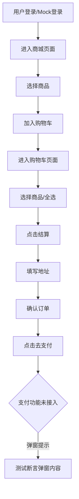

# 购物车到订单 E2E 测试教程

> **适用对象**：新老开发者、测试工程师、产品经理  
> **目标**：帮助你理解如何用 Playwright 编写、维护和调试“购物车到订单”全流程 E2E 测试，并掌握常见问题的排查与解决方法。

---

## 一、为什么要做 E2E 测试？

- **端到端（E2E）测试**可以模拟真实用户的操作流程，验证前后端集成、页面交互、业务流程的完整性。
- 对于电商类项目，购物车到订单的流程是核心业务，必须保证其稳定可靠。

---

## 二、测试用例覆盖的核心流程

1. **完整购物车到订单流程**  
   用户登录 → 进入商城 → 选择商品 → 加入购物车 → 进入购物车 → 选择商品 → 结算 → 填写地址 → 确认订单 → 支付（弹窗提示未接入）

2. **购物车为空时的处理**  
   验证空购物车页面的友好提示和结算按钮的隐藏

3. **购物车商品数量调整**  
   增加/减少商品数量，断言数量变化

4. **购物车商品移除功能**  
   移除商品，断言商品消失

5. **购物车全选功能**  
   测试全选/反选，断言所有商品的选中状态和结算按钮可用性

---

## 三、实现要点与技术细节

### 1. 测试环境准备

- **Mock 登录**：通过 `localStorage` 和 `zustand` store 注入用户信息，跳过真实登录流程。
- **Mock 数据隔离**：每个测试前清空购物车本地存储和 mock 数据（调用 `/api/cart` DELETE），避免数据串台。

### 2. Playwright 操作技巧

- **等待页面渲染**：使用 `await expect(locator).toBeVisible()` 等方法，确保页面元素已渲染再进行后续操作。
- **处理弹窗**：支付功能未接入时，前端用 `alert` 提示。Playwright 需用 `Promise.all` 并发等待 `dialog` 事件和按钮点击，避免 click 卡死。
  ```js
  await Promise.all([
    page.waitForEvent("dialog").then((dialog) => {
      expect(dialog.message()).toContain("支付功能暂未接入");
      return dialog.dismiss();
    }),
    page.getByRole("button", { name: /去支付/i }).click(),
  ]);
  ```
- **全选功能的正确断言**：
  - 商品初始为选中状态，点击“全选”会变成全部未选中。
  - 测试前应先将所有商品取消选中，再点击“全选”，最后断言所有商品都被选中。
    ```js
    // 先取消所有商品选中
    for (let i = 0; i < count; i++) {
      const selectCheckbox = cartItems.nth(i).locator('button[title*="选择"]');
      const isSelected = await selectCheckbox
        .getAttribute("class")
        .then((cls) => cls?.includes("border-red-500 bg-red-500"));
      if (isSelected) await selectCheckbox.click();
    }
    // 点击全选
    await selectAllButton.click();
    // 等待所有商品都被选中
    await expect
      .poll(
        async () => {
          let allSelected = true;
          for (let i = 0; i < count; i++) {
            const selectCheckbox = cartItems
              .nth(i)
              .locator('button[title*="选择"]');
            const isSelected = await selectCheckbox
              .getAttribute("class")
              .then((cls) => cls?.includes("border-red-500 bg-red-500"));
            if (!isSelected) {
              allSelected = false;
              break;
            }
          }
          return allSelected;
        },
        { timeout: 3000 }
      )
      .toBeTruthy();
    ```

### 3. 断言的健壮性

- **不要硬编码商品数量**，而是断言“有商品”并遍历所有商品做断言，兼容 mock 污染和多 worker 并发。
- **断言按钮可用性**：通过 `await expect(locator).toBeEnabled()` 判断结算按钮状态。

---

## 四、常见问题与排查思路

### 1. 商品数量断言失败

- **原因**：mock 数据未隔离，或多 worker 并发导致 mockCartItems 污染。
- **解决**：每个测试前清空 mock 数据，或断言“有商品”而不是数量。

### 2. “全选”断言失败

- **原因**：商品初始已选中，点击“全选”反而取消选中。
- **解决**：测试前先取消所有商品选中，再点击“全选”并断言。

### 3. 弹窗断言卡死

- **原因**：Playwright 需并发等待 click 和 dialog，否则 click 会一直等待弹窗被处理。
- **解决**：用 `Promise.all` 并发等待。

---

## 五、最佳实践与团队建议

- **每个测试用例都要保证数据隔离**，避免串台。
- **断言要健壮**，兼容多商品、mock 污染等情况。
- **遇到异步 UI 状态变化，优先用 `expect.poll` 等待 UI 稳定**。
- **遇到 E2E 难以复现的问题，优先排查 mock 数据和本地存储的隔离性**。

---

## 六、流程图（Mermaid）



---
