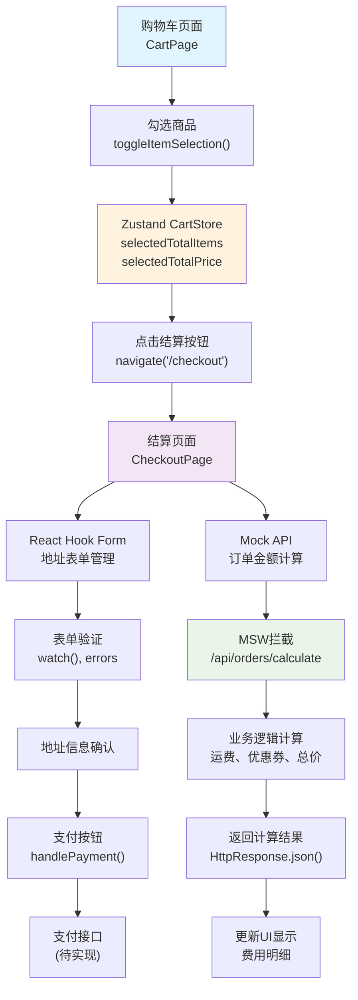

# 结算功能实现教程

## 概述

本教程介绍了在电商项目中实现结算功能的关键技术和新特性，包括Zustand状态管理的进阶用法、React Hook Form表单处理、MSW Mock扩展等。


## 数据流图


## 核心技术特性

### 1. Zustand状态管理的进阶用法

#### 部分选择与计算属性
```typescript
// src/stores/cartStore.ts
interface CartItem {
  // ... 其他属性
  selected: boolean; // 新增：选择状态
}

interface CartStore {
  // 计算属性：选中商品的统计信息
  selectedTotalItems: number;
  selectedTotalPrice: number;
  
  // 选择操作方法
  toggleItemSelection: (itemId: string) => void;
  toggleAllSelection: () => void;
  getSelectedItems: () => CartItem[];
}
```

#### 状态持久化的扩展
```typescript
partialize: (state) => ({
  items: state.items,
  totalItems: state.totalItems,
  totalPrice: state.totalPrice,
  selectedTotalItems: state.selectedTotalItems,  // 新增
  selectedTotalPrice: state.selectedTotalPrice   // 新增
})
```

**核心特性**：
- **计算属性自动更新**：通过 `calculateTotals()` 统一管理所有衍生状态
- **持久化选择**：将选择状态持久化到localStorage
- **函数式状态更新**：使用纯函数方式更新嵌套状态

### 2. React Hook Form 表单管理

#### 基础配置与默认值
```typescript
const {
  register,
  handleSubmit,
  formState: { errors },
  watch,
  setValue
} = useForm<AddressForm>({
  defaultValues: {
    name: '张三',
    phone: '13800138000',
    // ... 其他默认值
  }
});
```

#### 高级校验规则
```typescript
const phoneValidation = {
  required: '请输入手机号',
  pattern: {
    value: /^1[3-9]\d{9}$/,
    message: '请输入正确的手机号'
  }
};
```

**新特性亮点**：
- **watch 实时监听**：无需手动state管理，自动监听表单值变化
- **条件渲染优化**：通过 `watch()` 实现表单值的实时预览
- **声明式校验**：将校验逻辑与组件逻辑分离

### 3. MSW Mock Service 扩展

#### 类型安全的API设计
```typescript
// src/mocks/handlers/order.ts
interface OrderCalculationRequest {
  items: Array<{
    productId: string;
    quantity: number;
    price: number;
  }>;
  couponCode?: string;
}

interface OrderCalculationResponse {
  subtotal: number;
  shipping: number;
  discount: number;
  total: number;
  couponDiscount?: number;
  shippingMethod: string;
}
```

#### 模拟复杂业务逻辑
```typescript
http.post('/api/orders/calculate', async ({ request }) => {
  const body = await request.json() as OrderCalculationRequest;
  
  // 计算商品小计
  const subtotal = body.items.reduce((sum, item) => sum + (item.price * item.quantity), 0);
  
  // 计算运费（满99免运费）
  const shipping = subtotal >= 99 ? 0 : 10;
  
  // 计算优惠券折扣
  let couponDiscount = 0;
  if (body.couponCode) {
    switch (body.couponCode) {
      case 'SAVE10':
        couponDiscount = Math.min(subtotal * 0.1, 50);
        break;
      // ... 其他优惠券逻辑
    }
  }
  
  return HttpResponse.json({ subtotal, shipping, discount, total });
});
```

**关键技术点**：
- **异步处理模拟**：使用 `async/await` 模拟真实API延迟
- **业务逻辑复用**：在Mock中实现与真实后端一致的计算逻辑
- **类型安全**：TypeScript接口确保前后端数据契约一致

### 4. 组件状态与UI交互

#### 条件渲染的优化模式
```typescript
// 基于状态的条件渲染
{!isEditingAddress ? (
  <div className="space-y-2">
    <div className="flex items-center gap-4">
      <span className="font-medium">{watch('name')}</span>
      <span className="text-gray-600">{watch('phone')}</span>
    </div>
  </div>
) : (
  <form onSubmit={handleSubmit(onAddressSubmit)}>
    {/* 表单内容 */}
  </form>
)}
```

#### 按钮状态的动态管理
```typescript
// 购物车页面的全选逻辑
const isAllSelected = items.length > 0 && items.every(item => item.selected);
const hasSelectedItems = items.some(item => item.selected);

<button
  className={`w-full font-medium py-3 px-8 rounded-lg transition-colors ${
    hasSelectedItems
      ? 'bg-red-500 text-white hover:bg-red-600'
      : 'bg-gray-300 text-gray-500 cursor-not-allowed'
  }`}
  disabled={!hasSelectedItems}
>
  结算 ({selectedTotalItems})
</button>
```

## 技术决策与最佳实践

### 1. 状态管理策略

**选择Zustand而非Redux的原因**：
- **更少样板代码**：不需要actions、reducers等复杂结构
- **TypeScript友好**：天然支持类型推导
- **选择器优化**：内置状态切片功能

### 2. 表单处理策略

**选择React Hook Form的优势**：
- **性能优化**：非受控组件减少重渲染
- **内置校验**：无需额外的校验库
- **开发体验**：声明式API，代码更简洁

### 3. Mock数据策略

**MSW的技术优势**：
- **Service Worker拦截**：在网络层拦截，更接近真实环境
- **类型安全**：TypeScript支持确保API契约一致性
- **渐进式替换**：可逐个API替换为真实后端

## 代码组织模式

### 1. 状态逻辑分离
```typescript
// 将复杂的状态逻辑提取为custom hooks
const useCheckoutLogic = () => {
  const selectedItems = getSelectedItems();
  const orderCalculation = useMemo(() => ({
    subtotal: selectedTotalPrice,
    shipping: selectedTotalPrice >= 99 ? 0 : 10,
    total: selectedTotalPrice + (selectedTotalPrice >= 99 ? 0 : 10)
  }), [selectedTotalPrice]);
  
  return { selectedItems, orderCalculation };
};
```

### 2. 组件职责单一
- **CheckoutPage**：专注结算流程编排
- **CartPage**：专注购物车商品管理
- **CartStore**：专注状态管理逻辑

## 实际应用场景

### 用户操作流程
1. **购物车选择**：用户在购物车页面勾选商品
2. **结算跳转**：点击结算按钮验证并跳转
3. **地址管理**：在结算页面编辑收货地址
4. **金额确认**：实时计算并显示费用明细
5. **支付处理**：集成支付接口（当前为模拟）

### 数据流向
```
CartStore (选中商品) 
    ↓
CheckoutPage (读取选中项)
    ↓
React Hook Form (地址管理)
    ↓
Mock API (订单计算)
    ↓
支付接口 (待实现)
```

## 扩展建议

1. **地址管理增强**：考虑添加地址簿功能
2. **优惠券系统**：扩展更复杂的优惠逻辑
3. **库存检查**：添加实时库存验证
4. **支付集成**：接入真实的微信支付API

---

本教程展示了现代React应用中状态管理、表单处理和API Mock的最佳实践，这些技术栈为后续的后端集成和功能扩展奠定了坚实基础。 