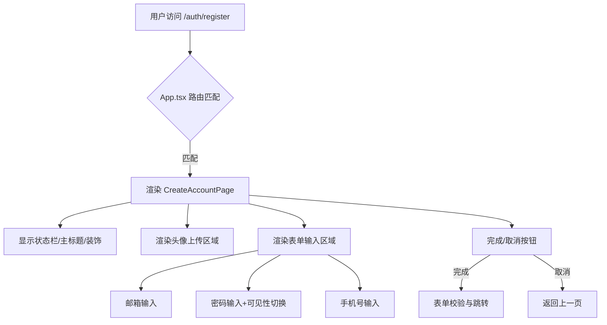

# 教程：用户注册页的实现与路由集成

在本项目中，用户注册页（CreateAccountPage）是用户完成账号创建流程的关键入口。本文将以教程形式，带你深入理解该页面的设计动机、核心功能、路由集成与数据流动。

## 1. 设计动机与页面定位

注册页是用户首次进入商城生态的起点。它不仅要实现基本的表单输入，还需兼顾移动端体验、头像上传、密码可见性切换等交互细节。

- **设计稿来源**：Figma 设计稿"02 Create Account"页面
- **目标用户**：移动端个人卖家/买家
- **核心诉求**：极简、易用、交互友好

## 2. 路由注册与页面集成

注册页通过 React Router 集成到主应用路由体系中。相关代码位于 `src/App.tsx`：

```tsx
import CreateAccountPage from "./pages/auth/CreateAccountPage";
// ...
<Routes>
  {/* ... */}
  <Route path="/auth/register" element={<CreateAccountPage />} />
</Routes>
```

- 这样，用户访问 `/auth/register` 时，即可进入注册页面。
- 路由注册方式与首页 WelcomePage 保持一致，便于扩展和维护。

## 3. 页面结构与核心功能

`CreateAccountPage.tsx` 采用函数组件实现，主要包含以下区域：

- **装饰背景**：顶部气泡装饰，提升视觉层次感。
- **状态栏**：复用 StatusBar 组件，适配移动端。
- **主标题**：突出"Create Account"主题。
- **头像上传**：支持本地图片上传与预览。
- **表单输入**：邮箱、密码、手机号，均有独立状态管理。
- **密码可见性切换**：提升输入体验。
- **表单提交与跳转**：点击"完成"后可跳转到后续页面。

### 关键代码片段

```tsx
const [formData, setFormData] = useState({ email: "", password: "", phoneNumber: "" });
const [showPassword, setShowPassword] = useState(false);
const [avatar, setAvatar] = useState<string | null>(null);

// 处理输入变化
const handleInputChange = (field: string, value: string) => {
  setFormData((prev) => ({ ...prev, [field]: value }));
};

// 头像上传
const handleAvatarUpload = (event: React.ChangeEvent<HTMLInputElement>) => {
  // ...读取并预览图片
};

// 密码可见性切换
const togglePasswordVisibility = () => setShowPassword(!showPassword);

// 表单提交
const handleDone = () => {
  // ...表单校验与跳转
  navigate("/shop");
};
```

## 4. 数据流动与交互流程

- **输入状态**：所有输入框均受控，状态集中在 formData。
- **头像上传**：本地读取图片并预览，未上传时显示相机图标。
- **密码可见性**：通过 showPassword 状态切换 input 类型。
- **表单提交**：点击"完成"后可进行表单校验与后续跳转。
- **取消操作**：支持返回上一页。

## 5. 页面渲染流程图



## 6. 实践建议与扩展

- 可在 handleDone 中补充表单校验、API 提交等逻辑。
- 头像上传可扩展为后端存储。
- 路由结构可按需扩展更多注册/登录相关页面。

## 总结

本教程梳理了注册页的设计动机、路由集成、页面结构与核心交互。通过受控组件与状态管理，结合现代路由体系，实现了高可维护、易扩展的注册流程。 