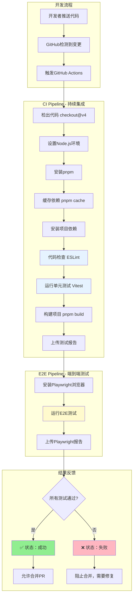
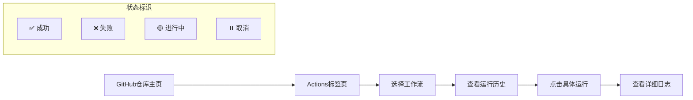
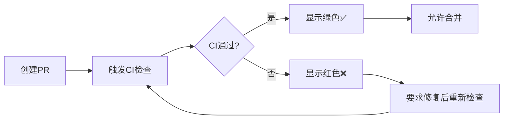

# GitHub Actions CI/CD 完全指南

## 为什么需要 CI/CD？

在我们的微信小程序项目开发过程中，随着代码量的增长和团队协作的需要，手动执行测试和部署变得越来越繁琐且容易出错。GitHub Actions CI/CD 就像是给我们的项目配备了一个**24小时不间断的质量卫士**，确保：

1. **代码质量保障**：每次提交都自动运行测试，及时发现问题
2. **协作效率提升**：团队成员提交代码后无需手动验证，CI 自动检查
3. **部署安全性**：只有通过所有测试的代码才能部署到生产环境
4. **回归问题预防**：修改代码时自动检查是否破坏了已有功能

## CI/CD 是如何工作的？

### 整体流程图



### GitHub Actions 配置文件详解

我们的 CI/CD 配置位于 `.github/workflows/ci.yml`，让我们逐个解析每个部分：

#### 1. 触发条件配置

```yaml
on:
  push:
    branches: [ main, dev, dev-* ]
  pull_request:
    branches: [ main, dev ]
```

**含义**：
- `push`：当向 `main`、`dev` 或任何 `dev-*` 分支推送代码时触发
- `pull_request`：当创建或更新针对 `main`、`dev` 分支的 PR 时触发

**为什么这样设计？**
- 保护主要分支：确保合并到主分支的代码都经过测试
- 支持功能分支：`dev-*` 模式支持功能分支的开发

#### 2. 运行环境配置

```yaml
jobs:
  test:
    name: 运行测试
    runs-on: ubuntu-latest
    
    strategy:
      matrix:
        node-version: [20.x]
```

**解析**：
- `ubuntu-latest`：使用最新的 Ubuntu 虚拟机（免费且性能好）
- `matrix`：矩阵策略，支持多版本测试（当前使用 Node.js 20.x）

#### 3. 步骤详细分析

##### 步骤1：代码检出
```yaml
- name: 检出代码
  uses: actions/checkout@v4
```

**作用**：下载代码仓库的内容到虚拟机

##### 步骤2：Node.js 环境设置
```yaml
- name: 设置 Node.js ${{ matrix.node-version }}
  uses: actions/setup-node@v4
  with:
    node-version: ${{ matrix.node-version }}
    cache: 'npm'
```

**作用**：安装指定版本的 Node.js，并启用 npm 缓存加速

##### 步骤3：pnpm 包管理器
```yaml
- name: 安装 pnpm
  uses: pnpm/action-setup@v3
  with:
    version: 8
```

**为什么使用 pnpm？**
- 更快的安装速度
- 节省磁盘空间
- 严格的依赖管理

##### 步骤4：智能缓存策略
```yaml
- name: 获取 pnpm store 目录
  id: pnpm-cache
  shell: bash
  run: |
    echo "STORE_PATH=$(pnpm store path)" >> $GITHUB_OUTPUT
    
- name: 设置 pnpm 缓存
  uses: actions/cache@v4
  with:
    path: ${{ steps.pnpm-cache.outputs.STORE_PATH }}
    key: ${{ runner.os }}-pnpm-store-${{ hashFiles('**/pnpm-lock.yaml') }}
    restore-keys: |
      ${{ runner.os }}-pnpm-store-
```

**缓存原理**：
1. 获取 pnpm 的存储目录路径
2. 基于操作系统和 `pnpm-lock.yaml` 文件的哈希值创建缓存键
3. 如果依赖没有变化，直接使用缓存，大幅提升速度

##### 步骤5：质量检查
```yaml
- name: 代码检查 (ESLint)
  run: pnpm run lint
  
- name: 运行单元测试
  run: pnpm run test:unit:run
```

**检查顺序的重要性**：
1. 先进行语法和代码风格检查（ESLint）
2. 再运行单元测试
3. 快速失败原则：如果代码风格有问题，立即停止，节省时间

##### 步骤6：构建验证
```yaml
- name: 构建项目
  run: pnpm run build
```

**作用**：验证代码能够成功构建，模拟生产环境

##### 步骤7：报告上传
```yaml
- name: 上传测试覆盖率报告
  uses: actions/upload-artifact@v4
  if: always()
  with:
    name: test-coverage
    path: coverage/
    retention-days: 7
```

**特点**：
- `if: always()`：即使前面的步骤失败也会上传
- `retention-days: 7`：报告保存7天后自动删除

## 端到端测试流水线

### 为什么需要 E2E 测试？

单元测试只能验证组件的独立功能，而 E2E 测试能验证：
- 用户真实的操作流程
- 组件之间的集成
- 浏览器兼容性
- 网络请求和响应

### E2E 测试配置详解

```yaml
e2e-tests:
  name: 端到端测试
  runs-on: ubuntu-latest
  needs: test  # 依赖前面的单元测试完成
```

**设计思路**：
- `needs: test`：只有单元测试通过后才运行 E2E 测试
- 节省资源：如果单元测试失败，不会浪费时间运行 E2E 测试

### Playwright 浏览器安装

```yaml
- name: 安装 Playwright 浏览器
  run: pnpm exec playwright install --with-deps
```

**过程**：自动下载 Chromium、Firefox、WebKit 浏览器内核

## 如何查看和分析 CI/CD 结果？

### 1. GitHub Actions 面板导航



### 2. 成功运行的标志

```bash
✅ test (运行测试)
  ├── ✅ 检出代码
  ├── ✅ 设置 Node.js 20.x
  ├── ✅ 安装 pnpm
  ├── ✅ 设置 pnpm 缓存
  ├── ✅ 安装依赖
  ├── ✅ 代码检查 (ESLint)
  ├── ✅ 运行单元测试
  ├── ✅ 构建项目
  └── ✅ 上传测试覆盖率报告

✅ e2e-tests (端到端测试)
  ├── ✅ 检出代码
  ├── ✅ 设置 Node.js
  ├── ✅ 安装 pnpm
  ├── ✅ 安装依赖
  ├── ✅ 安装 Playwright 浏览器
  ├── ✅ 运行 Playwright 测试
  └── ✅ 上传 Playwright 报告
```

### 3. 失败时的诊断

#### ESLint 错误示例

```bash
❌ 代码检查 (ESLint)
  
Error: ESLint found problems:
  src/components/ProductCard.tsx
    12:7  error  'React' is defined but never used  no-unused-vars
    15:4  error  Missing return statement        consistent-return
    
Exit code: 1
```

**解决步骤**：
1. 查看具体的错误文件和行号
2. 在本地修复 ESLint 问题
3. 重新提交代码

#### 测试失败示例

```bash
❌ 运行单元测试

FAIL src/components/ui/ProductCard.test.tsx > ProductCard > 应该正确渲染商品基本信息
AssertionError: expected "测试商品2" to equal "测试商品"

Expected: "测试商品"
Received: "测试商品2"
```

**解决步骤**：
1. 分析测试预期和实际结果的差异
2. 检查是否是测试数据问题还是代码逻辑问题
3. 修复后重新运行

## 本地测试 vs CI 环境

### 本地开发环境

```bash
# 本地运行完整的 CI 流程
pnpm run lint          # 代码检查
pnpm run test:unit:run  # 单元测试
pnpm run build          # 构建验证
pnpm run test           # E2E 测试
```

### CI 环境的优势

1. **一致性**：每次都在干净的环境中运行
2. **全面性**：测试多种浏览器和环境
3. **客观性**：不受本地环境影响
4. **可追溯性**：所有运行记录都有日志

## 性能优化策略

### 1. 缓存策略

```yaml
# 依赖缓存
- uses: actions/cache@v4
  with:
    path: ${{ steps.pnpm-cache.outputs.STORE_PATH }}
    key: ${{ runner.os }}-pnpm-store-${{ hashFiles('**/pnpm-lock.yaml') }}
```

**效果**：首次运行需要 2-3 分钟，后续运行只需要 30-60 秒

### 2. 并行执行策略

```yaml
strategy:
  matrix:
    node-version: [18.x, 20.x]  # 如果需要测试多版本
```

### 3. 条件执行

```yaml
- name: 运行单元测试
  run: pnpm run test:unit:run
  if: runner.os == 'Linux'  # 只在 Linux 环境运行
```

## Badge 的配置和含义

### README 中的 Badge

```markdown
[](https://github.com/yourname/plan3-online-sales-wechat/actions/workflows/ci.yml)
[](https://github.com/yourname/plan3-online-sales-wechat/actions/workflows/ci.yml)
```

**状态说明**：
- 🟢 **passing**：所有测试通过
- 🔴 **failing**：有测试失败
- 🟡 **pending**：正在运行中

### 自定义 Badge

```yaml
# 在工作流中生成自定义指标
- name: 生成测试统计
  run: |
    echo "TESTS_COUNT=$(npm test -- --reporter=json | jq '.numTotalTests')" >> $GITHUB_ENV
    echo "COVERAGE=$(npm run test:coverage | grep -o '[0-9]*%' | tail -1)" >> $GITHUB_ENV
```

## 与项目开发流程的集成

### 1. 分支保护策略

```yaml
# GitHub 仓库设置 > Branches > Branch protection rules
required_status_checks:
  - "test (运行测试)"
  - "e2e-tests (端到端测试)"
```

**效果**：只有 CI 通过的代码才能合并到主分支

### 2. PR 检查流程



### 3. 发布流程集成

虽然当前配置主要关注测试，但可以扩展为完整的 CD（持续部署）：

```yaml
deploy:
  needs: [test, e2e-tests]
  if: github.ref == 'refs/heads/main'
  runs-on: ubuntu-latest
  steps:
    - name: 部署到生产环境
      run: # 部署脚本
```

## 故障排除指南

### 常见问题及解决方案

#### 1. 依赖安装失败

```bash
Error: Cannot resolve dependency tree
```

**解决方案**：
- 检查 `pnpm-lock.yaml` 是否提交
- 本地删除 `node_modules` 重新安装
- 确保本地和 CI 使用相同的 pnpm 版本

#### 2. 测试超时

```bash
Error: Test timeout of 30000ms exceeded
```

**解决方案**：
- 增加测试超时配置
- 检查是否有异步操作没有正确等待
- 优化测试数据大小

#### 3. 浏览器启动失败（E2E）

```bash
Error: Failed to launch browser
```

**解决方案**：
- 确保 Playwright 浏览器正确安装
- 检查系统依赖是否完整
- 使用 `--with-deps` 参数安装依赖

## 未来扩展方向

### 1. 增强的测试覆盖率

```yaml
- name: 覆盖率检查
  run: |
    pnpm run test:unit:coverage
    npx nyc check-coverage --lines 80 --branches 80
```

### 2. 多环境部署

```yaml
deploy-staging:
  if: github.ref == 'refs/heads/dev'
  # 部署到测试环境
  
deploy-production:
  if: github.ref == 'refs/heads/main'
  # 部署到生产环境
```

### 3. 安全扫描集成

```yaml
- name: 安全扫描
  uses: github/codeql-action/analyze@v2
  with:
    languages: javascript
```

### 4. 性能监控

```yaml
- name: Lighthouse CI
  uses: treosh/lighthouse-ci-action@v9
  with:
    configPath: './lighthouse.json'
```

## 总结与最佳实践

通过这套完整的 CI/CD 系统，我们实现了：

1. **自动化质量保障**：每次提交都经过完整的测试流程
2. **快速反馈循环**：开发者能够及时发现和修复问题
3. **团队协作效率**：减少了手动测试和集成的工作量
4. **部署安全性**：只有高质量的代码才能进入生产环境

**关键要点**：
- CI/CD 不是负担，而是提升开发效率的工具
- 合理的缓存策略能显著提升流水线速度
- 渐进式扩展：从基础测试开始，逐步增加更多检查
- 保持配置的简洁和可维护性

这个 CI/CD 系统为我们的微信小程序项目提供了坚实的质量保障基础，让我们可以更自信地进行功能开发和迭代。 