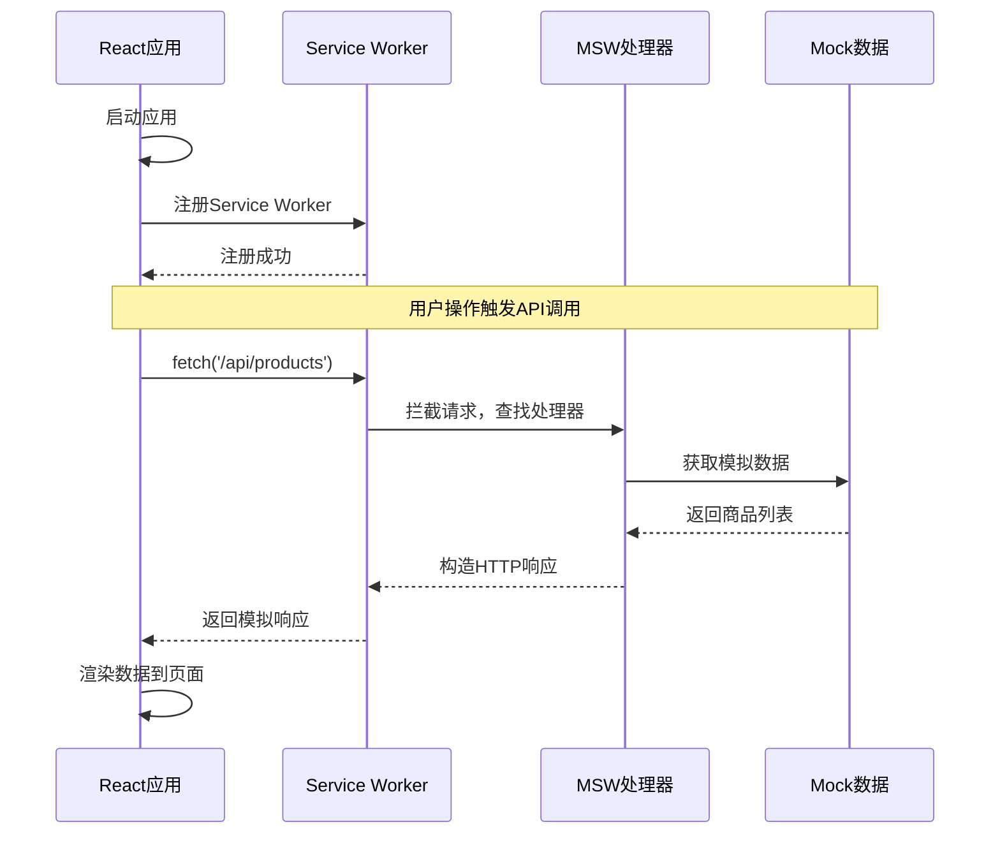
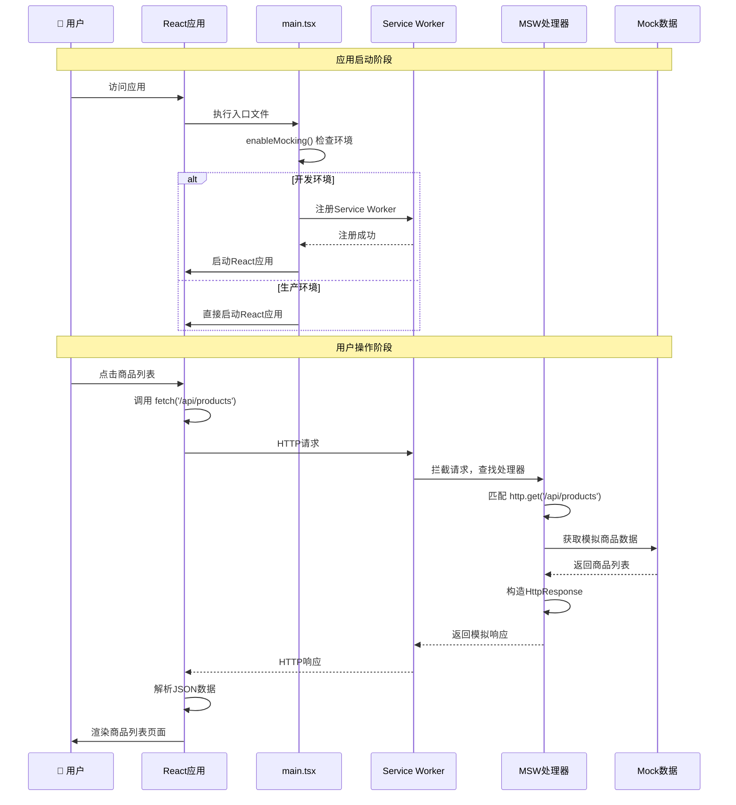

# MSW (Mock Service Worker) 集成教程

## 目录
- [为什么需要MSW？](#为什么需要msw)
- [MSW的核心概念](#msw的核心概念)
- [安装和配置过程](#安装和配置过程)
- [文件结构详解](#文件结构详解)
- [工作流程图解](#工作流程图解)
- [实际使用示例](#实际使用示例)
- [常见问题与调试](#常见问题与调试)
- [最佳实践](#最佳实践)

---

## 为什么需要MSW？

在前端开发过程中，我们经常遇到以下挑战：

1. **后端API尚未开发完成**：前端开发进度受后端制约
2. **开发环境不稳定**：后端服务器偶尔宕机或响应缓慢
3. **测试数据管理困难**：需要不同的数据状态来测试各种场景
4. **网络环境限制**：离线开发或网络不稳定时无法调用真实API

传统的解决方案（如硬编码mock数据）存在问题：
- 与真实API调用逻辑脱离
- 难以模拟不同的响应状态（成功、失败、加载中）
- 切换真实API时需要大量代码修改

**MSW的优势**：
- 在**Service Worker层面**拦截网络请求，对业务代码无侵入
- 完全模拟真实的HTTP请求/响应流程
- 开发时使用mock，生产时自动禁用
- 支持复杂的请求处理逻辑（分页、过滤、状态管理等）

---

## MSW的核心概念

### Service Worker 是什么？

Service Worker是浏览器在后台运行的脚本，它：
- 独立于主线程运行
- 可以拦截和处理网络请求
- 通常用于缓存策略、推送通知等功能

### MSW如何工作？

```
浏览器发起请求 → Service Worker拦截 → MSW处理器匹配 → 返回模拟响应
```

这个过程对于应用代码来说是**完全透明的**，应用代码依然使用 `fetch()` 或 `axios` 发起请求，只是响应变成了我们预定义的模拟数据。

---

## 安装和配置过程

### 第一步：安装依赖

```bash
pnpm add -D msw
```

### 第二步：初始化Service Worker文件

```bash
npx msw init public/ --save
```

**这个命令做了什么？**
1. 在 `public/` 目录下生成 `mockServiceWorker.js` 文件
2. 在 `package.json` 中添加 `msw.workerDirectory` 配置
3. 这个JS文件是MSW的Service Worker实现，**不要手动修改它**

### 第三步：创建请求处理器

创建 `src/mocks/handlers.ts`：

```typescript
import { http, HttpResponse } from 'msw';

export const handlers = [
  // 处理GET请求
  http.get('/api/products', ({ request }) => {
    // 可以从request中获取查询参数
    const url = new URL(request.url);
    const page = url.searchParams.get('page') || '1';
    
    // 返回模拟数据
    return HttpResponse.json({
      data: mockProducts,
      pagination: { page: parseInt(page), total: 100 }
    });
  }),
  
  // 处理POST请求
  http.post('/api/cart', async ({ request }) => {
    const body = await request.json();
    // 处理逻辑...
    return HttpResponse.json({ success: true });
  })
];
```

### 第四步：配置浏览器端

创建 `src/mocks/browser.ts`：

```typescript
import { setupWorker } from 'msw/browser';
import { handlers } from './handlers';

export const worker = setupWorker(...handlers);
```

### 第五步：在应用入口集成

修改 `src/main.tsx`：

```typescript
// 在开发环境中启动MSW
async function enableMocking() {
  if (process.env.NODE_ENV !== 'development') {
    return; // 生产环境不启用
  }

  const { worker } = await import('./mocks/browser');
  return worker.start({
    onUnhandledRequest: 'bypass', // 未处理的请求正常通过
  });
}

enableMocking().then(() => {
  // 启动React应用
  ReactDOM.createRoot(document.getElementById("root")!).render(
    <React.StrictMode>
      <BrowserRouter>
        <App />
      </BrowserRouter>
    </React.StrictMode>
  );
});
```

---

## 文件结构详解

我们的MSW集成涉及以下关键文件：

```
project/
├── public/
│   └── mockServiceWorker.js          # MSW生成的Service Worker（不要修改）
├── src/
│   ├── mocks/
│   │   ├── handlers.ts               # API处理器定义
│   │   └── browser.ts                # 浏览器配置
│   └── main.tsx                      # 应用入口（集成MSW启动）
└── package.json                      # 包含MSW配置
```

### `public/mockServiceWorker.js` 详解

这个文件是通过 `npx msw init` 命令自动生成的，它包含：

1. **Service Worker生命周期管理**：
   ```javascript
   addEventListener('install', function () {
     self.skipWaiting() // 立即激活新的Service Worker
   })
   
   addEventListener('activate', function (event) {
     event.waitUntil(self.clients.claim()) // 控制所有客户端
   })
   ```

2. **请求拦截机制**：
   ```javascript
   addEventListener('fetch', function (event) {
     // 拦截所有fetch请求
     if (event.request.mode === 'navigate') {
       return; // 跳过页面导航请求
     }
     
     event.respondWith(handleRequest(event, requestId))
   })
   ```

3. **与主线程通信**：
   - Service Worker通过 `postMessage` 与主线程通信
   - 主线程发送请求信息，Service Worker返回模拟响应

### `src/mocks/handlers.ts` 详解

这里定义了所有的API处理逻辑：

```typescript
import { http, HttpResponse } from 'msw';

export const handlers = [
  // 商品列表API
  http.get('/api/products', ({ request }) => {
    const url = new URL(request.url);
    const page = parseInt(url.searchParams.get('page') || '1');
    const limit = parseInt(url.searchParams.get('limit') || '10');
    
    // 模拟分页逻辑
    const startIndex = (page - 1) * limit;
    const endIndex = startIndex + limit;
    const paginatedProducts = mockProducts.slice(startIndex, endIndex);
    
    return HttpResponse.json({
      data: paginatedProducts,
      pagination: {
        page,
        limit,
        total: mockProducts.length,
        totalPages: Math.ceil(mockProducts.length / limit)
      }
    });
  }),
  
  // 商品详情API
  http.get('/api/products/:id', ({ params }) => {
    const product = getProductById(params.id as string);
    if (!product) {
      return new HttpResponse(null, { status: 404 });
    }
    return HttpResponse.json({ data: product });
  }),
  
  // 购物车操作API
  http.post('/api/cart', async ({ request }) => {
    const body = await request.json();
    // 模拟添加到购物车的逻辑
    return HttpResponse.json({ success: true, data: newCartItem });
  })
];
```

---

## 工作流程图解
简单图

详细图


### 详细流程说明

1. **应用启动阶段**：
   - `main.tsx` 中的 `enableMocking()` 函数检查环境
   - 如果是开发环境，导入并启动MSW worker
   - worker 注册 Service Worker 到浏览器

2. **请求拦截阶段**：
   - 应用代码正常调用 `fetch('/api/products')`
   - Service Worker 拦截这个请求
   - MSW 查找匹配的处理器（`handlers.ts` 中定义的）

3. **响应生成阶段**：
   - 找到匹配的处理器后，执行处理逻辑
   - 处理器返回 `HttpResponse` 对象
   - Service Worker 将其转换为真实的HTTP响应

4. **数据返回阶段**：
   - 应用代码接收到响应，就像真实API一样
   - 继续执行后续的数据处理和页面渲染

---

## 实际使用示例

### 示例1：商品列表页面

```typescript
// ShopPage.tsx
const ShopPage: React.FC = () => {
  const [products, setProducts] = useState([]);
  
  useEffect(() => {
    // 这个请求会被MSW拦截
    fetch('/api/products?page=1&limit=10')
      .then(res => res.json())
      .then(data => setProducts(data.data));
  }, []);
  
  return (
    <div>
      {products.map(product => (
        <ProductCard key={product.id} product={product} />
      ))}
    </div>
  );
};
```

对应的MSW处理器：

```typescript
// handlers.ts
http.get('/api/products', ({ request }) => {
  const url = new URL(request.url);
  const page = parseInt(url.searchParams.get('page') || '1');
  const limit = parseInt(url.searchParams.get('limit') || '10');
  
  console.log(`[MSW] 获取商品列表 - 页码: ${page}, 每页: ${limit}`);
  
  // 模拟分页逻辑
  const startIndex = (page - 1) * limit;
  const endIndex = startIndex + limit;
  const paginatedProducts = mockProducts.slice(startIndex, endIndex);
  
  return HttpResponse.json({
    data: paginatedProducts,
    pagination: {
      page,
      limit,
      total: mockProducts.length,
      totalPages: Math.ceil(mockProducts.length / limit)
    }
  });
})
```

### 示例2：购物车操作

```typescript
// 添加到购物车的函数
const addToCart = async (productId: string, quantity: number) => {
  try {
    const response = await fetch('/api/cart', {
      method: 'POST',
      headers: { 'Content-Type': 'application/json' },
      body: JSON.stringify({
        productId,
        quantity,
        selectedVariants: { color: 'black', size: 'M' }
      })
    });
    
    const result = await response.json();
    if (result.success) {
      // 更新本地状态
      updateCartStore(result.data);
    }
  } catch (error) {
    console.error('添加到购物车失败:', error);
  }
};
```

对应的MSW处理器：

```typescript
// handlers.ts
http.post('/api/cart', async ({ request }) => {
  const body = await request.json() as {
    productId: string;
    quantity: number;
    selectedVariants: { [key: string]: string };
  };
  
  console.log('[MSW] 添加到购物车:', body);
  
  const product = getProductById(body.productId);
  if (!product) {
    return new HttpResponse(null, { status: 404 });
  }
  
  // 模拟添加逻辑
  const newCartItem = {
    id: `${body.productId}|${Date.now()}`,
    productId: body.productId,
    name: product.name,
    price: product.price,
    quantity: body.quantity,
    selectedVariants: body.selectedVariants
  };
  
  // 模拟延迟
  await new Promise(resolve => setTimeout(resolve, 500));
  
  return HttpResponse.json({
    success: true,
    data: newCartItem
  });
})
```

---

## 常见问题与调试

### 1. MSW没有拦截请求

**症状**：控制台没有MSW日志，请求直接发送到真实服务器

**解决方案**：
- 检查 `public/mockServiceWorker.js` 是否存在
- 确认浏览器开发者工具中Service Worker已注册
- 检查 `main.tsx` 中的启动逻辑

### 2. 请求被拦截但没有对应处理器

**症状**：控制台显示"无法处理的请求"警告

**解决方案**：
```typescript
// 在handlers.ts中添加对应的处理器
http.get('/api/new-endpoint', () => {
  return HttpResponse.json({ data: 'mock response' });
})
```

### 3. 开发者工具查看MSW状态

1. 打开浏览器开发者工具
2. 进入 Application → Service Workers
3. 确认MSW Service Worker状态为"activated"
4. 在Console中可以看到MSW的日志输出

### 4. 生产环境误启用MSW

**预防措施**：
```typescript
// main.tsx中的环境检查
if (process.env.NODE_ENV !== 'development') {
  return; // 确保生产环境不启用
}
```

---

## 最佳实践

### 1. 处理器组织

按功能模块拆分处理器：

```typescript
// handlers/products.ts
export const productHandlers = [
  http.get('/api/products', ...),
  http.get('/api/products/:id', ...),
];

// handlers/cart.ts  
export const cartHandlers = [
  http.post('/api/cart', ...),
  http.put('/api/cart/:id', ...),
];

// handlers/index.ts
export const handlers = [
  ...productHandlers,
  ...cartHandlers,
];
```

### 2. 模拟真实场景

```typescript
// 模拟网络延迟
http.get('/api/products', async ({ request }) => {
  await new Promise(resolve => setTimeout(resolve, 1000));
  return HttpResponse.json(data);
});

// 模拟错误响应
http.get('/api/products', ({ request }) => {
  const shouldFail = Math.random() > 0.8;
  if (shouldFail) {
    return new HttpResponse(null, { status: 500 });
  }
  return HttpResponse.json(data);
});
```

### 3. 数据持久化

在处理器中维护状态：

```typescript
// 模拟购物车状态
let mockCartItems: CartItem[] = [];

export const cartHandlers = [
  http.get('/api/cart', () => {
    return HttpResponse.json({ data: mockCartItems });
  }),
  
  http.post('/api/cart', async ({ request }) => {
    const newItem = await request.json();
    mockCartItems.push(newItem);
    return HttpResponse.json({ success: true });
  }),
];
```

### 4. 调试和日志

```typescript
http.get('/api/products', ({ request }) => {
  const url = new URL(request.url);
  console.log('[MSW] 商品列表请求:', {
    page: url.searchParams.get('page'),
    category: url.searchParams.get('category'),
  });
  
  // 处理逻辑...
});
```

---

## 总结

MSW为前端开发提供了一个优雅的API模拟解决方案：

**核心优势**：
- 🚀 **无侵入性**：不需要修改业务代码
- 🔄 **真实模拟**：完整的HTTP请求/响应流程
- 🛠️ **灵活配置**：支持复杂的业务逻辑模拟
- 🎯 **环境隔离**：开发/生产环境自动切换

**关键文件回顾**：
- `public/mockServiceWorker.js`：MSW生成的Service Worker（自动生成，不要修改）
- `src/mocks/handlers.ts`：API处理器定义（核心业务逻辑）
- `src/mocks/browser.ts`：浏览器配置（简单的工厂函数）
- `src/main.tsx`：应用入口集成（环境检查和启动）

通过这套配置，我们实现了一个完整的前端开发环境，既能脱离后端独立开发，又能保持与真实API调用的一致性。当后端API准备就绪时，只需要简单地禁用MSW或修改API base URL即可无缝切换。 