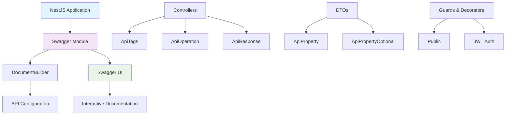
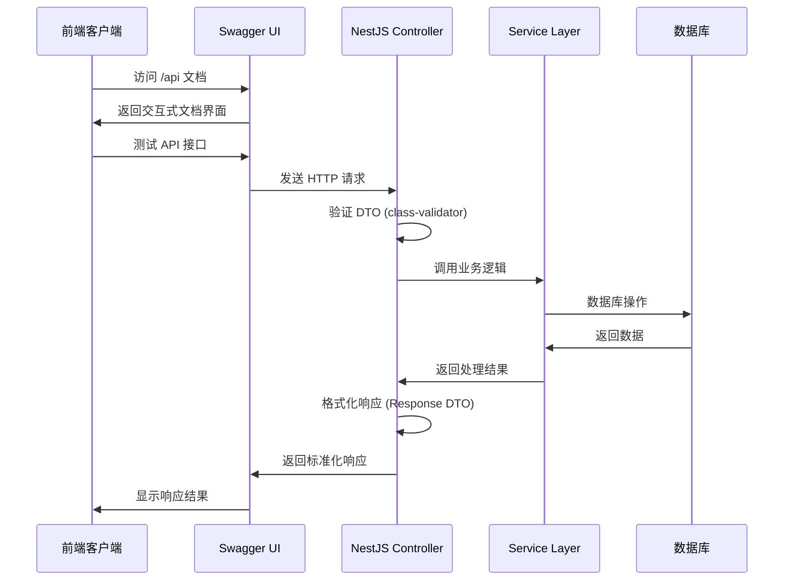

# NestJS Swagger API 文档集成教程

## 概述

本教程详细介绍了如何在 NestJS 项目中集成 Swagger API 文档，包括配置、装饰器使用、DTO 定义和最佳实践。通过本教程，你将了解从零开始构建完整的 API 文档系统的全过程。

## 为什么需要 Swagger API 文档？

在现代 Web 开发中，API 文档是前后端协作的重要桥梁：

1. **自动化文档生成**：避免手动维护文档的繁琐和不一致
2. **交互式测试**：提供可视化界面直接测试 API
3. **类型安全**：确保前端和后端的数据结构一致
4. **团队协作**：为前端开发者提供清晰的 API 规范
5. **版本管理**：随代码变更自动更新文档

## 技术架构图



## 核心实现步骤

### 第一步：安装和基础配置

#### 1.1 安装依赖

```bash
npm install @nestjs/swagger swagger-ui-express
```

#### 1.2 主应用配置 (main.ts)

```typescript
import { DocumentBuilder, SwaggerModule } from '@nestjs/swagger';

async function bootstrap() {
  const app = await NestFactory.create(AppModule);
  
  // Swagger API 文档配置
  const config = new DocumentBuilder()
    .setTitle('在线销售平台 API')
    .setDescription('微信小程序在线销售平台的后端API文档')
    .setVersion('1.0')
    .addTag('用户管理', '用户注册、登录、个人信息管理')
    .addTag('商品管理', '商品列表、详情、搜索、分类')
    .addTag('购物车', '购物车增删改查')
    .addTag('订单管理', '订单创建、查询、状态管理')
    .addTag('支付', '微信支付相关接口')
    .addBearerAuth(
      {
        type: 'http',
        scheme: 'bearer',
        bearerFormat: 'JWT',
        name: 'JWT',
        description: 'Enter JWT token',
        in: 'header',
      },
      'JWT-auth',
    )
    .build();
  
  const document = SwaggerModule.createDocument(app, config);
  SwaggerModule.setup('api', app, document, {
    swaggerOptions: {
      persistAuthorization: true,
    },
  });
}
```

**关键配置说明：**
- `setTitle()`: 设置 API 文档标题
- `addTag()`: 为不同模块添加标签分组
- `addBearerAuth()`: 配置 JWT 认证
- `persistAuthorization`: 保持认证状态

### 第二步：控制器装饰器应用

#### 2.1 控制器级别装饰器

```typescript
import { ApiTags, ApiOperation, ApiResponse, ApiParam } from '@nestjs/swagger';

@ApiTags('商品管理')
@Controller('products')
export class ProductController {
  // 控制器实现
}
```

#### 2.2 方法级别装饰器

```typescript
@ApiOperation({ 
  summary: '获取商品列表', 
  description: '分页获取商品列表，支持搜索、筛选和排序' 
})
@ApiResponse({ 
  status: 200, 
  description: '获取成功',
  schema: {
    type: 'object',
    properties: {
      success: { type: 'boolean', example: true },
      data: { $ref: '#/components/schemas/ProductListResponseDto' },
      message: { type: 'string', example: '获取商品列表成功' }
    }
  }
})
@Public()
@Get()
async findAll(@Query(ValidationPipe) query: ProductQueryDto) {
  // 方法实现
}
```

**装饰器功能说明：**
- `@ApiTags()`: 为控制器分组
- `@ApiOperation()`: 描述 API 操作
- `@ApiResponse()`: 定义响应格式
- `@ApiParam()`: 描述路径参数
- `@ApiQuery()`: 描述查询参数

### 第三步：DTO 类型定义和装饰器

#### 3.1 查询 DTO 示例

```typescript
import { ApiPropertyOptional } from '@nestjs/swagger';
import { IsOptional, IsString, IsInt, Min, IsEnum } from 'class-validator';

export class ProductQueryDto {
  @ApiPropertyOptional({ description: '搜索关键词', example: 'iPhone' })
  @IsOptional()
  @IsString()
  search?: string;

  @ApiPropertyOptional({ description: '页码', example: 1, minimum: 1 })
  @IsOptional()
  @Type(() => Number)
  @IsInt()
  @Min(1)
  page?: number = 1;

  @ApiPropertyOptional({ 
    description: '商品状态', 
    enum: ProductStatus,
    example: ProductStatus.PUBLISHED 
  })
  @IsOptional()
  @IsEnum(ProductStatus)
  status?: ProductStatus;
}
```

#### 3.2 响应 DTO 示例

```typescript
export class ProductResponseDto {
  @ApiProperty({ description: '商品ID', example: 'uuid-string' })
  id: string;

  @ApiProperty({ description: '商品名称', example: 'iPhone 15 Pro' })
  name: string;

  @ApiPropertyOptional({ description: '商品描述', example: '最新款iPhone，性能强劲' })
  description?: string;

  @ApiProperty({ description: '商品价格（分）', example: 999900 })
  price: number;

  @ApiProperty({ description: '商品状态', enum: ProductStatus, example: ProductStatus.PUBLISHED })
  status: ProductStatus;
}
```

#### 3.3 认证相关 DTO

```typescript
export class LoginDto {
  @ApiPropertyOptional({ description: '微信OpenID（微信登录时使用）', example: 'wx_openid_123' })
  @IsOptional()
  @IsString()
  openId?: string;

  @ApiPropertyOptional({ description: '邮箱地址', example: 'user@example.com' })
  @IsOptional()
  @IsEmail()
  email?: string;

  @ApiPropertyOptional({ description: '密码（最少6位）', example: 'password123', minLength: 6 })
  @IsOptional()
  @IsString()
  @MinLength(6)
  password?: string;
}
```

**DTO 装饰器说明：**
- `@ApiProperty()`: 必需属性
- `@ApiPropertyOptional()`: 可选属性
- `enum`: 枚举类型定义
- `example`: 示例值
- `minimum/maximum`: 数值范围

### 第四步：复杂类型和嵌套对象

#### 4.1 嵌套对象定义

```typescript
export class ProductResponseDto {
  @ApiPropertyOptional({ 
    description: '商家信息',
    type: 'object',
    properties: {
      id: { type: 'string', description: '商家ID', example: 'uuid-string' },
      nickname: { type: 'string', description: '商家昵称', example: '苹果官方旗舰店' },
      avatar: { type: 'string', description: '商家头像', example: 'avatar.jpg' }
    }
  })
  merchant?: {
    id: string;
    nickname?: string;
    avatar?: string;
  };

  @ApiPropertyOptional({ description: '商品规格', type: [ProductSpecResponseDto] })
  specs?: ProductSpecResponseDto[];
}
```

#### 4.2 分页响应包装

```typescript
export class ProductListResponseDto {
  @ApiProperty({ description: '商品列表', type: [ProductResponseDto] })
  products: ProductResponseDto[];

  @ApiProperty({ description: '总数量', example: 100 })
  total: number;

  @ApiProperty({ description: '当前页码', example: 1 })
  page: number;

  @ApiProperty({ description: '每页数量', example: 10 })
  limit: number;

  @ApiProperty({ description: '总页数', example: 10 })
  totalPages: number;
}
```

## 数据流程图



## 最佳实践和注意事项

### 1. DTO 设计原则

- **单一职责**：每个 DTO 只负责一个特定的数据传输场景
- **类型安全**：使用 TypeScript 类型和 class-validator 装饰器
- **文档完整**：每个属性都应该有清晰的描述和示例

### 2. 装饰器使用规范

```typescript
// ✅ 好的实践
@ApiPropertyOptional({ 
  description: '用户昵称', 
  example: '张三',
  minLength: 1,
  maxLength: 50
})
@IsOptional()
@IsString()
@Length(1, 50)
nickname?: string;

// ❌ 避免的做法
@ApiPropertyOptional()
@IsOptional()
nickname?: string; // 缺少描述和示例
```

### 3. 响应格式标准化

```typescript
// 统一的响应格式
interface ApiResponse<T> {
  success: boolean;
  data: T | null;
  message: string;
  timestamp?: string;
}
```

### 4. 错误处理文档化

```typescript
@ApiResponse({ 
  status: 400, 
  description: '请求参数错误',
  schema: {
    type: 'object',
    properties: {
      success: { type: 'boolean', example: false },
      data: { type: 'null' },
      message: { type: 'string', example: '搜索关键词不能为空' }
    }
  }
})
```

## 常见问题和解决方案

### 问题 1：DTO 在 Swagger 中显示为空

**原因**：缺少 `@ApiProperty` 或 `@ApiPropertyOptional` 装饰器

**解决方案**：
```typescript
// 修改前
export class LoginDto {
  @IsOptional()
  @IsString()
  openId?: string;
}

// 修改后
export class LoginDto {
  @ApiPropertyOptional({ description: '微信OpenID', example: 'wx_openid_123' })
  @IsOptional()
  @IsString()
  openId?: string;
}
```

### 问题 2：枚举类型不显示可选值

**解决方案**：
```typescript
@ApiPropertyOptional({ 
  description: '商品状态', 
  enum: ProductStatus,
  example: ProductStatus.PUBLISHED 
})
@IsOptional()
@IsEnum(ProductStatus)
status?: ProductStatus;
```

### 问题 3：嵌套对象类型不正确

**解决方案**：
```typescript
@ApiPropertyOptional({ 
  description: '商品规格', 
  type: [ProductSpecResponseDto] // 使用具体的 DTO 类
})
specs?: ProductSpecResponseDto[];
```

## 部署和访问

### 开发环境

1. 启动应用：`npm run start:dev`
2. 访问文档：`http://localhost:3001/api`

### 生产环境注意事项

```typescript
// 生产环境可能需要条件性启用 Swagger
if (process.env.NODE_ENV !== 'production') {
  const document = SwaggerModule.createDocument(app, config);
  SwaggerModule.setup('api', app, document);
}
```

## 总结

通过本教程，我们完成了：

1. **Swagger 基础配置**：在 NestJS 中集成 Swagger 模块
2. **控制器文档化**：使用装饰器为 API 端点添加文档
3. **DTO 类型定义**：创建完整的数据传输对象
4. **最佳实践应用**：遵循标准化的文档编写规范

这套 API 文档系统为前后端协作提供了强有力的支持，确保了 API 的可维护性和可测试性。随着项目的发展，文档会自动保持同步，大大提高了开发效率。

## 相关资源

- [NestJS Swagger 官方文档](https://docs.nestjs.com/openapi/introduction)
- [OpenAPI 规范](https://swagger.io/specification/)
- [Class Validator 文档](https://github.com/typestack/class-validator)