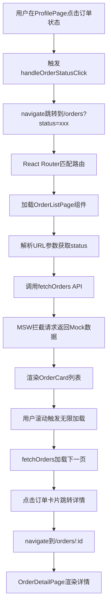
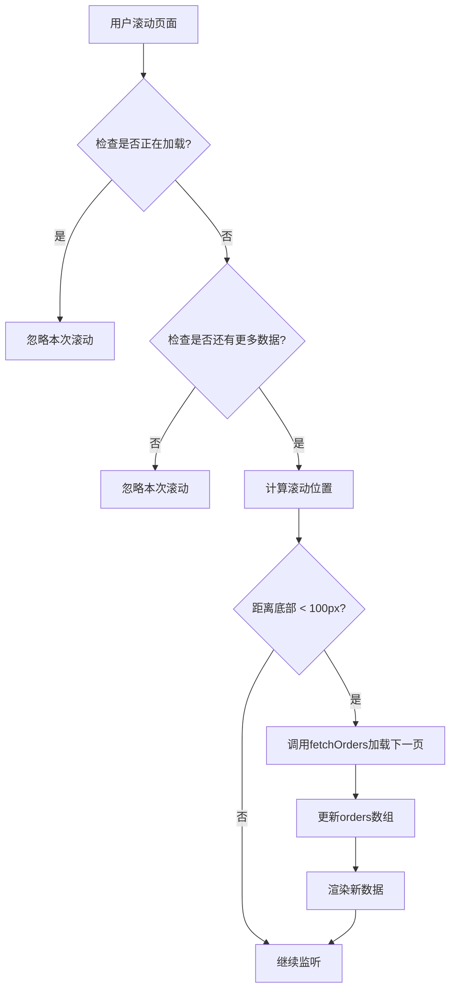

# 订单管理系统架构解析：从用户点击到无限滚动的完整实现指南

## 前言：为什么需要订单管理功能？

在现代电商应用中，订单管理是连接用户购买行为与商家履约的核心纽带。一个完善的订单管理系统不仅要让用户能够清晰地追踪购买历史，更要通过良好的交互设计提升用户的购物体验。本教程将深入解析我们如何在 React+Vite 应用中实现一个功能完整、体验流畅的订单管理系统。

## 目录

1. [整体架构概览](#整体架构概览)
2. [用户流程：从点击到页面渲染](#用户流程从点击到页面渲染)
3. [路由系统：URL 到组件的映射机制](#路由系统url到组件的映射机制)
4. [核心组件深度解析](#核心组件深度解析)
5. [无限滚动：性能与体验的平衡](#无限滚动性能与体验的平衡)
6. [Mock 数据设计：前后端分离的最佳实践](#mock数据设计前后端分离的最佳实践)
7. [状态管理与筛选逻辑](#状态管理与筛选逻辑)
8. [最佳实践与开发经验](#最佳实践与开发经验)

## 整体架构概览

### 系统组件层次结构

我们的订单管理系统采用了分层的组件架构，每个层次都有明确的职责：

```
订单管理系统
├── 路由层 (App.tsx)
│   ├── /orders → OrderListPage
│   └── /orders/:id → OrderDetailPage
├── 页面层 (Page Components)
│   ├── OrderListPage (列表页面)
│   └── OrderDetailPage (详情页面)
├── UI组件层 (UI Components)
│   └── OrderCard (订单卡片)
├── 数据层 (Mock Data)
│   └── order.ts (订单数据与API)
└── 入口层 (Entry Points)
    └── ProfilePage (从个人中心进入)
```

### 设计原则

1. **关注点分离**：UI 展示、数据获取、状态管理各司其职
2. **组件复用**：OrderCard 既用于列表也可用于其他场景
3. **渐进式增强**：从基础功能到高级特性（无限滚动、筛选）
4. **用户体验优先**：加载状态、错误处理、空状态都有考虑

## 用户流程：从点击到页面渲染

让我们跟随一个真实的用户操作，了解整个系统是如何响应的：

### 流程图



### 详细步骤解析

#### 步骤 1：用户交互触发 (ProfilePage.tsx)

```tsx
// src/pages/profile/ProfilePage.tsx
const handleOrderStatusClick = (statusId: string) => {
  switch (statusId) {
    case "pending_payment":
      navigate("/orders?status=pending_payment");
      break;
    // ... 其他状态
  }
};
```

**关键点**：

- 使用 React Router 的`navigate`函数进行编程式导航
- 通过 URL 参数传递状态筛选条件
- 保持 URL 的 RESTful 设计原则

#### 步骤 2：路由匹配与组件加载 (App.tsx)

```tsx
// src/App.tsx
const OrderListPage = React.lazy(() => import("./pages/order/OrderListPage"));

<Routes>
  <Route path="orders" element={<OrderListPage />} />
  <Route path="orders/:id" element={<OrderDetailPage />} />
</Routes>;
```

**关键点**：

- 使用`React.lazy`实现代码分割，提升首屏加载性能
- 清晰的路由层次：列表页和详情页分离
- 支持动态参数`:id`用于详情页面

#### 步骤 3：URL 参数解析与初始化 (OrderListPage.tsx)

```tsx
// src/pages/order/OrderListPage.tsx
const location = useLocation();
const urlParams = new URLSearchParams(location.search);
const initialStatus = urlParams.get("status") || "";

useEffect(() => {
  fetchOrders(1, selectedStatus, true);
}, []);
```

**关键点**：

- 使用`useLocation`钩子获取当前 URL 信息
- `URLSearchParams`API 解析查询参数
- 初始化时就根据 URL 参数进行状态筛选

## 核心组件深度解析

### OrderCard 组件：信息密度与交互性的平衡

OrderCard 是整个订单系统的 UI 基石，我们来分析它是如何在有限的空间内展示丰富信息的：

```tsx
// src/components/ui/OrderCard.tsx
const OrderCard: React.FC<OrderCardProps> = ({ order, onClick }) => {
  // 获取第一个商品用于显示
  const firstItem = order.items[0];
  const hasMoreItems = order.items.length > 1;

  return (
    <div onClick={handleCardClick} className="cursor-pointer hover:shadow-md">
      {/* 订单头部：订单号 + 状态 */}
      <div className="flex items-center justify-between">
        <span>订单号: {order.orderNumber}</span>
        <span className={statusInfo.color}>{statusInfo.label}</span>
      </div>

      {/* 商品信息：只显示第一个商品 */}
      {firstItem && (
        <div className="flex items-start space-x-3">
          
          <div className="flex-1">
            <h3>{firstItem.name}</h3>
            {/* 规格显示 */}
            {Object.entries(firstItem.selectedVariants).map(([key, value]) => (
              <span key={key}>
                {key}: {value}
              </span>
            ))}
          </div>
        </div>
      )}

      {/* 更多商品提示 */}
      {hasMoreItems && <div>还有 {order.items.length - 1} 件其他商品</div>}
    </div>
  );
};
```

**设计亮点**：

1. **信息优先级**：订单号、状态、主要商品信息优先显示
2. **渐进式信息披露**：只显示第一个商品，通过"还有 X 件"提示完整信息
3. **交互反馈**：`hover:shadow-md`提供视觉反馈
4. **可扩展性**：通过`onClick`回调支持不同场景的点击处理

### OrderListPage：复杂状态管理的典范

OrderListPage 是一个状态管理的复杂组件，让我们分析它是如何优雅地处理多个异步状态的：

```tsx
// src/pages/order/OrderListPage.tsx
const OrderListPage: React.FC = () => {
  // 状态管理：数据、加载、分页、筛选
  const [orders, setOrders] = useState<Order[]>([]);
  const [loading, setLoading] = useState(false);
  const [hasMore, setHasMore] = useState(true);
  const [page, setPage] = useState(1);
  const [selectedStatus, setSelectedStatus] = useState(initialStatus);

  // 核心业务逻辑：获取订单数据
  const fetchOrders = useCallback(
    async (pageNum: number, status: string = "", reset: boolean = false) => {
      if (loading) return; // 防止重复请求

      setLoading(true);
      // ... API调用逻辑
      setOrders((prev) => (reset ? data.orders : [...prev, ...data.orders]));
      setHasMore(pageNum < data.pagination.totalPages);
    },
    [loading]
  );
};
```

**架构亮点**：

1. **状态隔离**：每个状态都有明确的职责和生命周期
2. **防抖保护**：`if (loading) return`防止重复请求
3. **数据合并**：支持重置（筛选时）和追加（分页时）两种模式
4. **依赖优化**：`useCallback`配合依赖数组优化性能

## 无限滚动：性能与体验的平衡

无限滚动是现代移动应用的标配功能，我们来深入理解其实现原理：

### 滚动检测机制

```tsx
// src/pages/order/OrderListPage.tsx
const handleScroll = useCallback(() => {
  if (loading || !hasMore) return;

  const scrollTop = window.pageYOffset || document.documentElement.scrollTop;
  const windowHeight = window.innerHeight;
  const documentHeight = document.documentElement.scrollHeight;

  // 当滚动到底部100px时加载更多
  if (scrollTop + windowHeight >= documentHeight - 100) {
    fetchOrders(page + 1, selectedStatus);
  }
}, [loading, hasMore, page, selectedStatus, fetchOrders]);

useEffect(() => {
  window.addEventListener("scroll", handleScroll);
  return () => window.removeEventListener("scroll", handleScroll);
}, [handleScroll]);
```

### 实现原理图解



**性能优化策略**：

1. **防抖处理**：通过 loading 状态防止频繁触发
2. **预加载**：距离底部 100px 就开始加载，提升用户体验
3. **内存清理**：及时移除事件监听器防止内存泄漏
4. **依赖优化**：`useCallback`减少不必要的重新绑定

## Mock 数据设计：前后端分离的最佳实践

我们的 Mock 数据系统不仅仅是"假数据"，而是一个完整的 API 仿真系统：

### 分页数据结构

```tsx
// src/mocks/handlers/order.ts
http.get("/api/orders", ({ request }) => {
  const url = new URL(request.url);
  const page = parseInt(url.searchParams.get("page") || "1");
  const limit = parseInt(url.searchParams.get("limit") || "10");

  // 生成20条mock数据
  const mockOrders: Order[] = Array.from({ length: 20 }, (_, index) => ({
    id: `order_${index + 1}`,
    orderNumber: `ORD${Date.now() - index * 86400000}${Math.floor(
      Math.random() * 1000
    )}`,
    status: ["pending", "paid", "shipped", "delivered"][
      Math.floor(Math.random() * 4)
    ],
    // ... 更多字段
  }));

  const startIndex = (page - 1) * limit;
  const endIndex = startIndex + limit;
  const paginatedOrders = mockOrders.slice(startIndex, endIndex);

  return HttpResponse.json({
    orders: paginatedOrders,
    pagination: {
      page,
      limit,
      total: mockOrders.length,
      totalPages: Math.ceil(mockOrders.length / limit),
    },
  });
});
```

**设计优势**：

1. **真实分页逻辑**：完全模拟后端 API 的分页机制
2. **随机数据生成**：每次刷新都有不同的数据分布
3. **标准响应格式**：为后续真实 API 对接奠定基础
4. **状态多样性**：包含各种订单状态的数据

## 状态管理与筛选逻辑

### URL 状态同步机制

我们实现了一个优雅的 URL 状态同步机制，让用户的筛选操作能够反映在 URL 中：

```tsx
// src/pages/order/OrderListPage.tsx
const handleStatusChange = (status: string) => {
  setSelectedStatus(status);
  setOrders([]);
  setPage(1);
  setHasMore(true);
  fetchOrders(1, status, true);

  // 更新URL参数
  const newParams = new URLSearchParams();
  if (status) {
    newParams.set("status", status);
  }
  navigate(`/orders?${newParams.toString()}`, { replace: true });
};
```

**实现亮点**：

1. **状态重置**：切换筛选条件时清空现有数据
2. **URL 同步**：筛选状态实时反映在 URL 中
3. **历史管理**：使用`replace: true`避免产生多余的历史记录
4. **书签友好**：用户可以直接分享筛选后的 URL

### 状态筛选 UI 设计

```tsx
// 状态筛选标签
<div className="flex space-x-2 overflow-x-auto">
  {statusOptions.map((option) => (
    <button
      key={option.value}
      onClick={() => handleStatusChange(option.value)}
      className={`px-4 py-2 rounded-full text-sm font-medium whitespace-nowrap flex-shrink-0 transition-colors ${
        selectedStatus === option.value
          ? "bg-blue-600 text-white"
          : "bg-gray-100 text-gray-600 hover:bg-gray-200"
      }`}
    >
      {option.label}
    </button>
  ))}
</div>
```

**UI 设计考虑**：

1. **移动优先**：`overflow-x-auto`支持横向滚动
2. **视觉层次**：选中状态有明显的色彩区分
3. **交互反馈**：悬停状态提供即时反馈
4. **布局稳定**：`whitespace-nowrap`防止文字换行

## 最佳实践与开发经验

### 1. 组件设计原则

**单一职责原则**：

- `OrderCard`只负责展示单个订单信息
- `OrderListPage`专注于列表管理和分页
- `OrderDetailPage`专门处理详情展示

**可复用性设计**：

```tsx
// OrderCard支持自定义点击处理
interface OrderCardProps {
  order: Order;
  onClick?: (order: Order) => void; // 可选的自定义点击处理
}
```

### 2. 性能优化策略

**懒加载与代码分割**：

```tsx
// App.tsx中的懒加载
const OrderListPage = React.lazy(() => import("./pages/order/OrderListPage"));
```

**状态更新优化**：

```tsx
// 使用函数式更新避免闭包陷阱
setOrders((prev) => (reset ? data.orders : [...prev, ...data.orders]));
```

**事件监听器清理**：

```tsx
useEffect(() => {
  window.addEventListener("scroll", handleScroll);
  return () => window.removeEventListener("scroll", handleScroll);
}, [handleScroll]);
```

### 3. 用户体验设计

**加载状态管理**：

- 首次加载：骨架屏占位
- 分页加载：底部 loading 指示器
- 错误状态：友好的错误提示和重试按钮

**空状态设计**：

```tsx
{
  !loading && orders.length === 0 && !error && (
    <div className="text-center py-20">
      <p className="text-gray-500 text-lg mb-2">暂无订单</p>
      <p className="text-gray-400 text-sm mb-6">快去挑选心仪的商品吧</p>
      <button onClick={() => navigate("/shop")}>去购物</button>
    </div>
  );
}
```

### 4. 错误处理与边界情况

**网络错误处理**：

```tsx
try {
  const response = await fetch(`/api/orders?${params}`);
  if (!response.ok) {
    throw new Error("获取订单列表失败");
  }
} catch (err) {
  setError(err instanceof Error ? err.message : "未知错误");
}
```

**边界条件考虑**：

- 没有更多数据时的提示
- 网络请求失败的重试机制
- 订单 ID 不存在时的 404 处理

## 技术要点总结

### 关键技术栈

| 技术            | 用途     | 优势                   |
| --------------- | -------- | ---------------------- |
| React Router v6 | 路由管理 | 声明式路由，支持懒加载 |
| React Hooks     | 状态管理 | 函数组件，逻辑复用     |
| MSW             | API Mock | 真实的网络请求仿真     |
| TailwindCSS     | 样式设计 | 原子化 CSS，快速开发   |
| TypeScript      | 类型安全 | 编译时错误检查         |

### 核心实现模式

1. **容器组件模式**：页面组件负责数据获取和状态管理
2. **展示组件模式**：UI 组件专注于视觉呈现
3. **Hooks 模式**：自定义 Hook 封装复杂逻辑
4. **URL 状态模式**：筛选条件通过 URL 参数管理

## 未来扩展方向

### 短期优化

1. **虚拟滚动**：处理大量订单数据时的性能优化
2. **离线支持**：PWA 缓存策略，支持离线浏览历史订单
3. **搜索功能**：按订单号、商品名称搜索

### 长期规划

1. **实时更新**：WebSocket 推送订单状态变更
2. **数据分析**：订单统计和趋势分析
3. **多端同步**：跨设备的订单状态同步

---

通过这个订单管理系统的实现，我们展示了如何在 React 应用中构建一个功能完整、性能优良的复杂功能模块。从用户的第一次点击到最终的页面渲染，每个环节都经过了精心设计，体现了现代前端开发的最佳实践。

这个系统不仅仅是代码的堆砌，更是产品思维、用户体验和技术实现的完美结合。它为我们后续的功能开发提供了坚实的基础和宝贵的经验。
