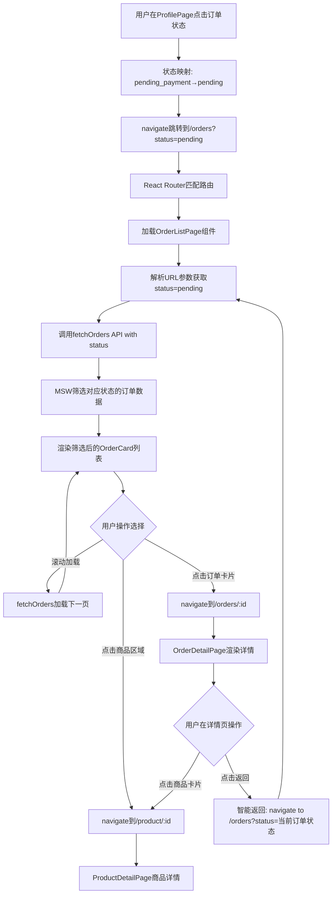
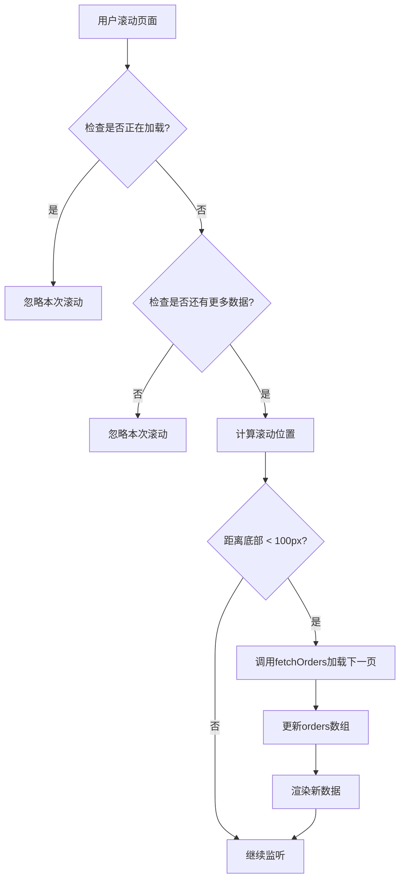

# 订单管理系统架构解析：从用户点击到无限滚动的完整实现指南

## 前言：为什么需要订单管理功能？

在现代电商应用中，订单管理是连接用户购买行为与商家履约的核心纽带。一个完善的订单管理系统不仅要让用户能够清晰地追踪购买历史，更要通过良好的交互设计提升用户的购物体验。本教程将深入解析我们如何在 React+Vite 应用中实现一个功能完整、体验流畅的订单管理系统。

## 目录

1. [整体架构概览](#整体架构概览)
2. [用户流程：从点击到页面渲染](#用户流程从点击到页面渲染)
3. [Profile 页面状态联动机制](#profile页面状态联动机制)
4. [路由系统：URL 到组件的映射机制](#路由系统url到组件的映射机制)
5. [核心组件深度解析](#核心组件深度解析)
6. [商品跳转功能实现](#商品跳转功能实现)
7. [无限滚动：性能与体验的平衡](#无限滚动性能与体验的平衡)
8. [Mock 数据设计：前后端分离的最佳实践](#mock数据设计前后端分离的最佳实践)
9. [状态管理与筛选逻辑](#状态管理与筛选逻辑)
10. [智能返回与导航优化](#智能返回与导航优化)
11. [最佳实践与开发经验](#最佳实践与开发经验)

## 整体架构概览

### 系统组件层次结构

我们的订单管理系统采用了分层的组件架构，每个层次都有明确的职责：

```
订单管理系统
├── 路由层 (App.tsx)
│   ├── /orders → OrderListPage
│   └── /orders/:id → OrderDetailPage
├── 页面层 (Page Components)
│   ├── OrderListPage (列表页面)
│   ├── OrderDetailPage (详情页面)
│   └── ProfilePage (个人中心 - 入口页面)
├── UI组件层 (UI Components)
│   └── OrderCard (订单卡片 - 支持商品跳转)
├── 数据层 (Mock Data)
│   └── order.ts (订单数据与API - 支持状态筛选)
└── 导航层 (Navigation)
    ├── 状态联动机制
    ├── 智能返回功能
    └── 商品跳转逻辑
```

### 设计原则

1. **关注点分离**：UI 展示、数据获取、状态管理各司其职
2. **组件复用**：OrderCard 既用于列表也可用于其他场景
3. **渐进式增强**：从基础功能到高级特性（无限滚动、筛选、跳转）
4. **用户体验优先**：状态联动、智能返回、商品跳转等体验优化
5. **一致性导航**：保持用户在不同页面间的状态上下文

## 用户流程：从点击到页面渲染

让我们跟随一个真实的用户操作，了解整个系统是如何响应的：

### 完整用户流程图



### 详细步骤解析

#### 步骤 1：用户交互触发 (ProfilePage.tsx)

```tsx
// src/pages/profile/ProfilePage.tsx
const handleOrderStatusClick = (statusId: string) => {
  // 映射Profile页面的状态ID到订单列表页面的状态参数
  const statusMapping: { [key: string]: string } = {
    pending_payment: "pending", // 待付款 → pending
    pending_shipment: "paid", // 待发货 → paid
    pending_delivery: "shipped", // 待收货 → shipped
    pending_review: "delivered", // 待评价 → delivered
    refund_service: "cancelled", // 退款/售后 → cancelled
  };

  const mappedStatus = statusMapping[statusId];
  if (mappedStatus) {
    navigate(`/orders?status=${mappedStatus}`);
  } else {
    navigate("/orders");
  }
};
```

**关键改进**：

- ✅ **状态映射机制**：解决了 Profile 页面状态 ID 与订单 API 状态参数不匹配的问题
- ✅ **容错处理**：未知状态时默认跳转到全部订单
- ✅ **语义化映射**：用户界面语言与后端 API 状态的完美对接

## Profile 页面状态联动机制

### 问题背景

在实际开发中，我们发现 Profile 页面的订单状态标识（如`pending_payment`）与订单列表 API 的状态参数（如`pending`）存在不匹配问题，导致用户点击状态后无法看到正确的筛选结果。

### 解决方案：状态映射表

我们设计了一个完整的状态映射机制：

```tsx
// 状态映射关系表
const statusMapping = {
  // Profile显示 → API参数 → 用户理解
  pending_payment: "pending", // 待付款 → pending → 等待用户付款
  pending_shipment: "paid", // 待发货 → paid → 商家准备发货
  pending_delivery: "shipped", // 待收货 → shipped → 商品在运输中
  pending_review: "delivered", // 待评价 → delivered → 商品已送达
  refund_service: "cancelled", // 退款/售后 → cancelled → 订单问题处理
};
```

### 实现效果

- **点击"待付款"** → 自动跳转到显示所有`pending`状态订单的列表
- **点击"待发货"** → 自动跳转到显示所有`paid`状态订单的列表
- **状态筛选标签自动选中** → 用户看到正确的筛选结果

## 路由系统：URL 到组件的映射机制

### 路由层 (App.tsx)

```tsx
// src/App.tsx
const OrderListPage = React.lazy(() => import("./pages/order/OrderListPage"));
const OrderDetailPage = React.lazy(
  () => import("./pages/order/OrderDetailPage")
);

<Routes>
  <Route path="orders" element={<OrderListPage />} />
  <Route path="orders/:id" element={<OrderDetailPage />} />
</Routes>;
```

### 页面层 (Page Components)

- `OrderListPage`：负责订单列表的展示和分页，包含状态筛选、无限滚动等功能。
- `OrderDetailPage`：负责订单详情的展示，包含商品信息、物流信息等。
- `ProfilePage`：作为入口页面，提供订单状态筛选的入口。

### 核心组件层 (UI Components)

- `OrderCard`：订单列表中展示单个订单的卡片组件，包含订单号、状态、商品信息等。
- `OrderDetailPage`：订单详情页面，展示订单的详细信息，包括商品列表、物流信息等。

### 数据层 (Mock Data)

- `order.ts`：模拟订单数据的获取和更新，支持状态筛选、分页等功能。

## 核心组件深度解析

### OrderCard 组件：信息密度与交互性的平衡

OrderCard 组件在最新版本中新增了商品跳转功能，让我们分析这个重要的交互改进：

```tsx
// src/components/ui/OrderCard.tsx
const OrderCard: React.FC<OrderCardProps> = ({ order, onClick }) => {
  // 处理商品点击 - 跳转到商品详情页
  const handleProductClick = (e: React.MouseEvent, productId: string) => {
    e.stopPropagation(); // 🔑 关键：阻止事件冒泡，避免触发卡片点击
    navigate(`/product/${productId}`);
  };

  return (
    <div onClick={handleCardClick} className="cursor-pointer hover:shadow-md">
      {/* 订单头部信息 */}
      <div className="flex items-center justify-between">
        <span>订单号: {order.orderNumber}</span>
        <span className={statusInfo.color}>{statusInfo.label}</span>
      </div>

      {/* 🆕 新增：可点击的商品区域 */}
      {firstItem && (
        <div
          className="flex items-start space-x-3 mb-3 cursor-pointer hover:bg-gray-50 rounded-lg p-2 -m-2 transition-colors"
          onClick={(e) => handleProductClick(e, firstItem.productId)}
          title="点击查看商品详情"
        >
          
          <div className="flex-1 min-w-0">
            <h3 className="text-sm font-medium text-gray-900 truncate hover:text-blue-600 transition-colors">
              {firstItem.name}
            </h3>
            {/* 规格显示 */}
            {Object.entries(firstItem.selectedVariants).map(([key, value]) => (
              <span key={key}>
                {key}: {value}
              </span>
            ))}
          </div>
        </div>
      )}

      {/* 更多商品提示 */}
      {hasMoreItems && <div>还有 {order.items.length - 1} 件其他商品</div>}
    </div>
  );
};
```

**新增功能亮点**：

1. **双重交互区域**：

   - 点击订单卡片 → 跳转订单详情
   - 点击商品区域 → 跳转商品详情

2. **事件冒泡控制**：

   - 使用`e.stopPropagation()`防止商品点击触发订单点击
   - 确保两种点击行为相互独立

3. **视觉反馈设计**：
   - 商品区域独立的悬停效果（背景变灰）
   - 商品标题悬停时颜色变蓝
   - 添加`title`属性提供操作提示

### OrderListPage：复杂状态管理的典范

OrderListPage 是一个状态管理的复杂组件，让我们分析它是如何优雅地处理多个异步状态的：

```tsx
// src/pages/order/OrderListPage.tsx
const OrderListPage: React.FC = () => {
  // 状态管理：数据、加载、分页、筛选
  const [orders, setOrders] = useState<Order[]>([]);
  const [loading, setLoading] = useState(false);
  const [hasMore, setHasMore] = useState(true);
  const [page, setPage] = useState(1);
  const [selectedStatus, setSelectedStatus] = useState(initialStatus);

  // 核心业务逻辑：获取订单数据
  const fetchOrders = useCallback(
    async (pageNum: number, status: string = "", reset: boolean = false) => {
      if (loading) return; // 防止重复请求

      setLoading(true);
      // ... API调用逻辑
      setOrders((prev) => (reset ? data.orders : [...prev, ...data.orders]));
      setHasMore(pageNum < data.pagination.totalPages);
    },
    [loading]
  );
};
```

**架构亮点**：

1. **状态隔离**：每个状态都有明确的职责和生命周期
2. **防抖保护**：`if (loading) return`防止重复请求
3. **数据合并**：支持重置（筛选时）和追加（分页时）两种模式
4. **依赖优化**：`useCallback`配合依赖数组优化性能

## 商品跳转功能实现

### OrderDetailPage 中的商品跳转

除了订单列表中的商品跳转，我们还在订单详情页面实现了同样的功能：

```tsx
// src/pages/order/OrderDetailPage.tsx
const OrderDetailPage: React.FC = () => {
  // 处理商品点击 - 跳转到商品详情页
  const handleProductClick = (productId: string) => {
    navigate(`/product/${productId}`);
  };

  return (
    <div>
      {/* 商品信息卡片 */}
      <div className="bg-white rounded-lg shadow-sm border border-gray-100 p-4">
        <h3 className="text-lg font-medium text-gray-900 mb-4">商品信息</h3>

        <div className="space-y-4">
          {order.items.map((item, index) => (
            <div
              key={index}
              className="flex items-start space-x-3 cursor-pointer hover:bg-gray-50 rounded-lg p-3 -mx-3 transition-colors"
              onClick={() => handleProductClick(item.productId)}
              title="点击查看商品详情"
            >
              
              <div className="flex-1 min-w-0">
                <h4 className="text-sm font-medium text-gray-900 mb-1 hover:text-blue-600 transition-colors">
                  {item.name}
                </h4>
                {/* 商品规格和价格信息 */}
              </div>
            </div>
          ))}
        </div>
      </div>
    </div>
  );
};
```

### 跨页面的一致性体验

通过在多个页面实现相同的商品跳转逻辑，我们确保了：

1. **交互一致性**：用户在任何页面看到商品信息时都可以点击查看详情
2. **学习成本降低**：相同的交互模式减少用户的认知负担
3. **购买路径优化**：用户可以从订单历史快速回到商品页面进行复购

## 无限滚动：性能与体验的平衡

### 滚动检测机制

```tsx
// src/pages/order/OrderListPage.tsx
const handleScroll = useCallback(() => {
  if (loading || !hasMore) return;

  const scrollTop = window.pageYOffset || document.documentElement.scrollTop;
  const windowHeight = window.innerHeight;
  const documentHeight = document.documentElement.scrollHeight;

  // 当滚动到底部100px时加载更多
  if (scrollTop + windowHeight >= documentHeight - 100) {
    fetchOrders(page + 1, selectedStatus);
  }
}, [loading, hasMore, page, selectedStatus, fetchOrders]);

useEffect(() => {
  window.addEventListener("scroll", handleScroll);
  return () => window.removeEventListener("scroll", handleScroll);
}, [handleScroll]);
```

### 实现原理图解



**性能优化策略**：

1. **防抖处理**：通过 loading 状态防止频繁触发
2. **预加载**：距离底部 100px 就开始加载，提升用户体验
3. **内存清理**：及时移除事件监听器防止内存泄漏
4. **依赖优化**：`useCallback`减少不必要的重新绑定

## Mock 数据设计：前后端分离的最佳实践

### 🆕 状态筛选功能的 MSW 实现

我们显著改进了 MSW handler，现在它能够正确处理状态筛选：

```tsx
// src/mocks/handlers/order.ts
http.get("/api/orders", ({ request }) => {
  const url = new URL(request.url);
  const page = parseInt(url.searchParams.get("page") || "1");
  const limit = parseInt(url.searchParams.get("limit") || "10");
  const status = url.searchParams.get("status"); // 🆕 获取状态筛选参数

  // 🆕 为了保证筛选结果的可预测性，我们固定生成特定状态的订单
  const allStatuses: Order["status"][] = [
    "pending",
    "paid",
    "shipped",
    "delivered",
    "cancelled",
  ];
  const mockOrders: Order[] = [];

  // 🆕 为每种状态生成5个订单，确保有足够的数据进行筛选
  allStatuses.forEach((orderStatus, statusIndex) => {
    for (let i = 0; i < 5; i++) {
      const index = statusIndex * 5 + i;
      mockOrders.push({
        id: `order_${index + 1}`,
        orderNumber: `ORD${Date.now() - index * 86400000}${Math.floor(
          Math.random() * 1000
        )}`,
        status: orderStatus, // 🔑 确保状态分布均匀
        // ... 其他订单数据
      });
    }
  });

  // 🆕 根据状态筛选订单
  let filteredOrders = mockOrders;
  if (status && status !== "all") {
    filteredOrders = mockOrders.filter((order) => order.status === status);
  }

  // 🆕 按创建时间降序排序
  filteredOrders.sort(
    (a, b) => new Date(b.createdAt).getTime() - new Date(a.createdAt).getTime()
  );

  const startIndex = (page - 1) * limit;
  const endIndex = startIndex + limit;
  const paginatedOrders = filteredOrders.slice(startIndex, endIndex);

  return HttpResponse.json({
    orders: paginatedOrders,
    pagination: {
      page,
      limit,
      total: filteredOrders.length, // 🔑 基于筛选后的总数
      totalPages: Math.ceil(filteredOrders.length / limit),
    },
  });
});
```

**改进亮点**：

1. **真实的状态筛选**：API 现在能根据`status`参数返回对应状态的订单
2. **数据分布均匀**：每种状态固定生成 5 个订单，确保筛选结果稳定
3. **分页逻辑正确**：基于筛选后的数据进行分页计算
4. **时间排序**：订单按创建时间降序排列，符合用户期望

## 状态管理与筛选逻辑

### URL 状态同步机制

我们实现了一个优雅的 URL 状态同步机制，让用户的筛选操作能够反映在 URL 中：

```tsx
// src/pages/order/OrderListPage.tsx
const handleStatusChange = (status: string) => {
  setSelectedStatus(status);
  setOrders([]);
  setPage(1);
  setHasMore(true);
  fetchOrders(1, status, true);

  // 更新URL参数
  const newParams = new URLSearchParams();
  if (status) {
    newParams.set("status", status);
  }
  navigate(`/orders?${newParams.toString()}`, { replace: true });
};
```

**实现亮点**：

1. **状态重置**：切换筛选条件时清空现有数据
2. **URL 同步**：筛选状态实时反映在 URL 中
3. **历史管理**：使用`replace: true`避免产生多余的历史记录
4. **书签友好**：用户可以直接分享筛选后的 URL

### 状态筛选 UI 设计

```tsx
// 状态筛选标签
<div className="flex space-x-2 overflow-x-auto">
  {statusOptions.map((option) => (
    <button
      key={option.value}
      onClick={() => handleStatusChange(option.value)}
      className={`px-4 py-2 rounded-full text-sm font-medium whitespace-nowrap flex-shrink-0 transition-colors ${
        selectedStatus === option.value
          ? "bg-blue-600 text-white"
          : "bg-gray-100 text-gray-600 hover:bg-gray-200"
      }`}
    >
      {option.label}
    </button>
  ))}
</div>
```

**UI 设计考虑**：

1. **移动优先**：`overflow-x-auto`支持横向滚动
2. **视觉层次**：选中状态有明显的色彩区分
3. **交互反馈**：悬停状态提供即时反馈
4. **布局稳定**：`whitespace-nowrap`防止文字换行

## 智能返回与导航优化

### 🆕 OrderDetailPage 的智能返回功能

我们为订单详情页面实现了智能返回机制，让用户返回时能看到正确的筛选状态：

```tsx
// src/pages/order/OrderDetailPage.tsx
const OrderDetailPage: React.FC = () => {
  const [order, setOrder] = useState<Order | null>(null);

  // 🆕 智能返回逻辑
  const handleGoBack = () => {
    // 如果有订单信息，根据订单状态智能返回到对应的筛选页面
    if (order) {
      navigate(`/orders?status=${order.status}`);
    } else {
      // 如果没有订单信息，使用浏览器返回
      navigate(-1);
    }
  };

  // ... 其他代码
};
```

**智能返回的优势**：

1. **上下文保持**：用户从"待发货"筛选进入详情，返回时仍然看到"待发货"列表
2. **减少操作步骤**：无需重新选择筛选条件
3. **用户体验一致**：保持了整个浏览过程的连贯性

### 导航流程优化

```mermaid
graph LR
    A[Profile: 点击"待发货"] --> B[订单列表: 显示paid状态]
    B --> C[点击某个订单]
    C --> D[订单详情页面]
    D --> E[点击返回]
    E --> F[智能返回: 显示paid状态列表]

    D --> G[点击商品]
    G --> H[商品详情页面]
    H --> I[正常返回]
    I --> D
```

## 最佳实践与开发经验

### 1. 🆕 状态联动设计模式

**问题**：不同页面使用不同的状态标识系统
**解决方案**：创建状态映射层

```tsx
// 可复用的状态映射工具
export const createStatusMapper = (mappingTable: Record<string, string>) => {
  return (sourceStatus: string): string => {
    return mappingTable[sourceStatus] || sourceStatus;
  };
};

// 使用示例
const profileToOrderStatus = createStatusMapper({
  pending_payment: "pending",
  pending_shipment: "paid",
  // ... 更多映射
});
```

### 2. 🆕 事件冒泡控制模式

**问题**：嵌套可点击元素的交互冲突
**解决方案**：精确的事件控制

```tsx
// 最佳实践：事件处理的层次设计
const handleParentClick = () => {
  // 父级点击逻辑
};

const handleChildClick = (e: React.MouseEvent) => {
  e.stopPropagation(); // 阻止冒泡
  // 子级点击逻辑
};

return (
  <div onClick={handleParentClick}>
    <div onClick={handleChildClick}>子级可点击区域</div>
  </div>
);
```

### 3. 🆕 智能导航模式

**原则**：导航应该保持用户的上下文状态

```tsx
// 智能导航的通用模式
const createSmartNavigator = (getCurrentContext: () => any) => {
  return (fallbackPath: string) => {
    const context = getCurrentContext();
    if (context) {
      // 基于上下文的智能导航
      navigate(`/list?${context.toQueryString()}`);
    } else {
      // 降级到常规导航
      navigate(fallbackPath);
    }
  };
};
```

### 4. 🆕 Mock 数据的状态一致性

**原则**：Mock 数据应该完整模拟真实 API 的行为

```tsx
// 状态驱动的数据生成
const generateOrdersByStatus = (status: string, count: number) => {
  return Array.from({ length: count }, (_, index) => ({
    // ... 基础数据
    status,
    // 状态相关的逻辑字段
    paidAt: ["paid", "shipped", "delivered"].includes(status)
      ? new Date().toISOString()
      : undefined,
    trackingNumber: ["shipped", "delivered"].includes(status)
      ? generateTrackingNumber()
      : undefined,
  }));
};
```

### 5. 组件设计原则

**单一职责原则**：

- `OrderCard`只负责展示单个订单信息
- `OrderListPage`专注于列表管理和分页
- `OrderDetailPage`专门处理详情展示

**可复用性设计**：

```tsx
// OrderCard支持自定义点击处理
interface OrderCardProps {
  order: Order;
  onClick?: (order: Order) => void; // 可选的自定义点击处理
}
```

### 6. 性能优化策略

**懒加载与代码分割**：

```tsx
// App.tsx中的懒加载
const OrderListPage = React.lazy(() => import("./pages/order/OrderListPage"));
```

**状态更新优化**：

```tsx
// 使用函数式更新避免闭包陷阱
setOrders((prev) => (reset ? data.orders : [...prev, ...data.orders]));
```

### 7. 🆕 用户体验设计进阶

**多层级交互反馈**：

```tsx
// 层次化的视觉反馈
<div className="hover:shadow-md transition-shadow">
  {" "}
  {/* 卡片级反馈 */}
  <div className="hover:bg-gray-50 transition-colors">
    {" "}
    {/* 商品区域反馈 */}
    <h3 className="hover:text-blue-600 transition-colors">
      {" "}
      {/* 文字级反馈 */}
      商品名称
    </h3>
  </div>
</div>
```

**状态保持策略**：

- URL 参数保持筛选状态
- 智能返回保持浏览上下文
- 组件内状态管理保持交互状态

## 技术要点总结

### 🆕 新增技术特性

| 功能     | 实现技术                    | 用户价值                   |
| -------- | --------------------------- | -------------------------- |
| 状态联动 | 状态映射表 + React Router   | 点击状态后看到正确筛选结果 |
| 商品跳转 | 事件冒泡控制 + 嵌套点击区域 | 从订单快速跳转到商品详情   |
| 智能返回 | 上下文感知导航              | 返回时保持筛选状态         |
| 状态筛选 | MSW 参数处理 + 数据预生成   | 真实的筛选体验             |

### 关键技术栈

| 技术            | 用途     | 优势                   |
| --------------- | -------- | ---------------------- |
| React Router v6 | 路由管理 | 声明式路由，支持懒加载 |
| React Hooks     | 状态管理 | 函数组件，逻辑复用     |
| MSW             | API Mock | 真实的网络请求仿真     |
| TailwindCSS     | 样式设计 | 原子化 CSS，快速开发   |
| TypeScript      | 类型安全 | 编译时错误检查         |

### 核心实现模式

1. **容器组件模式**：页面组件负责数据获取和状态管理
2. **展示组件模式**：UI 组件专注于视觉呈现
3. **🆕 状态映射模式**：解决不同层级的状态标识问题
4. **🆕 智能导航模式**：基于上下文的导航决策
5. **🆕 多层交互模式**：同一区域支持多种点击行为

## 未来扩展方向

### 短期优化

1. **虚拟滚动**：处理大量订单数据时的性能优化
2. **离线支持**：PWA 缓存策略，支持离线浏览历史订单
3. **搜索功能**：按订单号、商品名称搜索
4. **🆕 批量操作**：多选订单进行批量操作

### 长期规划

1. **实时更新**：WebSocket 推送订单状态变更
2. **数据分析**：订单统计和趋势分析
3. **多端同步**：跨设备的订单状态同步
4. **🆕 个性化推荐**：基于订单历史的商品推荐

---

## 总结：完整用户体验的技术实现

通过这次订单管理系统的完善实现，我们不仅实现了基础的 CRUD 功能，更重要的是关注了用户体验的每个细节：

### 🎯 **用户体验改进成果**

1. **一致性导航**：从 Profile 页面点击状态到订单列表的状态筛选完全联动
2. **快速跳转**：从订单信息直接跳转到商品详情，缩短用户操作路径
3. **智能返回**：保持用户的浏览上下文，减少重复操作
4. **真实筛选**：状态筛选功能真正有效，用户看到期望的结果

### 🛠️ **技术架构价值**

1. **状态映射层**：解决了不同系统间状态标识不一致的问题
2. **事件控制策略**：实现了复杂的嵌套交互而不冲突
3. **Mock 数据完整性**：为真实 API 对接提供了完美的前期基础
4. **组件复用性**：OrderCard 等组件在多个场景中都能良好工作

### 🚀 **开发效率提升**

1. **模块化设计**：每个功能点都可以独立开发和测试
2. **类型安全**：TypeScript 确保了组件间接口的一致性
3. **工具链集成**：Vite+React+MSW 提供了高效的开发体验
4. **文档化代码**：良好的注释和结构为团队协作奠定基础

这个订单管理系统展示了如何将产品思维、用户体验和技术实现完美结合。它不仅仅是代码的堆砌，更是对用户需求的深度理解和技术能力的系统性体现。为我们后续的功能开发提供了坚实的基础和宝贵的经验。
