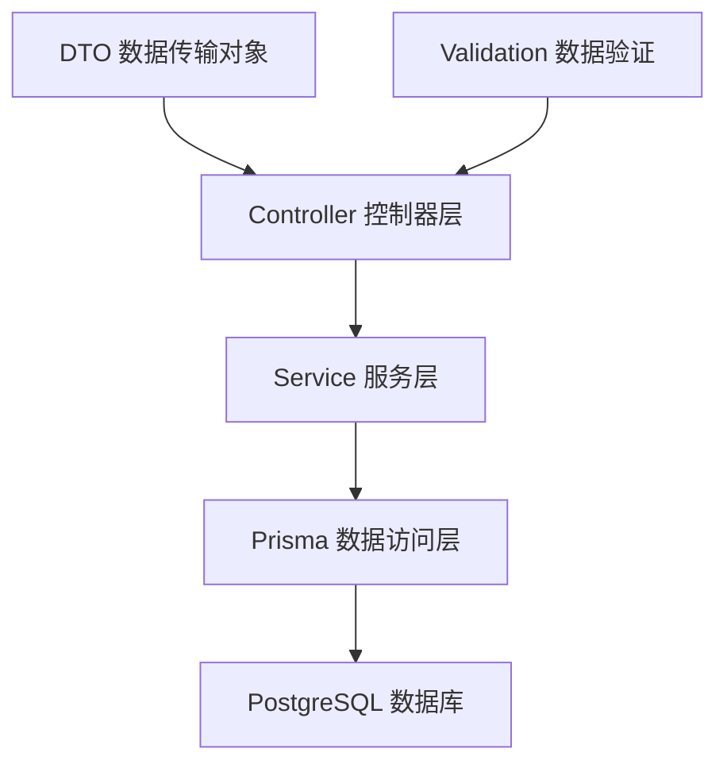
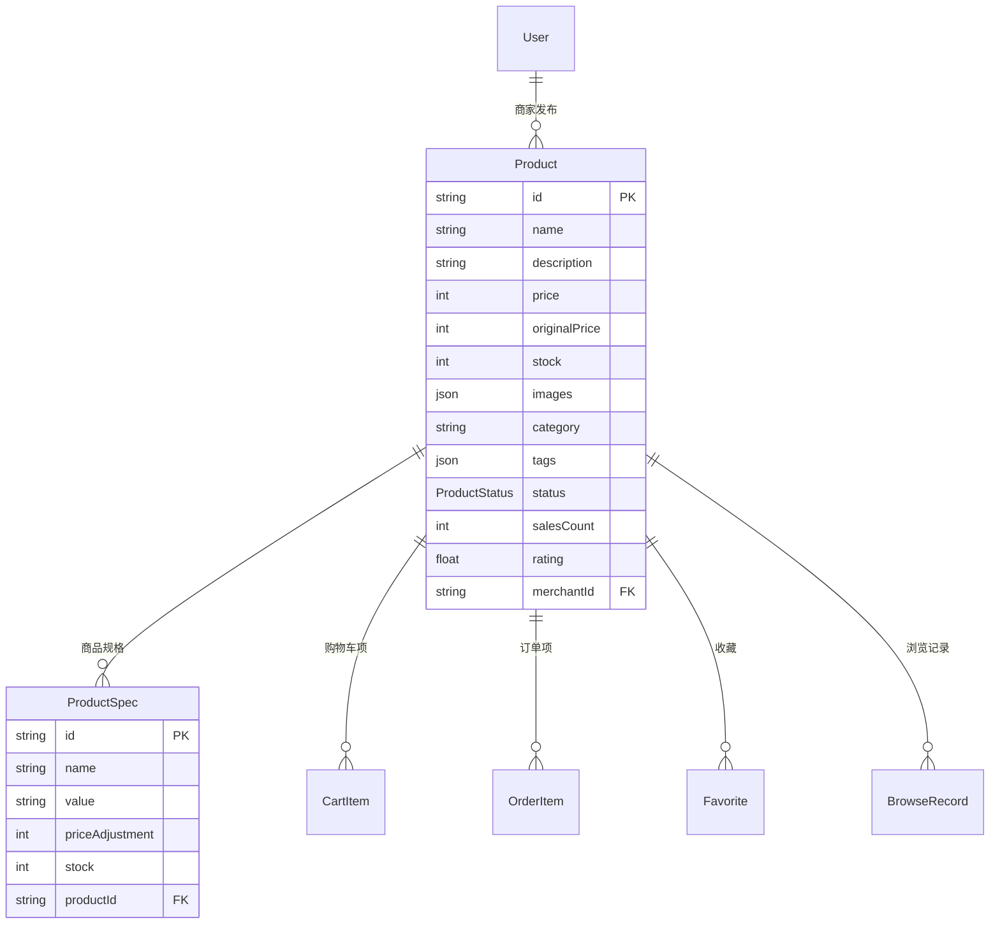

# 商品模块 API 实现教程

## 概述

本教程将详细介绍商品模块 API 的完整实现过程，包括数据模型设计、服务层逻辑、控制器接口以及数据传输对象（DTO）的定义。通过本教程，你将了解如何构建一个功能完整的商品管理系统。

## 为什么需要商品模块？

在电商系统中，商品模块是核心功能之一，它需要支持：
- 商品的基本信息管理（名称、价格、库存等）
- 商品的分类和标签管理
- 商品的搜索和筛选功能
- 商品的分页展示
- 商品规格的管理
- 商家与商品的关联关系

## 架构设计

商品模块采用经典的三层架构：



## 数据模型设计

### 核心模型关系



### 商品状态枚举

```typescript
enum ProductStatus {
  DRAFT,      // 草稿
  PUBLISHED,  // 已发布
  ARCHIVED    // 已归档
}
```

## 实现步骤

### 第一步：定义数据传输对象（DTO）

#### 1. 查询参数 DTO

```typescript
// product-query.dto.ts
import { IsOptional, IsString, IsInt, Min, IsEnum } from 'class-validator';
import { Transform, Type } from 'class-transformer';
import { ProductStatus } from '@prisma/client';

export class ProductQueryDto {
  @IsOptional()
  @IsString()
  search?: string;  // 搜索关键词

  @IsOptional()
  @IsString()
  category?: string;  // 商品分类

  @IsOptional()
  @IsEnum(ProductStatus)
  status?: ProductStatus;  // 商品状态

  @IsOptional()
  @Type(() => Number)
  @IsInt()
  @Min(1)
  page?: number = 1;  // 页码

  @IsOptional()
  @Type(() => Number)
  @IsInt()
  @Min(1)
  limit?: number = 10;  // 每页数量

  @IsOptional()
  @IsString()
  sortBy?: string = 'createdAt';  // 排序字段

  @IsOptional()
  @IsString()
  sortOrder?: 'asc' | 'desc' = 'desc';  // 排序方向

  @IsOptional()
  @Type(() => Number)
  @IsInt()
  @Min(0)
  minPrice?: number;  // 最低价格

  @IsOptional()
  @Type(() => Number)
  @IsInt()
  @Min(0)
  maxPrice?: number;  // 最高价格

  @IsOptional()
  @IsString()
  merchantId?: string;  // 商家ID
}
```

**关键特性：**
- 使用 `class-validator` 进行数据验证
- 使用 `class-transformer` 进行类型转换
- 所有字段都是可选的，提供默认值
- 支持多维度的商品筛选

#### 2. 响应数据 DTO

```typescript
// product-response.dto.ts
export class ProductResponseDto {
  id: string;
  name: string;
  description?: string;
  price: number;
  originalPrice?: number;
  stock: number;
  images?: any;
  category?: string;
  tags?: any;
  status: ProductStatus;
  salesCount: number;
  rating?: number;
  createdAt: Date;
  updatedAt: Date;
  merchantId: string;
  merchant?: {
    id: string;
    nickname?: string;
    avatar?: string;
  };
  specs?: ProductSpecResponseDto[];
}

export class ProductListResponseDto {
  products: ProductResponseDto[];
  total: number;
  page: number;
  limit: number;
  totalPages: number;
}
```

### 第二步：实现服务层逻辑

#### 核心查询方法

```typescript
// product.service.ts
@Injectable()
export class ProductService {
  constructor(private prisma: PrismaService) {}

  async findAll(query: ProductQueryDto): Promise<ProductListResponseDto> {
    const {
      search,
      category,
      status = ProductStatus.PUBLISHED,
      page = 1,
      limit = 10,
      sortBy = 'createdAt',
      sortOrder = 'desc',
      minPrice,
      maxPrice,
      merchantId,
    } = query;

    const skip = (page - 1) * limit;

    // 构建查询条件
    const where: Prisma.ProductWhereInput = {
      status,
      ...(search && {
        OR: [
          { name: { contains: search, mode: 'insensitive' } },
          { description: { contains: search, mode: 'insensitive' } },
          { category: { contains: search, mode: 'insensitive' } },
        ],
      }),
      ...(category && { category }),
      ...(merchantId && { merchantId }),
      ...(minPrice !== undefined || maxPrice !== undefined
        ? {
            price: {
              ...(minPrice !== undefined && { gte: minPrice }),
              ...(maxPrice !== undefined && { lte: maxPrice }),
            },
          }
        : {}),
    };

    // 优化查询，只选择必要字段
    const select: Prisma.ProductSelect = {
      id: true,
      name: true,
      description: true,
      price: true,
      originalPrice: true,
      stock: true,
      images: true,
      category: true,
      tags: true,
      status: true,
      salesCount: true,
      rating: true,
      createdAt: true,
      updatedAt: true,
      merchantId: true,
      merchant: {
        select: {
          id: true,
          nickname: true,
          avatar: true,
        },
      },
    };

    const [products, total] = await Promise.all([
      this.prisma.product.findMany({
        where,
        select,
        orderBy: { [sortBy]: sortOrder },
        skip,
        take: limit,
      }),
      this.prisma.product.count({ where }),
    ]);

    const totalPages = Math.ceil(total / limit);

    return {
      products: products as ProductResponseDto[],
      total,
      page,
      limit,
      totalPages,
    };
  }
}
```

**关键优化技术：**

1. **查询优化**：使用 `select` 只查询必要字段，避免查询大字段
2. **并行查询**：使用 `Promise.all` 同时执行数据查询和计数查询
3. **动态条件构建**：根据参数动态构建 WHERE 条件
4. **模糊搜索**：支持商品名称、描述、分类的模糊搜索
5. **价格区间筛选**：支持最低价和最高价筛选

#### 商品详情查询

```typescript
async findById(id: string, includeSpecs = false): Promise<ProductResponseDto> {
  const select: Prisma.ProductSelect = {
    // ... 基础字段
    ...(includeSpecs && {
      specs: {
        select: {
          id: true,
          name: true,
          value: true,
          priceAdjustment: true,
          stock: true,
          createdAt: true,
          updatedAt: true,
        },
      },
    }),
  };

  const product = await this.prisma.product.findUnique({
    where: { id },
    select,
  });

  if (!product) {
    throw new NotFoundException('商品不存在');
  }

  return product as ProductResponseDto;
}
```

**特性：**
- 可选择是否包含商品规格信息
- 异常处理：商品不存在时抛出 404 异常

### 第三步：实现控制器接口

```typescript
// product.controller.ts
@Controller('products')
export class ProductController {
  constructor(private readonly productService: ProductService) {}

  @Public()
  @Get()
  async findAll(@Query(ValidationPipe) query: ProductQueryDto) {
    const result = await this.productService.findAll(query);
    return {
      success: true,
      data: result,
      message: '获取商品列表成功',
    };
  }

  @Public()
  @Get('search')
  async search(
    @Query('q') searchTerm: string,
    @Query(ValidationPipe) query: ProductQueryDto,
  ) {
    if (!searchTerm) {
      return {
        success: false,
        data: null,
        message: '搜索关键词不能为空',
      };
    }

    const result = await this.productService.search(searchTerm, query);
    return {
      success: true,
      data: result,
      message: '搜索商品成功',
    };
  }

  @Public()
  @Get(':id')
  async findOne(
    @Param('id', ParseUUIDPipe) id: string,
    @Query('includeSpecs') includeSpecs?: string,
  ) {
    const shouldIncludeSpecs = includeSpecs === 'true';
    const product = await this.productService.findById(id, shouldIncludeSpecs);
    return {
      success: true,
      data: product,
      message: '获取商品详情成功',
    };
  }
}
```

## API 接口设计

### 接口列表

| 方法 | 路径 | 描述 | 参数 |
|------|------|------|------|
| GET | `/products` | 获取商品列表 | query: ProductQueryDto |
| GET | `/products/search` | 搜索商品 | q: string, query: ProductQueryDto |
| GET | `/products/categories` | 获取商品分类 | - |
| GET | `/products/category/:category` | 按分类获取商品 | category: string |
| GET | `/products/merchant/:merchantId` | 按商家获取商品 | merchantId: string |
| GET | `/products/:id` | 获取商品详情 | id: string, includeSpecs?: boolean |

### 请求示例

#### 1. 获取商品列表
```http
GET /products?page=1&limit=10&category=Electronics&minPrice=1000&maxPrice=5000
```

#### 2. 搜索商品
```http
GET /products/search?q=手机&page=1&limit=10
```

#### 3. 获取商品详情
```http
GET /products/123e4567-e89b-12d3-a456-426614174000?includeSpecs=true
```

### 响应格式

所有接口都遵循统一的响应格式：

```typescript
{
  success: boolean;
  data: any;
  message: string;
}
```

## 数据库查询优化

### 1. 字段选择优化

```typescript
const select: Prisma.ProductSelect = {
  id: true,
  name: true,
  // 只选择需要的字段，避免查询大字段
  merchant: {
    select: {
      id: true,
      nickname: true,
      avatar: true,
    },
  },
};
```

### 2. 并行查询优化

```typescript
const [products, total] = await Promise.all([
  this.prisma.product.findMany({ /* ... */ }),
  this.prisma.product.count({ where }),
]);
```

### 3. 索引建议

为了提高查询性能，建议在以下字段上创建索引：

```sql
-- 商品状态索引
CREATE INDEX idx_product_status ON "Product"(status);

-- 商品分类索引
CREATE INDEX idx_product_category ON "Product"(category);

-- 商家ID索引
CREATE INDEX idx_product_merchant ON "Product"("merchantId");

-- 价格索引
CREATE INDEX idx_product_price ON "Product"(price);

-- 复合索引：状态+分类
CREATE INDEX idx_product_status_category ON "Product"(status, category);
```

## 测试策略

### 单元测试示例

```typescript
describe('ProductController', () => {
  let controller: ProductController;
  let service: ProductService;

  const mockProductService = {
    findAll: jest.fn(),
    findById: jest.fn(),
    search: jest.fn(),
  };

  beforeEach(async () => {
    const module: TestingModule = await Test.createTestingModule({
      controllers: [ProductController],
      providers: [
        {
          provide: ProductService,
          useValue: mockProductService,
        },
      ],
    }).compile();

    controller = module.get<ProductController>(ProductController);
    service = module.get<ProductService>(ProductService);
  });

  describe('findAll', () => {
    it('should return product list', async () => {
      const mockResult = {
        products: [],
        total: 0,
        page: 1,
        limit: 10,
        totalPages: 0,
      };

      mockProductService.findAll.mockResolvedValue(mockResult);

      const result = await controller.findAll({
        page: 1,
        limit: 10,
        status: ProductStatus.PUBLISHED,
      });

      expect(result.success).toBe(true);
      expect(result.data).toEqual(mockResult);
    });
  });
});
```

## 扩展功能

### 1. 缓存优化

可以使用 Redis 缓存热门商品和分类数据：

```typescript
@Injectable()
export class ProductService {
  async getCategories(): Promise<string[]> {
    const cacheKey = 'product:categories';
    
    // 先从缓存获取
    let categories = await this.redis.get(cacheKey);
    
    if (!categories) {
      // 缓存未命中，查询数据库
      categories = await this.prisma.product.findMany({
        where: { status: ProductStatus.PUBLISHED },
        select: { category: true },
        distinct: ['category'],
      });
      
      // 写入缓存，过期时间1小时
      await this.redis.setex(cacheKey, 3600, JSON.stringify(categories));
    }
    
    return categories;
  }
}
```

### 2. 全文搜索

可以集成 Elasticsearch 实现更强大的搜索功能：

```typescript
async searchWithElasticsearch(searchTerm: string): Promise<ProductListResponseDto> {
  const searchResult = await this.elasticsearch.search({
    index: 'products',
    body: {
      query: {
        multi_match: {
          query: searchTerm,
          fields: ['name^2', 'description', 'category', 'tags'],
        },
      },
      highlight: {
        fields: {
          name: {},
          description: {},
        },
      },
    },
  });
  
  // 处理搜索结果...
}
```

## 总结

通过本教程，我们实现了一个功能完整的商品模块 API，包括：

1. **数据模型设计**：定义了商品、商品规格等核心模型
2. **DTO 设计**：实现了查询参数验证和响应数据格式化
3. **服务层实现**：提供了商品的增删改查、搜索、分页等功能
4. **控制器设计**：暴露了 RESTful API 接口
5. **性能优化**：通过字段选择、并行查询等技术提升性能
6. **测试覆盖**：编写了单元测试确保代码质量

这个商品模块为电商系统提供了坚实的基础，支持后续的购物车、订单等功能的开发。