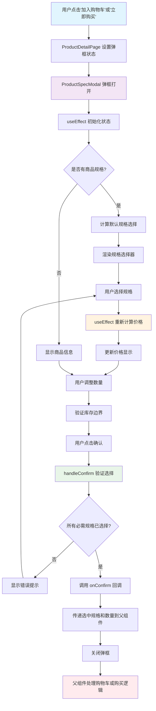
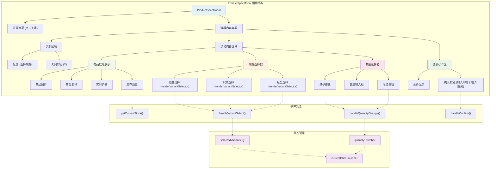

# React 进阶语法与特性深度学习：ProductSpecModal 组件案例解析

> 通过一个真实的商品规格选择弹框组件，深入学习 React 的核心概念、TypeScript 集成、以及现代前端开发的最佳实践。

## 🎯 学习目标

通过本教程，你将掌握：
- TypeScript 在 React 中的最佳实践
- React Hooks 的深度应用 (useState, useEffect)
- 复杂状态管理的设计模式
- 组件间通信的多种方式
- 条件渲染与动态样式处理
- 函数式编程思维在 React 中的应用
- 现代 JavaScript 语法特性的综合运用

## 📋 背景介绍

`ProductSpecModal` 是一个商品规格选择弹框组件，用户可以在其中选择商品的不同规格（如颜色、尺寸）、调整购买数量，并实时查看价格变化。该组件展示了现代 React 开发中的多个重要概念。

### 功能特性
- 🎨 动态规格选择（颜色、尺寸、版型等）
- 💰 实时价格计算（支持规格加价）
- 📦 库存验证和缺货状态显示
- 🔢 数量调整和边界验证
- ✅ 表单验证和用户交互反馈
- 📱 响应式移动端适配

## 🏗️ 组件架构分析

让我们从整体架构开始，了解这个组件的设计思路：

### 组件调用关系
```typescript
// 组件的调用关系
ProductDetailPage
└── ProductSpecModal (弹框组件)
    ├── 商品信息展示
    ├── 规格选择器
    ├── 数量选择器
    └── 确认按钮
```

### 用户交互流程



### 组件内部结构



## 📚 核心语法特性详解

### 1. TypeScript 接口定义与类型安全

#### 🎓 知识点：接口设计的最佳实践

```typescript
interface ProductSpecModalProps {
  product: Product;                    // 必需：商品数据
  isOpen: boolean;                    // 必需：弹框显示状态
  onClose: () => void;                // 必需：关闭回调
  onConfirm: (selectedVariants: { [key: string]: string }, quantity: number) => void;
  confirmText: string;                // 必需：确认按钮文字
  initialVariants?: { [key: string]: string };  // 可选：初始规格选择
  initialQuantity?: number;           // 可选：初始数量
}
```

**学习重点：**
- **可选属性 (`?`)**: `initialVariants?` 表示该属性可以不传递
- **函数类型定义**: `() => void` 定义无参数无返回值的函数
- **复杂类型定义**: `{ [key: string]: string }` 定义键值对对象类型
- **回调函数类型**: `onConfirm` 定义了带参数的回调函数类型

#### 🚀 进阶技巧：泛型接口的使用

```typescript
// 可以进一步优化为泛型接口
interface ModalProps<T> {
  data: T;
  isOpen: boolean;
  onClose: () => void;
  onConfirm: (data: T) => void;
}

// 使用时：ModalProps<Product>
```

### 2. React 函数组件与 Props 解构

#### 🎓 知识点：现代函数组件的标准写法

```typescript
const ProductSpecModal: React.FC<ProductSpecModalProps> = ({
  product,
  isOpen,
  onClose,
  onConfirm,
  confirmText,
  initialVariants = {},        // 默认值设置
  initialQuantity = 1
}) => {
  // 组件逻辑...
}
```

**学习重点：**
- **组件类型注解**: `React.FC<PropsType>` 是函数组件的标准类型注解
- **参数解构**: 直接从 props 中解构出需要的属性
- **默认值设置**: 在解构时设置默认值，避免 undefined

#### 🚀 进阶技巧：Props 的多种传递方式

```typescript
// 方式1：解构传递（推荐）
const { product, isOpen } = props;

// 方式2：剩余参数
const { product, ...restProps } = props;

// 方式3：条件默认值
const quantity = initialQuantity ?? 1;
```

### 3. useState Hook：复杂状态管理

#### 🎓 知识点：多状态的组织与管理

```typescript
const [selectedVariants, setSelectedVariants] = useState<{ [key: string]: string }>({});
const [quantity, setQuantity] = useState(1);
const [currentPrice, setCurrentPrice] = useState(product.price);
```

**学习重点：**
- **类型注解**: `useState<Type>()` 显式指定状态类型
- **初始值策略**: 不同类型状态的初始值设置
- **状态分离**: 将不同概念的状态分开管理，便于维护

#### 🚀 进阶技巧：状态更新的模式

```typescript
// ❌ 错误：直接修改状态
selectedVariants.color = 'red';

// ✅ 正确：使用展开运算符更新对象
setSelectedVariants(prev => ({
  ...prev,
  [type]: value
}));

// ✅ 正确：函数式更新
setQuantity(prevQuantity => prevQuantity + 1);
```

### 4. useEffect Hook：副作用管理与优化

#### 🎓 知识点：useEffect 的依赖项管理

```typescript
// 弹框打开时重置状态
useEffect(() => {
  if (isOpen) {
    // 重新计算默认变体
    let variants: { [key: string]: string } = {};
    if (product.variants) {
      const variantTypes = Array.from(new Set(product.variants.map(v => v.type)));
      variantTypes.forEach(type => {
        const firstVariant = product.variants?.find(v => v.type === type);
        if (firstVariant) {
          variants[type] = firstVariant.value;
        }
      });
    }
    
    setSelectedVariants(variants);
    setQuantity(1);
  }
}, [isOpen]); // 只依赖 isOpen，避免无限循环
```

**学习重点：**
- **依赖项数组**: `[isOpen]` 确保只在 `isOpen` 变化时执行
- **条件执行**: `if (isOpen)` 避免不必要的重置操作
- **副作用清理**: 在适当时机重置状态

#### 🚀 进阶技巧：避免无限循环的策略

```typescript
// ❌ 危险：对象依赖可能导致无限循环
useEffect(() => {
  // ...
}, [product, selectedVariants]); // 对象引用每次都不同

// ✅ 安全：使用具体的原始值
useEffect(() => {
  // ...
}, [product.id, isOpen]); // 只依赖不可变的值
```

### 5. 计算属性与派生状态

#### 🎓 知识点：基于现有状态计算新值

```typescript
// 实时计算价格
useEffect(() => {
  let price = product.price;
  if (product.variants) {
    // 计算价格调整
    Object.entries(selectedVariants).forEach(([type, value]) => {
      const variant = product.variants?.find(v => v.type === type && v.value === value);
      if (variant && variant.priceModifier) {
        price += variant.priceModifier;
      }
    });
  }
  setCurrentPrice(price);
}, [selectedVariants, product]);
```

**学习重点：**
- **Object.entries()**: 将对象转换为键值对数组
- **数组方法链**: `find()` 方法查找符合条件的元素
- **可选链操作符**: `variant?.priceModifier` 安全访问属性
- **累加计算**: 遍历所有选中规格，累加价格调整

#### 🚀 进阶技巧：使用 useMemo 优化计算

```typescript
// 使用 useMemo 避免重复计算
const currentPrice = useMemo(() => {
  let price = product.price;
  Object.entries(selectedVariants).forEach(([type, value]) => {
    const variant = product.variants?.find(v => v.type === type && v.value === value);
    if (variant?.priceModifier) {
      price += variant.priceModifier;
    }
  });
  return price;
}, [selectedVariants, product.price, product.variants]);
```

### 6. 事件处理与用户交互

#### 🎓 知识点：事件处理函数的设计模式

```typescript
// 规格选择处理
const handleVariantSelect = (type: string, value: string) => {
  setSelectedVariants(prev => ({
    ...prev,
    [type]: value
  }));
};

// 数量变化处理
const handleQuantityChange = (newQuantity: number) => {
  const maxStock = getCurrentStock();
  if (newQuantity >= 1 && newQuantity <= maxStock) {
    setQuantity(newQuantity);
  }
};
```

**学习重点：**
- **参数传递**: 事件处理函数接收业务参数而非原生事件对象
- **边界验证**: 在更新状态前进行有效性检查
- **函数式更新**: 使用前一个状态计算新状态
- **计算属性**: `getCurrentStock()` 基于当前选择计算库存

#### 🚀 进阶技巧：高阶函数与柯里化

```typescript
// 使用高阶函数简化事件处理
const createVariantHandler = (type: string) => (value: string) => {
  setSelectedVariants(prev => ({ ...prev, [type]: value }));
};

// 使用：
<button onClick={() => createVariantHandler('color')('red')}>
  红色
</button>
```

### 7. 条件渲染与动态样式

#### 🎓 知识点：React 中的条件渲染模式

```typescript
// 早期返回模式
if (!isOpen) return null;

// 条件渲染模式
{currentPrice !== product.price && (
  <span className="text-sm text-gray-500 line-through">
    ¥{product.price.toFixed(2)}
  </span>
)}

// 三元运算符
className={`px-4 py-2 rounded-md border text-sm font-medium transition-colors ${
  isOutOfStock
    ? 'border-gray-200 bg-gray-100 text-gray-400 cursor-not-allowed'
    : isSelected
    ? 'border-blue-500 bg-blue-50 text-blue-600'
    : 'border-gray-300 bg-white text-gray-700 hover:border-gray-400'
}`}
```

**学习重点：**
- **早期返回**: `if (!isOpen) return null` 提前退出组件渲染
- **逻辑与运算符**: `&&` 用于条件渲染
- **嵌套三元运算符**: 处理多种状态的样式切换
- **模板字符串**: 使用 `${}` 插值动态拼接 className

### 8. 数组方法与函数式编程

#### 🎓 知识点：JavaScript 数组方法的综合应用

```typescript
// 去重并获取规格类型
const variantTypes = Array.from(new Set(product.variants.map(v => v.type)));

// 过滤特定类型的规格
const typeVariants = variants.filter(v => v.type === type);

// 查找符合条件的元素
const firstVariant = product.variants?.find(v => v.type === type);

// 计算库存的复杂逻辑
const selectedVariantItems = Object.entries(selectedVariants)
  .map(([type, value]) => 
    product.variants?.find(v => v.type === type && v.value === value)
  )
  .filter(Boolean);
```

**学习重点：**
- **Set 去重**: `new Set()` 创建唯一值集合，`Array.from()` 转换为数组
- **链式调用**: `map().filter()` 连续处理数组
- **可选链**: `product.variants?.find()` 安全访问可能为空的属性
- **Boolean 过滤**: `.filter(Boolean)` 过滤掉假值

#### 🚀 进阶技巧：函数式编程模式

```typescript
// 使用 reduce 进行累加计算
const totalPrice = selectedVariants.reduce((acc, variant) => {
  return acc + (variant.priceModifier || 0);
}, product.price);

// 使用管道模式处理数据
const processVariants = (variants) => 
  variants
    .filter(v => v.stock > 0)
    .map(v => ({ ...v, displayName: getDisplayName(v.type) }))
    .sort((a, b) => a.value.localeCompare(b.value));
```

### 9. 组件通信与回调模式

#### 🎓 知识点：父子组件间的数据流

```typescript
// 子组件向父组件传递数据
const handleConfirm = () => {
  // 验证逻辑
  if (product.variants) {
    const requiredVariants = Array.from(new Set(product.variants.map(v => v.type)));
    const missingVariants = requiredVariants.filter(type => !selectedVariants[type]);
    
    if (missingVariants.length > 0) {
      alert(`请选择${missingVariants.join('、')}`);
      return;
    }
  }

  // 调用父组件回调，传递选择结果
  onConfirm(selectedVariants, quantity);
  onClose();
};
```

**学习重点：**
- **数据验证**: 在提交前验证用户输入的完整性
- **回调函数**: 通过 props 传入的函数与父组件通信
- **数据封装**: 将多个相关数据一起传递给父组件
- **用户反馈**: 使用 `alert()` 或其他方式给用户反馈

#### 🚀 进阶技巧：自定义 Hook 提取逻辑

```typescript
// 提取规格选择逻辑为自定义 Hook
const useProductSpecs = (product, initialVariants = {}) => {
  const [selectedVariants, setSelectedVariants] = useState(initialVariants);
  
  const selectVariant = useCallback((type, value) => {
    setSelectedVariants(prev => ({ ...prev, [type]: value }));
  }, []);
  
  const validateSelection = useCallback(() => {
    const requiredTypes = Array.from(new Set(product.variants?.map(v => v.type) || []));
    return requiredTypes.every(type => selectedVariants[type]);
  }, [product.variants, selectedVariants]);
  
  return { selectedVariants, selectVariant, validateSelection };
};
```

### 10. 可访问性与用户体验

#### 🎓 知识点：现代 Web 开发的可访问性实践

```typescript
<button
  onClick={onClose}
  className="w-8 h-8 flex items-center justify-center rounded-full hover:bg-gray-100"
  title="关闭"                    // 鼠标悬停提示
  aria-label="关闭规格选择弹框"    // 屏幕阅读器描述
>
  <svg className="w-6 h-6 text-gray-400" fill="none" stroke="currentColor" viewBox="0 0 24 24">
    <path strokeLinecap="round" strokeLinejoin="round" strokeWidth="2" d="M6 18L18 6M6 6l12 12" />
  </svg>
</button>
```

**学习重点：**
- **aria-label**: 为屏幕阅读器提供元素描述
- **title 属性**: 为鼠标用户提供悬停提示
- **disabled 状态**: 禁用不可操作的按钮
- **键盘导航**: 确保组件可以通过键盘操作

## 🎯 组件使用示例

### 在父组件中的使用方式

```typescript
// ProductDetailPage.tsx 中的使用
const [isSpecModalOpen, setIsSpecModalOpen] = useState(false);
const [modalMode, setModalMode] = useState<'cart' | 'buy'>('cart');

const handleSpecConfirm = (selectedVariants: { [key: string]: string }, quantity: number) => {
  // 处理用户选择的规格和数量
  addItem({
    productId: product.id,
    name: product.name,
    price: product.price,
    image: product.image,
    quantity,
    selectedVariants,
    stock: product.stock || 0
  });

  if (modalMode === 'cart') {
    alert('已添加到购物车');
  } else {
    // 跳转到结算页面
    navigate('/checkout');
  }
};

// JSX 中的使用
{product && (
  <ProductSpecModal
    product={product}
    isOpen={isSpecModalOpen}
    onClose={() => setIsSpecModalOpen(false)}
    onConfirm={handleSpecConfirm}
    confirmText={modalMode === 'cart' ? '加入购物车' : '立即购买'}
  />
)}
```

## 📊 性能优化建议

### 1. 避免不必要的重新渲染

```typescript
// 使用 useCallback 缓存函数
const handleVariantSelect = useCallback((type: string, value: string) => {
  setSelectedVariants(prev => ({ ...prev, [type]: value }));
}, []);

// 使用 useMemo 缓存计算结果
const sortedVariants = useMemo(() => {
  return product.variants?.sort((a, b) => a.value.localeCompare(b.value));
}, [product.variants]);
```

### 2. 合理设计依赖项数组

```typescript
// ✅ 只依赖必要的值
useEffect(() => {
  // 价格计算逻辑
}, [selectedVariants, product.id]);

// ❌ 避免依赖整个对象
useEffect(() => {
  // 价格计算逻辑
}, [selectedVariants, product]); // product 对象引用每次都可能不同
```

## 🚀 扩展学习

### 相关技术栈学习建议

1. **TypeScript 进阶**
   - 联合类型和交叉类型
   - 泛型约束和条件类型
   - 工具类型（Partial, Pick, Omit 等）

2. **React Hooks 深度学习**
   - useReducer 处理复杂状态
   - useContext 跨组件通信
   - 自定义 Hook 的设计模式

3. **现代 JavaScript 特性**
   - 异步编程（Promise, async/await）
   - 模块系统（ES6 import/export）
   - 函数式编程概念

4. **状态管理库**
   - Zustand（本项目使用）
   - Redux Toolkit
   - Jotai 或 Valtio

### 实践建议

1. **代码组织**
   - 按功能模块组织文件结构
   - 使用 barrel exports 简化导入
   - 统一的命名约定

2. **测试驱动开发**
   - 为关键组件编写单元测试
   - 使用 React Testing Library
   - 模拟用户交互场景

3. **代码质量工具**
   - ESLint 代码检查
   - Prettier 代码格式化
   - Husky Git hooks

## 🎯 总结

通过 `ProductSpecModal` 组件的深度分析，我们学习了：

- **TypeScript 集成**：类型安全的组件开发
- **React Hooks**：useState 和 useEffect 的高级用法
- **状态管理**：复杂状态的设计和更新模式
- **用户交互**：事件处理和表单验证
- **性能优化**：避免不必要的重新渲染
- **代码组织**：可维护和可扩展的组件结构

这个组件展示了现代 React 开发的最佳实践，是一个很好的学习案例。继续实践和应用这些概念，将帮助你构建更高质量的 React 应用。

---

💡 **下一步学习建议**：尝试为其他复杂组件编写类似的分析，并实践自定义 Hook 的抽取和复用。 