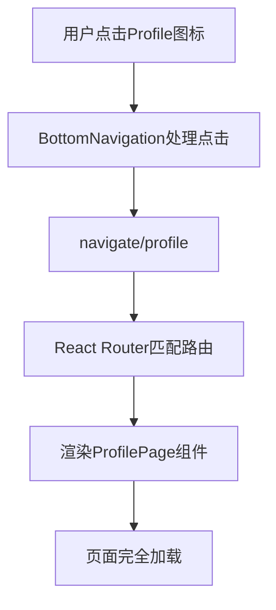

# 个人中心架构解析：从路由到交互的完整实现指南

## 前言：为什么需要Profile页面？

在现代电商应用中，个人中心页面是用户体验的核心枢纽。它不仅是用户管理个人信息的场所，更是连接各种业务功能的重要入口。本教程将深入解析我们如何在React+Vite应用中实现一个功能完整、交互流畅的Profile页面。

## 目录

1. [整体架构概览](#整体架构概览)
2. [路由集成：从底部导航到页面渲染](#路由集成从底部导航到页面渲染)
3. [UI架构设计：分层布局策略](#ui架构设计分层布局策略)
4. [数据结构与状态管理](#数据结构与状态管理)
5. [交互设计与事件处理](#交互设计与事件处理)
6. [样式系统与响应式设计](#样式系统与响应式设计)
7. [组件集成与复用](#组件集成与复用)
8. [最佳实践与开发经验](#最佳实践与开发经验)

## 整体架构概览

Profile页面采用了模块化、分层的架构设计，主要包含以下核心组件：

```
ProfilePage
├── StatusBar (固定顶部状态栏)
├── UserInfoCard (用户信息卡片)
├── OrderManagementCard (订单管理卡片)
├── MainFeaturesGrid (主要功能网格)
├── SettingsMenu (设置菜单列表)
├── LogoutButton (退出登录按钮)
└── BottomNavigation (固定底部导航)
```

### 设计原则

1. **功能分离**：每个区域承担明确的职责
2. **层次清晰**：通过视觉层次引导用户注意力
3. **交互一致**：统一的点击反馈和导航模式
4. **扩展性**：易于添加新功能或修改现有功能

## 路由集成：从底部导航到页面渲染

### 1. 路由配置（App.tsx）

Profile页面通过React Router集成到应用路由系统中：

```tsx
// src/App.tsx
import ProfilePage from "./pages/profile/ProfilePage";

function App() {
  return (
    <Routes>
      {/* 其他路由... */}
      <Route path="/profile" element={<ProfilePage />} />
    </Routes>
  );
}
```

### 2. 导航入口（BottomNavigation.tsx）

底部导航栏提供了Profile页面的主要入口：

```tsx
// src/components/common/BottomNavigation.tsx
const navItems = [
  // ... 其他导航项
  {
    id: 'profile',
    path: '/profile',
    label: 'Profile',
    icon: (active: boolean) => (
      <svg className={`w-6 h-6 mb-1 ${active ? 'text-blue-600' : 'text-gray-500'}`}>
        {/* 用户图标SVG */}
      </svg>
    )
  }
];
```

### 3. 路由跳转流程



## UI架构设计：分层布局策略

### 1. 整体布局结构

Profile页面采用垂直堆叠的布局模式，确保在移动设备上的最佳显示效果：

```tsx
return (
  <div className="min-h-screen bg-gray-50">
    <StatusBar />
    
    <div className="pb-20 pt-12">
      {/* 用户信息卡片 */}
      <UserInfoSection />
      
      {/* 订单管理卡片 */}
      <OrderManagementSection />
      
      {/* 主要功能网格 */}
      <MainFeaturesSection />
      
      {/* 设置菜单 */}
      <SettingsSection />
      
      {/* 退出登录按钮 */}
      <LogoutSection />
    </div>
    
    <BottomNavigation />
  </div>
);
```

### 2. 关键布局技巧

**顶部空间处理**：
```tsx
<div className="pb-20 pt-12">
```
- `pt-12` (48px)：为StatusBar (44px高度) 预留空间，避免内容被遮挡
- `pb-20` (80px)：为BottomNavigation预留空间

**卡片间距设计**：
```tsx
<div className="bg-white mx-4 mt-4 rounded-lg shadow-sm">
```
- `mx-4`：左右边距16px，在移动设备上提供适当的边距
- `mt-4`：顶部边距16px，卡片间保持统一间距
- `rounded-lg`：圆角设计，符合现代UI趋势

### 3. 用户信息卡片设计

用户信息卡片采用渐变背景和水平布局：

```tsx
<div className="bg-gradient-to-r from-blue-500 to-purple-600 px-6 py-8 text-white">
  <div className="flex items-center space-x-4">
    {/* 头像区域 */}
    <div className="w-16 h-16 bg-white bg-opacity-20 rounded-full flex items-center justify-center">
      {/* 用户图标 */}
    </div>
    
    {/* 用户信息 */}
    <div className="flex-1">
      <h2 className="text-xl font-bold mb-1">用户昵称</h2>
      <p className="text-blue-100 text-sm">点击查看和编辑个人资料</p>
    </div>
  </div>
</div>
```

**设计亮点**：
- 渐变背景营造高级感
- 半透明头像背景保持视觉层次
- flex布局确保内容对齐

## 数据结构与状态管理

### 1. 主要功能数据结构

```tsx
const mainFeatures = [
  {
    id: "favorites",
    icon: <HeartIcon />,
    label: "收藏",
    color: "text-red-500",
  },
  {
    id: "history", 
    icon: <ClockIcon />,
    label: "足迹",
    color: "text-green-500",
  },
  {
    id: "wallet",
    icon: <CreditCardIcon />,
    label: "钱包", 
    color: "text-purple-500",
  }
];
```

### 2. 订单状态数据结构

```tsx
const orderStatuses = [
  {
    id: "pending_payment",
    icon: <PaymentIcon />,
    label: "待付款",
    color: "text-orange-500",
  },
  // ... 其他订单状态
];
```

### 3. 设置菜单数据结构

```tsx
const settingsItems = [
  {
    id: "account",
    icon: <UserIcon />,
    label: "账户管理",
    description: "个人信息、密码设置",
  },
  // ... 其他设置项
];
```

**数据结构设计原则**：
- **一致性**：所有数据对象都包含`id`、`icon`、`label`字段
- **扩展性**：通过`color`、`description`等字段支持定制化
- **类型安全**：使用TypeScript确保数据结构正确性

## 交互设计与事件处理

### 1. 路由导航处理

Profile页面使用React Router的`useNavigate` Hook处理页面跳转：

```tsx
const navigate = useNavigate();

// 处理订单状态点击
const handleOrderStatusClick = (statusId: string) => {
  switch (statusId) {
    case "pending_payment":
      navigate("/orders?status=pending_payment");
      break;
    case "pending_shipment":
      navigate("/orders?status=pending_shipment");
      break;
    // ... 其他状态
  }
};

// 处理查看全部订单
const handleViewAllOrders = () => {
  navigate("/orders");
};
```

### 2. 功能模块点击处理

```tsx
const handleFeatureClick = (featureId: string) => {
  console.log("点击功能:", featureId);
  switch (featureId) {
    case "favorites":
      // TODO: 导航到收藏页面
      break;
    case "history":
      // TODO: 导航到足迹页面  
      break;
    case "wallet":
      // TODO: 导航到钱包页面
      break;
  }
};
```

### 3. 事件处理模式

所有交互元素都遵循统一的事件处理模式：

```tsx
<div
  key={item.id}
  className="cursor-pointer hover:bg-gray-50"
  onClick={() => handleItemClick(item.id)}
>
  {/* 内容 */}
</div>
```

**交互设计特点**：
- **视觉反馈**：`hover:bg-gray-50`提供悬停效果
- **语义化**：`cursor-pointer`明确指示可点击
- **一致性**：所有点击处理函数都使用相同的参数模式

## 样式系统与响应式设计

### 1. 网格布局系统

**订单状态网格（5列）**：
```tsx
<div className="grid grid-cols-5 gap-2 p-6">
  {orderStatuses.map((status) => (
    <div className="flex flex-col items-center space-y-2 cursor-pointer">
      {/* 订单状态内容 */}
    </div>
  ))}
</div>
```

**主要功能网格（3列）**：
```tsx
<div className="grid grid-cols-3 gap-4 p-6">
  {mainFeatures.map((feature) => (
    <div className="flex flex-col items-center space-y-2 cursor-pointer">
      {/* 功能内容 */}
    </div>
  ))}
</div>
```

### 2. 图标与颜色系统

每个功能模块都有独特的颜色标识：

```tsx
const colorMap = {
  favorites: "text-red-500",     // 收藏 - 红色
  history: "text-green-500",     // 足迹 - 绿色  
  wallet: "text-purple-500",     // 钱包 - 紫色
  // 订单状态颜色
  pending_payment: "text-orange-500",  // 待付款 - 橙色
  pending_delivery: "text-green-500",  // 待收货 - 绿色
  // ... 其他颜色
};
```

### 3. 阴影与圆角设计

```tsx
// 卡片样式
className="bg-white rounded-lg shadow-sm"

// 图标容器样式  
className="p-3 rounded-full bg-gray-50"

// 用户头像样式
className="w-16 h-16 bg-white bg-opacity-20 rounded-full"
```

## 组件集成与复用

### 1. 公共组件集成

Profile页面集成了两个关键的公共组件：

**StatusBar组件**：
- 固定在页面顶部
- 显示时间、信号、WiFi、电池等状态信息
- 高度为44px（`h-11`）

**BottomNavigation组件**：
- 固定在页面底部
- 提供主要页面间的导航
- 包含Home、Cart、Store、Profile四个主要入口

### 2. 组件导入与使用

```tsx
import StatusBar from "../../components/common/StatusBar";
import BottomNavigation from "../../components/common/BottomNavigation";

const ProfilePage: React.FC = () => {
  return (
    <div className="min-h-screen bg-gray-50">
      <StatusBar />
      {/* 页面内容 */}
      <BottomNavigation />
    </div>
  );
};
```

### 3. 布局协调

为了避免固定定位的组件遮挡内容，Profile页面采用了以下策略：

```tsx
<div className="pb-20 pt-12">
  {/* 主要内容 */}
</div>
```

- `pt-12`：为StatusBar预留48px顶部空间
- `pb-20`：为BottomNavigation预留80px底部空间

## 最佳实践与开发经验

### 1. 代码组织原则

**配置数据外置**：
```tsx
// 将UI配置数据定义在组件顶部
const mainFeatures = [/* ... */];
const orderStatuses = [/* ... */]; 
const settingsItems = [/* ... */];
```

**事件处理器分离**：
```tsx
// 每类交互都有独立的处理函数
const handleFeatureClick = (featureId: string) => { /* ... */ };
const handleOrderStatusClick = (statusId: string) => { /* ... */ };
const handleSettingClick = (settingId: string) => { /* ... */ };
```

### 2. 性能优化技巧

**图标组件内联**：
- 直接在配置对象中定义SVG图标
- 避免额外的组件渲染开销
- 保持图标与配置的紧密关联

**条件渲染优化**：
```tsx
{settingsItems.map((item, index) => (
  <div
    className={`... ${
      index !== settingsItems.length - 1 ? "border-b border-gray-100" : ""
    }`}
  >
    {/* 内容 */}
  </div>
))}
```

### 3. 可维护性设计

**统一的数据结构**：
- 所有配置对象都遵循相同的字段约定
- 便于后续功能扩展和维护

**预留扩展接口**：
```tsx
// TODO注释标明未来的扩展点
case "favorites":
  // TODO: 导航到收藏页面
  break;
```

**类型安全**：
```tsx
const ProfilePage: React.FC = () => {
  const navigate = useNavigate();
  // 使用TypeScript确保类型安全
};
```

### 4. 用户体验优化

**视觉层次设计**：
- 用户信息卡片使用渐变背景突出重要性
- 订单管理独立成卡片，提升业务重要性
- 设置功能采用列表形式，便于扫描

**交互反馈**：
```tsx
className="cursor-pointer hover:bg-gray-50 transition-colors"
```
- 明确的悬停状态
- 平滑的过渡动画

**信息架构**：
- 从个人信息到业务功能再到系统设置的逻辑顺序
- 每个功能区域都有清晰的视觉边界

## 总结

Profile页面的实现展示了现代React应用中个人中心页面的最佳实践：

1. **架构清晰**：模块化的组件设计和明确的职责分离
2. **集成完善**：与路由系统、导航组件的无缝集成  
3. **体验优秀**：响应式布局、一致的交互模式和优雅的视觉设计
4. **可维护性强**：结构化的代码组织和预留的扩展接口

这种设计模式可以作为其他页面开发的参考模板，确保整个应用保持一致的用户体验和代码质量。

---

*本教程基于实际开发经验总结，涵盖了从路由配置到用户体验的完整实现过程。如有问题或建议，欢迎反馈。* 