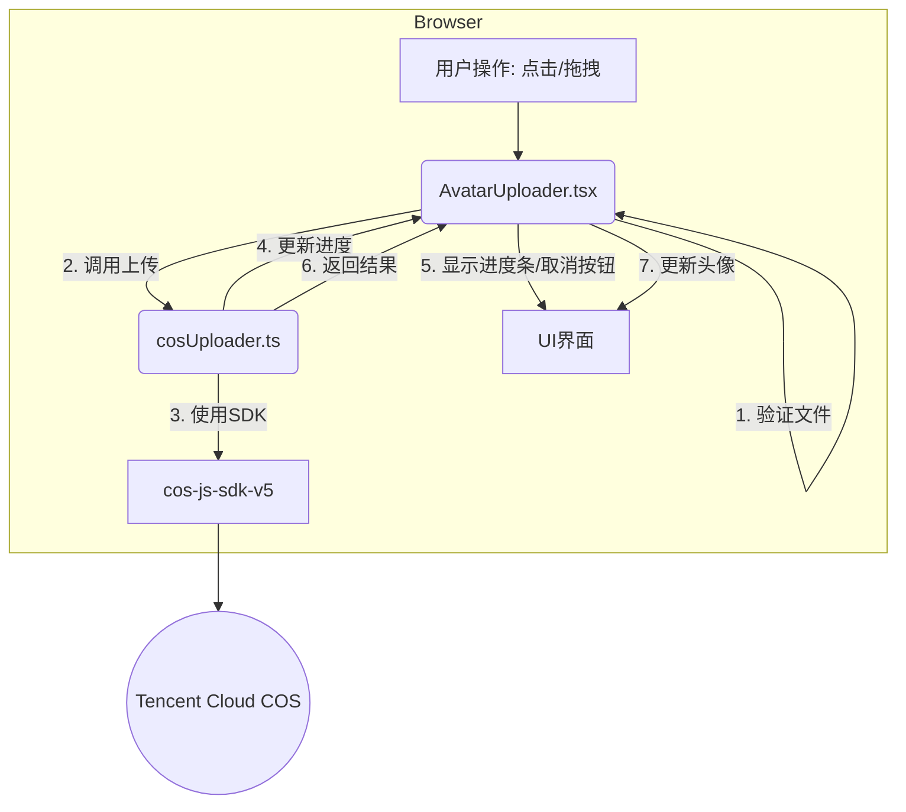

# 教程：实现头像真实上传与解决 Vitest 配置冲突

## 1. 背景：从模拟走向真实

在本次迭代之前，我们的 `AvatarUploader` 组件只是一个 UI 占位符。用户虽然可以点击并选择图片，但图片仅在前端通过 `URL.createObjectURL()` 生成一个临时链接，并未真正上传到服务器。这对于开发初期的 UI 验证是足够的，但距离生产环境的真实需求还有很大差距。

**核心目标**：实现一个功能完整的头像上传系统，将用户选择的图片**真实上传**到腾讯云对象存储（COS）服务，并在这个过程中提供清晰的交互反馈（如进度条和取消功能）。

## 2. 整体架构：分层设计，职责分离

为了保证代码的可维护性和可扩展性，我们采用了分层设计思想，将整个上传功能拆分为两个主要部分：

- **通用上传工具 (`frontend/src/utils/cosUploader.ts`)**：一个纯粹的、与 UI 无关的工具类，专门负责与腾讯云 COS SDK 交互，处理所有底层的上传逻辑。
- **UI 组件 (`frontend/src/components/ui/AvatarUploader.tsx`)**：负责所有与用户交互的界面逻辑，如显示头像、处理点击/拖拽事件、展示上传进度和错误信息。

这种设计的好处是，将来如果我们需要在项目的其他地方实现文件上传，可以直接复用 `cosUploader.ts`，而无需重写复杂的上传逻辑。

它们的协作关系可以用下图表示：



## 3. 核心实现：深入代码

### 3.1. `cosUploader.ts`: 通用上传引擎

这个文件是我们上传功能的核心。它封装了 `cos-js-sdk-v5` 的所有复杂性。

- **配置与初始化**：通过 `createCOSUploader` 函数创建一个 `COSUploader` 实例。它既支持开发时使用固定密钥，也支持生产环境通过临时密钥回调进行安全授权。
- **核心方法 `uploadFile`**：这是最重要的一个方法。它接收文件对象和一系列回调函数（`onProgress`, `onSuccess`, `onError`），返回一个 `Promise`。内部，它调用 `cos.uploadFile`，并通过其丰富的回调机制向外层报告进度。
- **任务管理**：我们为每个上传任务生成了唯一的 `taskId`，并提供了 `cancelUpload`, `pauseUpload`, `resumeUpload` 等方法，允许对正在进行的上传任务进行精细化控制。
- **详细日志**：在关键步骤（如初始化、开始上传、进度更新、成功、失败）都添加了 `console.log`，极大地简化了调试过程。

### 3.2. `AvatarUploader.tsx`: 智能 UI 交互层

这个组件负责所有用户能看到和操作的部分。

- **状态管理**：使用 `useState` 来管理多个关键状态，如 `isUploading`, `uploadProgress`, `dragOver` 等，以驱动 UI 的变化。
- **实时反馈**：
  - **圆形进度条**：根据 `uploadProgress.percent` 状态，通过计算 SVG `circle` 的 `strokeDasharray` 属性，实现了动态的圆形进度条，非常直观。
  - **取消按钮**：在上传过程中显示，允许用户中断操作。
  - **拖拽提示**：当用户拖拽文件到组件上时，边框会高亮，并显示提示文字。
- **与`cosUploader`集成**：我们使用 `useRef` 来持有 `cosUploader` 的实例，确保在组件的多次渲染之间，uploader 实例是稳定不变的。
- **错误处理**：通过 `try...catch` 块捕获上传过程中可能发生的任何错误，并通过 `alert` 友好地提示用户。

## 4. 一个重大的挑战：修复 Vitest 与 Storybook 的配置冲突

在为新功能编写单元测试时，我们遇到了一个意想不到的障碍：**测试无法正常运行**。

### 4.1. 问题的表象

当我们运行 `pnpm run test` 时，发现只有 Storybook 的测试（`.stories.tsx`）被执行了，而我们为 `AvatarUploader` 编写的传统单元测试（`AvatarUploader.test.tsx`）被完全忽略了。

### 4.2. 问题的根源

经过排查，我们发现根源在于 `frontend/.storybook/main.ts` 中引入的 `@storybook/addon-vitest` 插件。这个插件为了方便 Storybook 的交互式测试，**全局性地劫持了 Vitest 的配置**，强制 `include` 选项只包含 `stories` 文件，从而排除了所有其他模式的测试文件。

### 4.3. 解决方案：配置彻底分离

为了让两种测试和谐共存，我们采取了“分而治之”的策略：

1.  **清理 `frontend/vite.config.ts`**：
    我们将主配置文件 `frontend/vite.config.ts` 恢复为**纯粹的传统单元测试配置**。明确设置 `include` 和 `exclude` 选项，确保它只关心 `*.test.tsx` 和 `*.spec.tsx` 文件，并排除所有 Storybook 相关文件。

2.  **创建 `frontend/vitest.storybook.config.ts`**：
    我们新建了一个**专用于 Storybook 的 Vitest 配置文件**。在这个文件中，我们只保留了 `storybookTest()` 插件，并移除了 `include/exclude` 选项，让插件自己去管理路径（这是新版插件的推荐做法）。同时，我们还添加了 `optimizeDeps` 配置，解决了 Vite 在测试过程中因依赖变化而意外重载的问题。

3.  **更新 `package.json` 脚本**：
    我们更新了 `frontend/package.json` 和根目录 `package.json` 中的脚本，为不同类型的测试创建了专门的命令：

    ```json
    // in frontend/package.json
    "scripts": {
      "test:unit:run": "vitest run",
      "test:storybook:run": "vitest run --config=vitest.storybook.config.ts",
      "test:all": "pnpm run test:unit:run && pnpm run test:storybook:run"
    }
    ```

    ```json
    // in root package.json
    "scripts": {
      "test:frontend:unit": "pnpm --filter frontend test:unit:run",
      "test:frontend:storybook": "pnpm --filter frontend test:storybook:run",
      "test:frontend": "pnpm --filter frontend test:all"
    }
    ```

    - `test:frontend:unit` 使用默认的 `vite.config.ts`。
    - `test:frontend:storybook` 通过 `--config` 标志明确指向 Storybook 的专用配置。

通过这套组合拳，我们成功地解决了配置冲突，实现了两种测试环境的完全隔离和正常运行。这是一个关于现代前端工具链复杂性的典型案例，也是一次宝贵的调试经验。

## 5. 总结

本次迭代我们成功交付了一个生产级别的头像上传功能，并解决了一个复杂的工具链配置问题。

- **功能上**，用户现在拥有了带进度反馈和取消功能的真实上传体验。
- **架构上**，我们实现了逻辑与 UI 的分离，提高了代码的可复用性。
- **工程化上**，我们理清了 Vitest 与 Storybook 的集成方式，确保了项目测试体系的健壮性。

现在，项目的测试流程清晰，功能稳定，为后续的开发奠定了坚实的基础。
