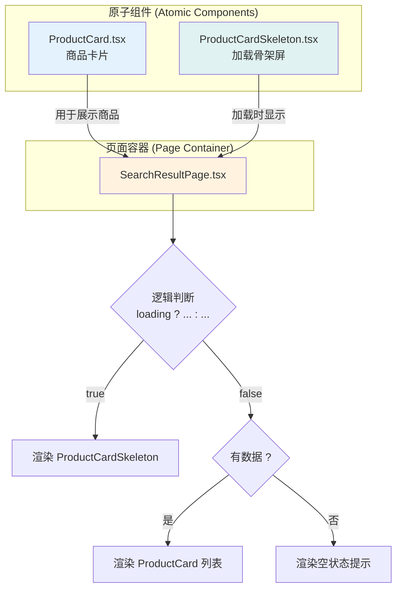

# 搜索体验的艺术：构建高效、美观的商品搜索结果页

## 🎯 为什么需要这个教程？

在电商应用中，**搜索是连接用户与商品最直接的桥梁**。一个优秀的搜索结果页，不仅要快速、准确地展示结果，更要提供流畅、美观的用户体验。这包括：优雅的加载状态、清晰的商品布局、以及可复用的组件化设计。

本教程将深入解析一个现代化的搜索结果页是如何从零到一构建的，我们将覆盖从**原子化组件**（商品卡片、骨架屏）到**页面级编排**（网格布局、状态管理）的全过程。

> **核心目标**：构建一个类似于"淘宝"或"京东"的移动端搜索结果页，它必须是响应式、高性能且易于维护的。

---

## 🏗️ 架构设计：组件驱动的页面构建

我们将采用自下而上的**组件驱动开发（CDD）**思路来构建整个页面。这种方法能确保我们的UI组件是独立、可复用和易于测试的。



---

## 🧩 第一部分：原子组件的设计与实现

### 1. `ProductCard.tsx`: 商品卡片组件

这是我们UI系统的基石。一个好的商品卡片需要展示所有关键信息，同时保持视觉上的简洁。

**文件位置**: `src/components/ui/ProductCard.tsx`

```tsx
// ProductCard.tsx 核心 JSX 结构
<div className="bg-white rounded-lg shadow-sm ...">
  {/* 1. 图片容器 (带懒加载和错误处理) */}
  <div className="w-full h-32 bg-gray-200 relative">
    
    <div className="...hidden">...</div> {/* 错误占位符 */}
    {/* 标签 (如 'New', 'Sale') */}
    <span className="absolute top-2 right-2 ...">{product.tags[0]}</span>
  </div>

  {/* 2. 商品信息区 */}
  <div className="p-3">
    <p className="text-sm text-gray-600 mb-1 line-clamp-2">{product.name}</p>
    <div className="flex items-center justify-between">
      <p className="font-bold text-gray-900">${product.price}</p>
      <span className="text-xs text-gray-500 line-through">${product.originalPrice}</span>
    </div>
    
    {/* 3. 评分组件 */}
    <div className="flex items-center mt-1">
      {/* 星星 */}
      {[...Array(5)].map((_, i) => (
        <svg key={i} ...></svg>
      ))}
      <span className="text-xs text-gray-500 ml-1">({product.reviews})</span>
    </div>
  </div>
</div>
```

**设计亮点**:
- **原子化**: 完全独立，只依赖传入的 `product` 对象。
- **视觉层级**: 使用不同字重、颜色和大小来区分价格、标题等信息。
- **健壮性**: `onError` 处理图片加载失败，显示一个优雅的占位符。
- **截断处理**: `line-clamp-2` (需要 `@tailwindcss/line-clamp` 插件) 确保商品标题最多显示两行，保持布局整洁。
- **动态标签**: 根据 `product.tags` 动态显示不同颜色和内容的标签。

### 2. `ProductCardSkeleton.tsx`: 骨架屏加载组件

在数据返回前，骨架屏能极大地提升用户体验，因为它提前描绘了页面的基本布局，减少了等待的焦虑感。

**文件位置**: `src/components/ui/ProductCardSkeleton.tsx`

```tsx
// ProductCardSkeleton.tsx 核心 JSX 结构
<div className="bg-white rounded-lg shadow-sm ...">
  {/* 图片骨架 */}
  <div className="w-full h-32 bg-gray-200 animate-pulse"></div>
  
  <div className="p-3">
    {/* 标题骨架 */}
    <div className="space-y-2 mb-2">
      <div className="h-4 bg-gray-200 rounded animate-pulse"></div>
      <div className="h-4 bg-gray-200 rounded w-3/4 animate-pulse"></div>
    </div>
    
    {/* 价格与评分骨架 */}
    {/* ... 其他 animate-pulse 元素 ... */}
  </div>
</div>
```

**技术实现**:
- **布局一致**: 骨架屏的尺寸和 `ProductCard` 完全一致，确保在切换时页面不会"跳动"。
- **Tailwind `animate-pulse`**: 这是 Tailwind CSS 提供的动画类，可以创建平滑的、呼吸般的加载效果。
- **无逻辑**: 这是一个纯粹的"哑"组件，没有任何状态或逻辑，只负责展示。

---

## 🖼️ 第二部分：使用 Tailwind CSS 实现网格瀑布流布局

这是搜索结果页的核心布局。我们使用 Tailwind CSS 的 Grid 模块，因为它简洁、强大且易于维护。

在 `SearchResultPage.tsx` 中，我们这样实现布局：

```tsx
// Loading 状态
<div className="grid grid-cols-2 gap-4 px-4">
  {[...Array(8)].map((_, index) => (
    <ProductCardSkeleton key={index} />
  ))}
</div>

// 数据加载完成
<div className="grid grid-cols-2 gap-4 px-4">
  {products.map((product) => (
    <ProductCard key={product.id} product={product} ... />
  ))}
</div>
```

**Tailwind 类名解析**:
- `grid`: 启用 Grid 布局容器。
- `grid-cols-2`: 定义网格为两列。这是移动端最常见的布局，能最大化信息密度和可读性。
- `gap-4`: 在网格项之间添加 `1rem` (16px) 的间隙，避免元素拥挤。
- `px-4`: 在容器的左右两边添加 `1rem` 的内边距。

**响应式设计 (可选)**:
如果我们想在平板或桌面设备上显示更多列，可以轻松扩展：
```html
<div class="grid grid-cols-2 md:grid-cols-3 lg:grid-cols-4 gap-4">
  <!-- ... -->
</div>
```
- `md:grid-cols-3`: 在中等屏幕尺寸（`>=768px`）及以上，网格变为三列。
- `lg:grid-cols-4`: 在大屏幕尺寸（`>=1024px`）及以上，网格变为四列。

---

##  orchestrator 第三部分：`SearchResultPage.tsx` 的编排艺术

这个页面是所有组件的"指挥家"，它负责：
1. 从 URL 获取搜索词。
2. 调用 API 获取数据。
3. 管理 `loading`, `products`, `error` 等状态。
4. 根据状态，决定渲染哪个组件（骨架屏、商品网格、还是空状态）。

### 核心逻辑拆解

```tsx
// SearchResultPage.tsx 简化逻辑
const SearchResultPage: React.FC = () => {
  // 1. 状态管理
  const [products, setProducts] = useState<Product[]>([]);
  const [loading, setLoading] = useState(true);
  const query = useSearchQuery(); // 自定义Hook获取URL参数

  // 2. 数据获取
  useEffect(() => {
    setLoading(true);
    fetch(`/api/products/search?q=${query}`)
      .then(res => res.json())
      .then(data => {
        setProducts(data.data);
      })
      .finally(() => setLoading(false));
  }, [query]);

  // 3. 渲染逻辑
  const renderProductGrid = () => {
    // a. 加载中 -> 渲染骨架屏
    if (loading) {
      return (
        <div className="grid grid-cols-2 gap-4 ...">
          {[...Array(8)].map((_, i) => <ProductCardSkeleton key={i} />)}
        </div>
      );
    }

    // b. 加载完成但无数据 -> 渲染空状态
    if (products.length === 0) {
      return (
        <div className="flex flex-col items-center ...">
          {/* ... 空状态UI ... */}
        </div>
      );
    }

    // c. 加载完成且有数据 -> 渲染商品网格
    return (
      <div className="grid grid-cols-2 gap-4 ...">
        {products.map(p => <ProductCard key={p.id} product={p} />)}
      </div>
    );
  };
  
  return (
    <div>
      {/* 头部搜索栏... */}
      {renderProductGrid()}
    </div>
  )
}
```

**关键实现**:
- **状态驱动UI**: 页面的显示内容完全由 `loading` 和 `products` 这两个状态决定。这是现代前端开发的核心思想。
- **清晰的渲染逻辑**: `renderProductGrid` 函数将复杂的条件渲染逻辑封装起来，让主 `return` 语句保持简洁。
- **用户友好的空状态**: 当搜索结果为空时，我们没有简单地显示一个空白页面，而是提供了一个友好的提示和一个操作按钮（如"浏览所有商品"），引导用户进行下一步操作。

---

## 📚 总结与最佳实践

我们成功构建了一个功能完善、体验优秀的搜索结果页。回顾整个过程，有几个关键的最佳实践：

1. **组件化思维**: 将UI拆分为独立的、可复用的组件是提升代码质量和开发效率的基石。
2. **状态驱动渲染**: UI应该总是数据状态的反映，而不是通过手动DOM操作来改变。
3. **拥抱加载状态**: 不要让用户面对白屏。使用骨架屏来优化等待体验。
4. **处理空状态**: 为空列表、错误等边缘情况设计友好的UI，提升应用的健壮性。
5. **善用Tailwind**: 使用像Tailwind这样的功能类CSS框架，可以极大地加速布局和样式开发。

这套架构不仅适用于搜索结果页，其设计思想（组件化、状态管理、条件渲染）可以推广到应用中的任何列表页面。 