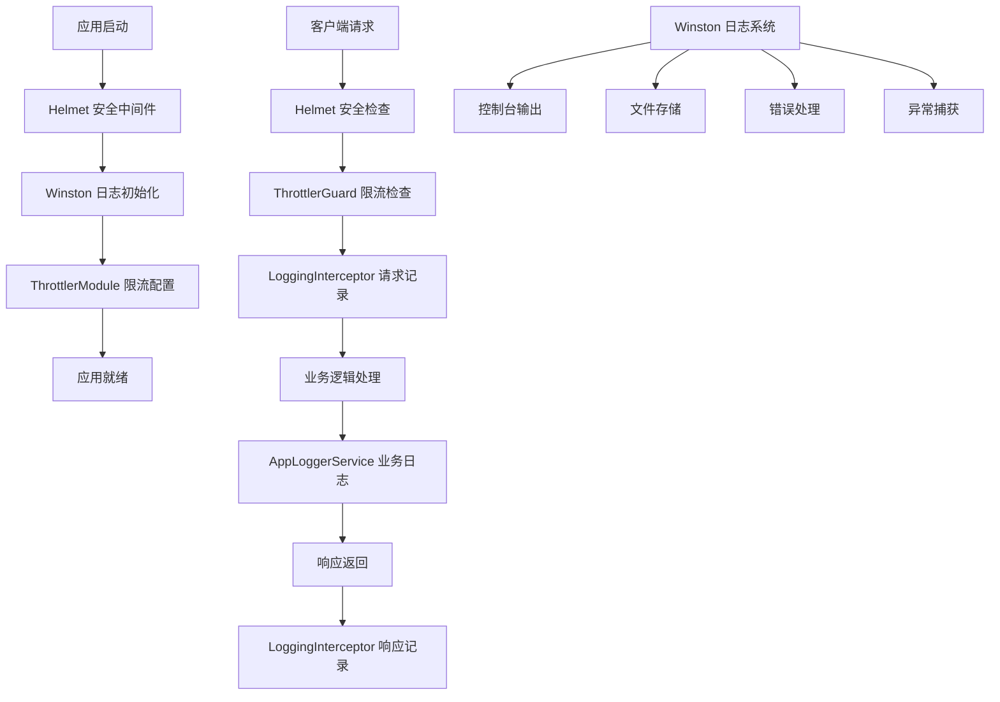
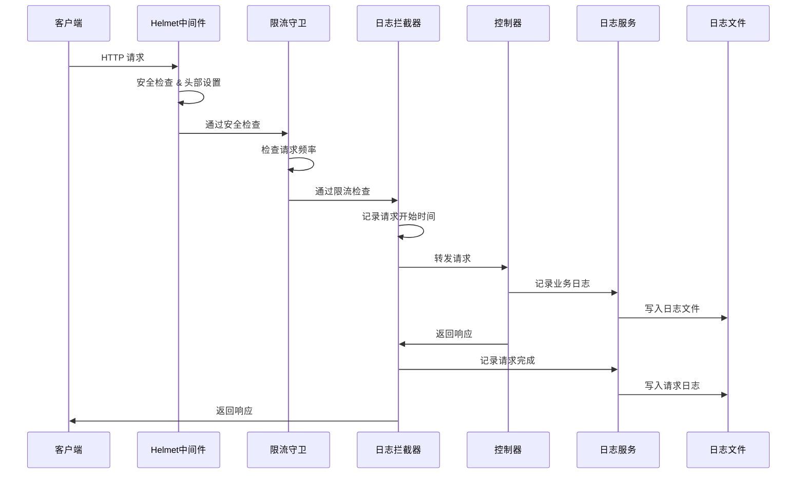

# 安全与日志系统教程：构建企业级 NestJS 应用的安全防护与监控体系

## 为什么需要安全与日志系统？

在现代 Web 应用开发中，安全性和可观测性是两个不可忽视的核心要素：

### 安全性的重要性
- **防范恶意攻击**：保护应用免受 XSS、CSRF、点击劫持等常见攻击
- **流量控制**：防止 DDoS 攻击和恶意爬虫，保护服务器资源
- **数据保护**：确保用户数据和业务数据的安全性

### 日志系统的价值
- **问题诊断**：快速定位和解决生产环境问题
- **性能监控**：追踪 API 响应时间和系统性能指标
- **安全审计**：记录用户操作和安全事件，便于事后分析
- **业务分析**：通过日志数据分析用户行为和业务趋势

## 系统架构概览

我们的安全与日志系统采用分层设计，从应用启动到请求处理的完整生命周期都有相应的保护和监控机制：



## 核心组件详解

### 1. Helmet 安全中间件

**位置**：<mcfile name="main.ts" path="d:/Users/charmmy/plan3-online-sales-wechat/backend/src/main.ts"></mcfile>

Helmet 是我们的第一道安全防线，在应用启动时配置：

```typescript
// 安全中间件 - Helmet
app.use(helmet({
  contentSecurityPolicy: {
    directives: {
      defaultSrc: ["'self'"],
      styleSrc: ["'self'", "'unsafe-inline'"],
      scriptSrc: ["'self'"],
      imgSrc: ["'self'", "data:", "https:"],
    },
  },
  crossOriginEmbedderPolicy: false, // 为了兼容 Swagger UI
}));
```

**工作原理**：
- **CSP (内容安全策略)**：防止 XSS 攻击，限制资源加载来源
- **安全头部**：自动添加多种安全相关的 HTTP 头部
- **点击劫持防护**：通过 X-Frame-Options 头部防止页面被嵌入到恶意网站

### 2. RateLimit 限流系统

**位置**：<mcfile name="app.module.ts" path="d:/Users/charmmy/plan3-online-sales-wechat/backend/src/app.module.ts"></mcfile>

我们实现了三级限流策略：

```typescript
ThrottlerModule.forRoot([
  {
    name: 'short',
    ttl: 1000, // 1 秒
    limit: 3, // 每秒最多 3 个请求
  },
  {
    name: 'medium',
    ttl: 10000, // 10 秒
    limit: 20, // 每 10 秒最多 20 个请求
  },
  {
    name: 'long',
    ttl: 60000, // 1 分钟
    limit: 100, // 每分钟最多 100 个请求
  },
])
```

**限流策略说明**：
- **短期限流**：防止瞬间高频请求
- **中期限流**：控制持续的高频访问
- **长期限流**：防止长时间的恶意请求

### 3. Winston 日志系统

**位置**：<mcfile name="logger.config.ts" path="d:/Users/charmmy/plan3-online-sales-wechat/backend/src/config/logger.config.ts"></mcfile>

#### 日志级别与分类

我们的日志系统支持多种级别：
- **error**：错误信息，生产环境必须记录
- **warn**：警告信息，包括安全事件
- **info**：一般信息，包括用户操作和 API 请求
- **debug**：调试信息，开发环境使用

#### 开发环境配置

```typescript
export const loggerConfig: WinstonModuleOptions = {
  level: process.env.LOG_LEVEL || 'info',
  transports: [
    // 控制台输出（带颜色）
    new winston.transports.Console({
      format: consoleFormat,
      level: 'debug',
    }),
    
    // 错误日志文件
    new winston.transports.File({
      filename: 'logs/error.log',
      level: 'error',
      maxsize: 5242880, // 5MB
      maxFiles: 5,
    }),
    
    // 综合日志文件
    new winston.transports.File({
      filename: 'logs/combined.log',
      maxsize: 5242880, // 5MB
      maxFiles: 5,
    }),
  ],
};
```

#### 生产环境配置

```typescript
export const productionLoggerConfig: WinstonModuleOptions = {
  level: 'error', // 生产环境只记录错误级别及以上
  transports: [
    // 生产环境控制台只输出错误
    new winston.transports.Console({
      level: 'error',
    }),
    
    // 分级文件存储
    new winston.transports.File({
      filename: 'logs/error.log',
      level: 'error',
      maxsize: 10485760, // 10MB
      maxFiles: 10,
    }),
    
    new winston.transports.File({
      filename: 'logs/info.log',
      level: 'info',
      maxsize: 10485760, // 10MB
      maxFiles: 10,
    }),
  ],
};
```

### 4. 自定义日志服务

**位置**：<mcfile name="logger.service.ts" path="d:/Users/charmmy/plan3-online-sales-wechat/backend/src/common/logger.service.ts"></mcfile>

<mcsymbol name="AppLoggerService" filename="logger.service.ts" path="d:/Users/charmmy/plan3-online-sales-wechat/backend/src/common/logger.service.ts" startline="4" type="class"></mcsymbol> 提供了专门的日志方法：

#### 基础日志方法
```typescript
// 信息日志
info(message: string, context?: string, meta?: any)

// 警告日志
warn(message: string, context?: string, meta?: any)

// 错误日志
error(message: string, trace?: string, context?: string, meta?: any)

// 调试日志
debug(message: string, context?: string, meta?: any)
```

#### 业务专用日志方法
```typescript
// 用户操作日志
logUserAction(userId: string, action: string, details?: any)

// API 请求日志
logApiRequest(method: string, url: string, userId?: string, duration?: number)

// 数据库操作日志
logDatabaseOperation(operation: string, table: string, details?: any)

// 安全事件日志
logSecurityEvent(event: string, details?: any)
```

### 5. 请求日志拦截器

**位置**：<mcfile name="logging.interceptor.ts" path="d:/Users/charmmy/plan3-online-sales-wechat/backend/src/common/interceptors/logging.interceptor.ts"></mcfile>

<mcsymbol name="LoggingInterceptor" filename="logging.interceptor.ts" path="d:/Users/charmmy/plan3-online-sales-wechat/backend/src/common/interceptors/logging.interceptor.ts" startline="12" type="class"></mcsymbol> 自动记录所有 API 请求：

```typescript
intercept(context: ExecutionContext, next: CallHandler): Observable<any> {
  const request = context.switchToHttp().getRequest();
  const { method, url, user } = request;
  const startTime = Date.now();

  return next.handle().pipe(
    tap((data) => {
      const duration = Date.now() - startTime;
      const userId = user?.id || 'anonymous';
      this.logger.logApiRequest(method, url, userId, duration);
    }),
    catchError((error) => {
      const duration = Date.now() - startTime;
      const userId = user?.id || 'anonymous';
      this.logger.logApiRequest(method, url, userId, duration);
      this.logger.error(`API Error: ${method} ${url}`, error.stack);
      return throwError(() => error);
    }),
  );
}
```

## 系统工作流程

### 应用启动流程

1. **主函数启动**：<mcsymbol name="bootstrap" filename="main.ts" path="d:/Users/charmmy/plan3-online-sales-wechat/backend/src/main.ts" startline="9" type="function"></mcsymbol> 函数开始执行
2. **Winston 日志初始化**：根据环境变量选择配置
3. **Helmet 中间件配置**：设置安全头部和 CSP 策略
4. **全局守卫注册**：ThrottlerGuard 和 JwtAuthGuard
5. **拦截器注册**：LoggingInterceptor 全局生效

### 请求处理流程



## 实际使用示例

### 1. 在业务代码中使用日志

```typescript
@Injectable()
export class UserService {
  constructor(private readonly logger: AppLoggerService) {}

  async createUser(userData: CreateUserDto) {
    try {
      // 记录用户操作
      this.logger.logUserAction('system', 'REGISTER', { email: userData.email });
      
      const user = await this.prisma.user.create({ data: userData });
      
      // 记录数据库操作
      this.logger.logDatabaseOperation('CREATE', 'users', { userId: user.id });
      
      return user;
    } catch (error) {
      // 记录错误
      this.logger.error('用户创建失败', error.stack, 'UserService');
      throw error;
    }
  }
}
```

### 2. 安全事件记录

```typescript
@Injectable()
export class AuthService {
  constructor(private readonly logger: AppLoggerService) {}

  async login(loginDto: LoginDto) {
    try {
      const user = await this.validateUser(loginDto);
      if (!user) {
        // 记录安全事件
        this.logger.logSecurityEvent('LOGIN_FAILED_INVALID_PASSWORD', {
          email: loginDto.email,
          ip: this.request.ip,
        });
        throw new UnauthorizedException('Invalid credentials');
      }
      
      // 记录成功登录
      this.logger.logUserAction(user.id, 'LOGIN_SUCCESS');
      return this.generateToken(user);
    } catch (error) {
      this.logger.error('登录失败', error.stack, 'AuthService');
      throw error;
    }
  }
}
```

### 3. 日志文件结构

运行后，系统会在 `logs/` 目录下生成以下文件：

```
logs/
├── combined.log      # 所有级别的日志
├── error.log         # 错误级别日志
├── info.log          # 信息级别日志（生产环境）
├── exceptions.log    # 未捕获异常
└── rejections.log    # 未处理的 Promise 拒绝
```

### 4. 日志格式示例

**控制台输出**（开发环境）：
```
2024-01-15 10:30:25 [info] [ApiRequest] API请求: POST /api/auth/login
{
  "method": "POST",
  "url": "/api/auth/login",
  "userId": "anonymous",
  "duration": 245,
  "timestamp": "2024-01-15T02:30:25.123Z"
}
```

**文件输出**（JSON 格式）：
```json
{
  "level": "info",
  "message": "API请求: POST /api/auth/login",
  "context": "ApiRequest",
  "method": "POST",
  "url": "/api/auth/login",
  "userId": "user123",
  "duration": 245,
  "timestamp": "2024-01-15T02:30:25.123Z",
  "service": "online-sales-backend"
}
```

## 配置与环境变量

### 关键环境变量

```bash
# 日志级别
LOG_LEVEL=info

# 生产环境标识
NODE_ENV=production

# 启用调试日志（生产环境）
ENABLE_DEBUG_LOG=true
```

### 环境特定配置

- **开发环境**：所有日志输出到控制台，详细的调试信息
- **生产环境**：错误日志优先，文件存储，控制台仅显示错误
- **Docker 环境**：使用 `.env.docker` 配置文件

## 监控与维护

### 日志文件管理

- **自动轮转**：文件大小超过限制时自动创建新文件
- **历史保留**：保留指定数量的历史文件
- **磁盘空间**：定期清理过期日志文件

### 性能考虑

- **异步写入**：日志写入不阻塞主线程
- **批量处理**：Winston 内部优化批量写入
- **内存管理**：合理设置日志级别避免过多输出

## 最佳实践

### 1. 日志级别选择
- **error**：系统错误、异常情况
- **warn**：安全事件、性能警告
- **info**：用户操作、API 请求
- **debug**：详细的调试信息

### 2. 结构化日志
- 使用统一的日志格式
- 包含必要的上下文信息
- 避免敏感信息泄露

### 3. 安全配置
- 定期更新 Helmet 配置
- 根据业务需求调整限流策略
- 监控安全事件日志

### 4. 生产环境优化
- 设置合适的日志级别
- 配置日志文件轮转
- 建立日志监控告警

## 总结

我们构建的安全与日志系统提供了：

1. **多层安全防护**：Helmet + RateLimit + JWT 认证
2. **全面日志覆盖**：请求、业务、安全、错误日志
3. **环境适配**：开发和生产环境的不同配置
4. **易于使用**：简洁的 API 和自动化的日志记录
5. **高性能**：异步处理和合理的资源管理

这套系统为我们的 NestJS 应用提供了企业级的安全保障和可观测性，是构建可靠 Web 服务的重要基础设施。

通过这个教程，你应该能够：
- 理解安全与日志系统的重要性和架构
- 掌握各个组件的配置和使用方法
- 在实际项目中正确应用这些最佳实践
- 根据需求调整和优化系统配置