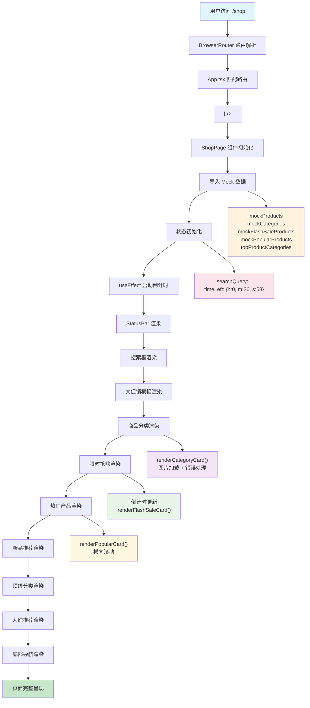

# 电商首页的设计与实现：Shop页面深度解析

## 🎯 为什么需要Shop页面？

Shop页面是整个电商应用的核心入口，承载着用户的主要购物体验。从产品定位角度来看，这个页面需要：

1. **快速展示商品**：让用户在最短时间内看到丰富的商品信息
2. **引导用户行为**：通过分类、搜索、推荐等功能引导用户深入浏览
3. **提升转化率**：通过限时抢购、热门商品等营销手段促进购买
4. **优化用户体验**：移动端优先的设计，符合微信生态的使用习惯

## 📋 页面功能全览

基于Figma设计稿"15 Shop"，我们实现了以下核心功能模块：

| 功能模块 | 说明 | 技术重点 |
|---------|------|----------|
| 状态栏 | 显示时间、信号、电池 | 自定义StatusBar组件 |
| 搜索功能 | 商品搜索入口 | 受控组件状态管理 |
| 大促销横幅 | 营销活动展示 | CSS渐变与布局 |
| 商品分类 | 6个主要分类展示 | 图片加载与错误处理 |
| 限时抢购 | 倒计时+商品列表 | useEffect定时器 |
| 热门产品 | 横向滚动展示 | 自定义渲染函数 |
| 新品推荐 | 最新商品展示 | 数据过滤与展示 |
| 顶级分类 | 圆形图标分类 | 图片圆形裁剪 |
| 为你推荐 | 个性化推荐 | 网格布局 |
| 底部导航 | 全局导航栏 | 固定定位与图标 |

## 🏗️ 技术架构与数据流

### 路由集成流程

下面的流程图展示了从用户访问URL到页面完整渲染的全过程：



**流程关键节点说明**：
- **蓝色节点**：用户入口，整个流程的起始点
- **绿色节点**：最终输出，页面完整呈现给用户
- **橙色节点**：数据层，所有Mock数据的加载
- **粉色节点**：状态层，React组件的状态初始化
- **紫色节点**：UI层，各个功能模块的渲染逻辑

### 数据架构设计

我们在 `src/assets/data/mock/products.ts` 中定义了完整的数据结构：

```typescript
// 核心数据类型
export interface Product {
  id: string;
  name: string;
  price: number;
  originalPrice?: number;
  discount?: number;
  image: string;
  category: string;
  tags?: string[];
  isNew?: boolean;
  isHot?: boolean;
  isSale?: boolean;
  rating?: number;
  reviews?: number;
}

export interface Category {
  id: string;
  name: string;
  image: string;
  count: number;
}

export interface FlashSale {
  id: string;
  product: Product;
  flashPrice: number;
  discount: number;
  endTime: Date;
}
```

### 状态管理策略

ShopPage使用React Hooks进行状态管理：

```typescript
const [searchQuery, setSearchQuery] = useState("");
const [timeLeft, setTimeLeft] = useState({ hours: 0, minutes: 36, seconds: 58 });
```

## 🎨 核心UI组件实现

### 1. 图片加载与错误处理

这是本次更新的重点技术改进。我们实现了健壮的图片加载机制：

```typescript
const renderProductCard = (product: Product, showPrice = true) => (
  <div className="bg-white rounded-lg shadow-sm overflow-hidden cursor-pointer">
    <div className="w-full h-32 bg-gray-200 relative">
       {
          // 图片加载失败时显示占位符
          const target = e.target as HTMLImageElement;
          target.style.display = 'none';
          target.nextElementSibling?.classList.remove('hidden');
        }}
      />
      {/* 图片加载失败时的占位符 */}
      <div className="absolute inset-0 bg-gradient-to-br from-blue-100 to-purple-100 flex items-center justify-center hidden">
        <div className="w-16 h-16 bg-primary/20 rounded-full"></div>
      </div>
    </div>
  </div>
);
```

**技术要点**：
- 使用 `onError` 事件处理图片加载失败
- 动态切换显示状态（隐藏失败图片，显示占位符）
- 使用 `object-cover` 确保图片比例协调
- 渐变背景提供视觉一致性

### 2. 倒计时功能实现

限时抢购的核心交互逻辑：

```typescript
useEffect(() => {
  const timer = setInterval(() => {
    setTimeLeft(prev => {
      if (prev.seconds > 0) {
        return { ...prev, seconds: prev.seconds - 1 };
      } else if (prev.minutes > 0) {
        return { ...prev, minutes: prev.minutes - 1, seconds: 59 };
      } else if (prev.hours > 0) {
        return { hours: prev.hours - 1, minutes: 59, seconds: 59 };
      }
      return prev;
    });
  }, 1000);

  return () => clearInterval(timer);
}, []);
```

**技术要点**：
- 使用 `setInterval` 创建1秒定时器
- 状态更新采用函数式更新避免闭包问题
- 组件卸载时清理定时器防止内存泄漏
- 时间格式化显示（padStart补零）

### 3. 搜索功能实现

受控组件的标准实现：

```typescript
const handleSearchChange = (e: React.ChangeEvent<HTMLInputElement>) => {
  setSearchQuery(e.target.value);
};

const handleSearchSubmit = () => {
  console.log("Search for:", searchQuery);
  // TODO: 实现搜索功能
};
```

## 🖼️ 图片资源管理策略

### 资源组织结构

```
public/assets/images/
├── products/          # 商品图片
│   ├── product-1.png
│   ├── product-2.png
│   └── ...
├── categories/        # 分类图片
│   ├── category-clothing.png
│   ├── category-bags.png
│   └── ...
├── flash-sale/        # 限时抢购图片
│   ├── flash-1.png
│   └── ...
└── top-products/      # 顶级分类图片
    ├── top-dresses.png
    └── ...
```

### 图片路径规范

所有图片使用绝对路径引用：
```typescript
image: '/assets/images/products/product-1.png'
```

这样做的好处：
- Vite开发服务器自动处理public目录
- 生产环境构建时自动优化
- 路径简洁明了，易于维护

## 🔄 组件渲染逻辑

### 分类卡片渲染

```typescript
const renderCategoryCard = (category: Category) => (
  <div className="bg-white rounded-lg shadow-sm p-4 cursor-pointer">
    <div className="w-16 h-16 bg-gray-200 rounded mb-3 mx-auto">
       {
          const target = e.target as HTMLImageElement;
          target.style.display = 'none';
          target.nextElementSibling?.classList.remove('hidden');
        }}
      />
      <div className="w-full h-full bg-gradient-to-br from-blue-100 to-purple-100 rounded flex items-center justify-center hidden">
        <div className="w-8 h-8 bg-primary/20 rounded-full"></div>
      </div>
    </div>
    <h3 className="font-bold text-sm text-gray-900 mb-1">{category.name}</h3>
    <div className="bg-blue-50 rounded px-2 py-1 inline-block">
      <span className="text-xs font-bold text-gray-900">{category.count}</span>
    </div>
  </div>
);
```

### 数据映射与渲染

```typescript
// 商品分类展示
{mockCategories.map(renderCategoryCard)}

// 限时抢购商品
{mockFlashSaleProducts.map((flashSale) => (
  <div key={flashSale.id} className="flex-shrink-0 w-28">
    {/* 渲染逻辑 */}
  </div>
))}

// 热门产品
{mockPopularProducts.map(renderPopularCard)}
```

## 🎯 关键技术决策

### 1. 为什么选择函数式组件？

- **性能优化**：配合React.memo可以避免不必要的重渲染
- **代码简洁**：Hooks让状态管理更直观
- **类型安全**：TypeScript集成更好

### 2. 为什么使用TailwindCSS？

- **开发效率**：原子化CSS类快速构建UI
- **一致性**：设计系统内置，避免样式冲突
- **响应式**：移动优先的设计理念

### 3. 为什么采用Mock数据？

- **开发并行**：前端开发不依赖后端API
- **测试便利**：数据结构清晰，便于测试
- **演示效果**：完整的数据让页面效果更真实

## 🚀 性能优化策略

### 图片懒加载（待实现）

```typescript
// 可以集成 react-intersection-observer
const { ref, inView } = useInView({
  threshold: 0,
  triggerOnce: true
});

return (
  <div ref={ref}>
    {inView && }
  </div>
);
```

### 组件记忆化

```typescript
const ProductCard = React.memo(({ product }: { product: Product }) => {
  // 组件实现
});
```

## 🔮 后续扩展计划

1. **搜索功能完善**：集成搜索API，支持模糊搜索
2. **商品详情页**：点击商品跳转到详情页
3. **购物车功能**：添加到购物车交互
4. **用户行为追踪**：记录用户浏览和点击行为
5. **个性化推荐**：基于用户行为优化推荐算法

## 📁 相关文件结构

```
src/
├── pages/shop/
│   └── ShopPage.tsx           # 主页面组件
├── assets/data/mock/
│   └── products.ts            # 模拟数据定义
├── components/common/
│   └── StatusBar.tsx          # 状态栏组件
└── App.tsx                    # 路由配置

public/assets/images/          # 图片资源
├── products/
├── categories/
├── flash-sale/
└── top-products/
```

## 🎨 设计规范

### 颜色系统
- 主色调：`text-primary` (蓝色系)
- 背景色：`bg-gray-50` (浅灰)
- 卡片背景：`bg-white`
- 文字颜色：`text-gray-900` (深灰)

### 间距规范
- 页面边距：`px-5`
- 组件间距：`mb-6`
- 内容间距：`space-x-3`, `space-y-2`

### 字体规范
- 标题字体：`font-raleway`
- 正文字体：`font-nunito`
- 字重：`font-bold`, `font-medium`

---

通过这个教程，你应该能够完全理解Shop页面的设计思路、技术实现和扩展方向。这个页面不仅是一个静态展示，更是一个可以持续迭代和优化的产品基础。 