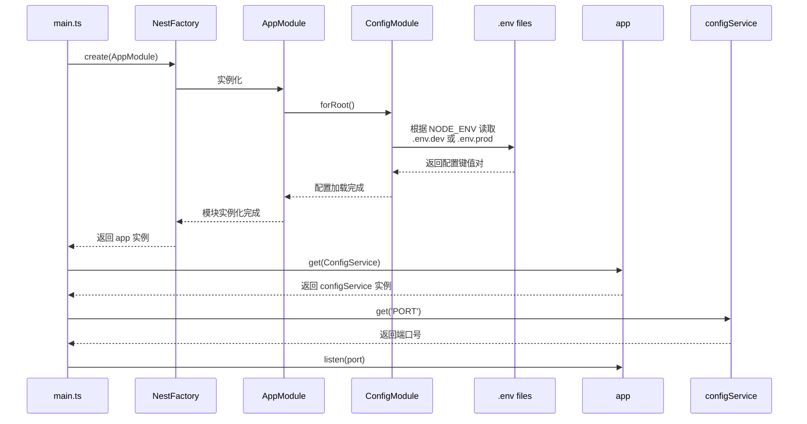

# 教程：如何准备 NestJS 后端项目

## 1. 我们为什么需要一个后端？

在我们的电商项目中，前端（React 应用）负责展示商品、接收用户操作。但它不能自己存储数据（如商品信息、用户信息、订单），也不能处理复杂的业务逻辑（如支付验证）。这些都需要一个**后端服务**来完成。

我们选择 **NestJS** 作为后端框架，因为它：

- **基于 TypeScript**：与我们的前端技术栈保持一致，减少心智负担。
- **架构清晰**：提供了模块（Module）、控制器（Controller）、服务（Service）等明确的组织方式，代码易于维护和扩展。
- **生态系统强大**：无缝集成了许多开发中必需的工具，如配置管理、数据库 ORM、测试等。

本教程将详细介绍我们是如何从零开始，一步步搭建和配置好这个 NestJS 后端项目的。

## 2. 初始化项目

我们没有在电脑上全局安装 NestJS 的命令行工具（CLI），而是直接使用 `npx` 来执行它。这样做的好处是能确保每个开发者都使用项目约定的统一版本，避免了“在我的电脑上能跑”的问题。

我们在 `backend` 目录下执行了以下命令：

```bash
npx @nestjs/cli new . --package-manager pnpm --skip-git
```

- `npx @nestjs/cli new .`：告诉 `npx` 临时下载 `@nestjs/cli` 包，并用它的 `new` 命令在当前目录（`.`）创建一个新项目。
- `--package-manager pnpm`：明确指定使用 `pnpm` 来安装依赖，与我们整个项目保持一致。
- `--skip-git`：因为我们的项目根目录已经是一个 Git 仓库了，所以跳过在 `backend` 子目录中再次创建 Git 仓库的步骤。

执行完毕后，`backend` 目录就拥有了一个标准的 NestJS 项目结构。

## 3. 环境与配置管理

一个专业的应用需要能在不同环境（如开发环境、生产环境）下运行，并且使用不同的配置（如数据库地址、端口号）。

### 3.1. 使用 `.env` 文件

我们创建了两个核心的环境配置文件：

- `backend/.env.dev`: 开发环境使用的配置。
- `backend/.env.prod`: 生产环境使用的配置。

为了让 Git 忽略这些文件（因为它们可能包含敏感信息，且每个环境的配置不同），我们在 `backend/.gitignore` 中添加了相应的规则。

### 3.2. 加载配置 (`ConfigModule`)

为了让 NestJS 应用能智能地读取这些 `.env` 文件，我们引入了官方的 `ConfigModule` 模块。

**第一步：安装**

```bash
pnpm add @nestjs/config
```

**第二步：在 `AppModule` 中注册**

我们修改了 `backend/src/app.module.ts`，让它在应用启动时，根据 `NODE_ENV` 环境变量来决定加载哪个 `.env` 文件。

```typescript
// backend/src/app.module.ts
import { Module } from "@nestjs/common";
import { ConfigModule } from "@nestjs/config";
import { AppController } from "./app.controller";
import { AppService } from "./app.service";

@Module({
  imports: [
    ConfigModule.forRoot({
      // 如果是生产环境，加载 .env.prod，否则加载 .env.dev
      envFilePath:
        process.env.NODE_ENV === "production" ? ".env.prod" : ".env.dev",
    }),
  ],
  controllers: [AppController],
  providers: [AppService],
})
export class AppModule {}
```

### 3.3. 使用配置

配置加载后，我们需要在应用中使用它。例如，我们希望应用的监听端口由 `.env` 文件中的 `PORT` 变量决定。

为此，我们修改了应用的入口文件 `backend/src/main.ts`：

```typescript
// backend/src/main.ts
import { NestFactory } from "@nestjs/core";
import { AppModule } from "./app.module";
import { ConfigService } from "@nestjs/config";

async function bootstrap() {
  const app = await NestFactory.create(AppModule);
  // 从应用中获取 ConfigService 的实例
  const configService = app.get(ConfigService);
  // 使用 get 方法读取 'PORT' 的值，如果不存在则默认为 3000
  const port = configService.get<number>("PORT") ?? 3000;
  // 监听指定端口
  await app.listen(port);
}
bootstrap();
```

整个启动和配置加载的流程可以用下图表示：



## 4. 容器化 (Docker)

为了简化部署流程，并确保开发和生产环境的一致性，我们使用 Docker 将后端应用打包成一个镜像。

### 4.1. `Dockerfile` 解析

我们在 `backend/Dockerfile` 中定义了构建镜像的步骤。这是一个**多阶段构建**的 `Dockerfile`，好处是最终的生产镜像非常小，且不包含编译过程中的非必需文件，更安全。

- **`development` 阶段**:
  1.  使用 `node:20-alpine` 作为基础镜像。
  2.  复制 `package.json` 和 `pnpm-lock.yaml` 并安装所有依赖（包括开发依赖）。
  3.  复制所有源代码。
  4.  执行 `pnpm run build`，编译 TypeScript 代码到 `dist` 目录。

- **`production` 阶段**:
  1.  再次使用干净的 `node:20-alpine` 镜像。
  2.  只安装生产环境必需的依赖（`--prod`）。
  3.  从 `development` 阶段拷贝编译好的 `dist` 目录。
  4.  设置启动命令为 `node dist/main`。

### 4.2. `docker-compose.yml`

为了方便地在本地启动整个后端服务（未来可能还包括数据库、Redis 等），我们在项目根目录创建了 `docker-compose.yml`。

```yaml
version: "3.8"
services:
  backend:
    build:
      context: ./backend # 指定 Dockerfile 的上下文路径
      dockerfile: Dockerfile
    ports:
      - "3000:3000" # 将容器的 3000 端口映射到主机的 3000 端口
    environment:
      - NODE_ENV=development # 设置环境变量为开发模式
    env_file:
      - ./backend/.env.dev # 加载开发环境的 .env 文件
    volumes:
      - ./backend:/usr/src/app # 将本地 backend 目录挂载到容器中，实现热更新
      - /usr/src/app/node_modules # 匿名卷，防止本地 node_modules 覆盖容器中的
```

现在，我们只需要在项目根目录运行 `docker-compose up`，就可以启动后端服务了。

## 5. 总结

通过以上步骤，我们完成了一个健壮、可配置、易于部署的 NestJS 后端项目的基础搭建工作。这为我们后续开发具体的业务功能（如用户、商品、订单 API）打下了坚实的基础。
