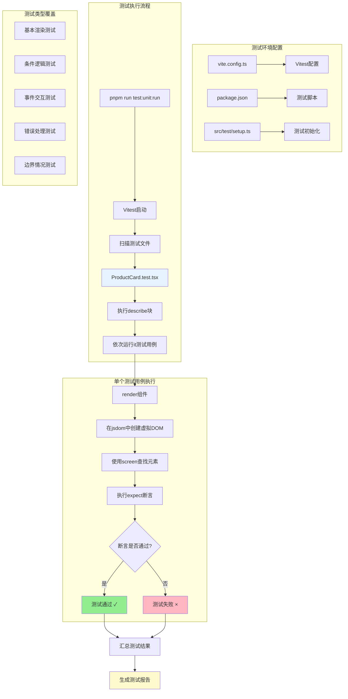

# ProductCard 组件单元测试完全指南

## 为什么需要单元测试？

在我们的微信小程序项目中，`ProductCard` 是一个核心的展示组件，用户在商店页面、搜索结果页面都会看到它。如果这个组件有bug，会直接影响用户体验。单元测试就像是给我们的代码买了一份"保险"，确保：

1. **功能正确性**：组件按预期显示商品信息
2. **代码重构安全**：修改代码后能立即知道是否破坏了原有功能
3. **开发效率**：无需手动打开浏览器反复测试，自动化验证
4. **团队协作**：新同事能通过测试快速理解组件的预期行为

## 测试环境是如何搭建的？

### 第一步：测试框架选择

我们选择了 **Vitest** 作为测试框架，原因是：
- 与 Vite 无缝集成，配置简单
- 支持 TypeScript，与我们的技术栈一致
- 兼容 Jest 的 API，学习成本低

### 第二步：配置文件修改

#### `vite.config.ts` 配置解析

```typescript
/// <reference types="vitest" />
import { defineConfig } from 'vite'
import react from '@vitejs/plugin-react'

export default defineConfig({
  // ... 其他配置
  test: {
    globals: true,           // 全局可用 describe, it, expect
    environment: 'jsdom',    // 模拟浏览器 DOM 环境
    setupFiles: './src/test/setup.ts', // 测试前的初始化
    css: true,              // 支持 CSS 模块
    include: ['src/**/*.{test,spec}.{js,ts,jsx,tsx}'], // 测试文件匹配
    exclude: ['tests/**/*', 'node_modules/**/*'],      // 排除 Playwright
  },
})
```

**关键配置说明**：
- `environment: 'jsdom'`：让测试在类似浏览器的环境中运行，可以操作 DOM
- `setupFiles`：指向测试初始化文件，加载必要的测试工具
- `include/exclude`：区分单元测试（src）和集成测试（tests）

#### `package.json` 脚本配置

```json
{
  "scripts": {
    "test:unit": "vitest",           // 监视模式，文件变化时自动重跑
    "test:unit:ui": "vitest --ui",   // 图形界面模式
    "test:unit:run": "vitest run"    // 一次性运行所有测试
  }
}
```

#### `src/test/setup.ts` 初始化

```typescript
import '@testing-library/jest-dom'
```

这行代码导入了额外的测试断言方法，比如 `toBeInTheDocument()`、`toHaveClass()` 等。

## 测试是如何运行的？

### 运行流程图



### 具体执行步骤

1. **环境准备**：Vitest 创建一个模拟的浏览器环境（jsdom）
2. **文件发现**：扫描所有 `*.test.tsx` 文件
3. **测试执行**：依次运行每个测试用例
4. **结果统计**：汇总通过/失败的测试数量

## ProductCard 测试了什么？

### 测试用例全览

我们的测试覆盖了 **10个关键场景**：

#### 1. 基本渲染测试
```typescript
it('应该正确渲染商品基本信息', () => {
  render(<ProductCard product={mockProduct} />);
  
  expect(screen.getByText('测试商品')).toBeInTheDocument();
  expect(screen.getByText('$99.99')).toBeInTheDocument();
  expect(screen.getByAltText('测试商品')).toHaveAttribute('src', 'https://example.com/product.jpg');
});
```

**测试目的**：确保组件能正确显示商品名称、价格和图片。

#### 2. 条件渲染测试
```typescript
it('当showPrice为false时不应该显示价格信息', () => {
  render(<ProductCard product={mockProduct} showPrice={false} />);
  
  expect(screen.queryByText('$99.99')).not.toBeInTheDocument();
});
```

**测试目的**：验证可选属性 `showPrice` 的条件逻辑。

#### 3. 交互行为测试
```typescript
it('应该处理onClick事件', () => {
  const handleClick = vi.fn(); // 创建模拟函数
  render(<ProductCard product={mockProduct} onClick={handleClick} />);
  
  const card = container.firstChild as HTMLElement;
  fireEvent.click(card);
  
  expect(handleClick).toHaveBeenCalledWith('1');
});
```

**测试目的**：确保点击事件正确触发并传递商品ID。

#### 4. 错误处理测试
```typescript
it('应该处理图片加载错误', () => {
  render(<ProductCard product={mockProduct} />);
  
  const image = screen.getByAltText('测试商品');
  fireEvent.error(image); // 模拟图片加载失败
  
  expect(image).toHaveStyle({ display: 'none' });
});
```

**测试目的**：验证图片加载失败时的降级显示逻辑。

## 如何读懂测试结果？

### 成功的测试输出

```bash
✓ src/components/ui/ProductCard.test.tsx (10 tests) 148ms
   ✓ ProductCard > 应该正确渲染商品基本信息 44ms
   ✓ ProductCard > 应该正确显示商品标签 7ms
   ✓ ProductCard > 当showPrice为false时不应该显示价格信息 3ms
   
Test Files  1 passed (1)
Tests  10 passed (10)
```

**解读**：
- `✓` 表示测试通过
- `44ms` 表示单个测试运行时间
- `10 passed (10)` 表示10个测试全部通过

### 失败的测试输出

```bash
× ProductCard > 应该正确显示商品标签 12ms
   → Unable to find an element with the text: New
   
Expected the element to have text content:
  New
Received:
  Sale
```

**解读**：
- `×` 表示测试失败
- `Unable to find...` 描述了具体的失败原因
- `Expected/Received` 显示了期望值和实际值的对比

### 测试覆盖率

虽然我们还没配置覆盖率报告，但可以通过查看测试用例判断覆盖程度：

- **UI 渲染**：✅ 测试了所有视觉元素
- **Props 传递**：✅ 测试了必需和可选属性
- **事件处理**：✅ 测试了用户交互
- **边界情况**：✅ 测试了错误处理和极端情况

## 测试的核心原理

### 1. 虚拟 DOM 渲染

```typescript
render(<ProductCard product={mockProduct} />);
```

这行代码在内存中创建了一个虚拟的DOM树，就像浏览器中的真实DOM，但速度更快。

### 2. 元素查找

```typescript
screen.getByText('测试商品')          // 根据文本内容查找
screen.getByAltText('测试商品')       // 根据alt属性查找
screen.queryByText('可能不存在的文本') // 查找可能不存在的元素
```

**区别**：
- `getBy*`：找不到元素会抛出错误
- `queryBy*`：找不到元素返回 null

### 3. 断言验证

```typescript
expect(element).toBeInTheDocument()     // 元素存在于DOM中
expect(element).toHaveClass('className') // 元素有指定CSS类
expect(mockFn).toHaveBeenCalledWith(arg) // 模拟函数被调用
```

### 4. 事件模拟

```typescript
fireEvent.click(element)    // 模拟点击
fireEvent.error(image)      // 模拟错误事件
fireEvent.change(input, { target: { value: 'new value' } })
```

## 测试数据的设计

### Mock 数据策略

```typescript
const mockProduct: Product = {
  id: '1',
  name: '测试商品',
  price: 99.99,
  originalPrice: 129.99,
  image: 'https://example.com/product.jpg',
  // ... 其他必需字段
};
```

**设计原则**：
1. **完整性**：包含所有必需字段
2. **真实性**：使用合理的测试数据
3. **可预测性**：避免随机值，确保测试结果稳定

### 边界情况覆盖

```typescript
const mockProductWithoutOptionalFields: Product = {
  id: '2',
  name: '简单商品',
  price: 49.99,
  // 故意省略可选字段
};
```

通过测试缺少可选字段的情况，确保组件的健壮性。

## 测试最佳实践

### 1. 测试描述清晰

```typescript
// 好的描述
it('应该正确渲染商品基本信息', () => {})

// 不好的描述  
it('test product card', () => {})
```

### 2. 每个测试专注单一功能

```typescript
// 好的做法：分别测试
it('应该显示商品名称', () => {})
it('应该显示商品价格', () => {})

// 不好的做法：一个测试包含太多验证
it('应该显示所有信息', () => {
  // 验证名称、价格、图片、标签...
})
```

### 3. 使用合适的查找方法

```typescript
// 优先级顺序（语义化 -> 实用性）
screen.getByRole('button')           // 最佳：基于可访问性
screen.getByLabelText('用户名')       // 较好：基于标签
screen.getByText('提交')             // 可以：基于文本
screen.getByTestId('submit-btn')     // 最后：基于测试ID
```

## 如何运行和调试测试

### 基本运行命令

```bash
# 运行所有单元测试
pnpm run test:unit:run

# 监视模式（文件变化时自动重跑）
pnpm run test:unit

# 图形界面模式
pnpm run test:unit:ui
```

### 调试失败的测试

1. **查看详细错误信息**：失败的测试会显示期望值和实际值
2. **使用 screen.debug()**：在测试中添加此行查看当前DOM结构
3. **逐步验证**：将复杂测试拆分成更小的片段

```typescript
it('调试示例', () => {
  const { container } = render(<ProductCard product={mockProduct} />);
  
  screen.debug(); // 打印当前DOM结构
  
  const element = screen.getByText('测试商品');
  console.log(element); // 查看元素详情
});
```

## 后续扩展建议

1. **添加快照测试**：自动检测UI变化
2. **集成测试覆盖率**：查看代码覆盖程度
3. **性能测试**：测试组件渲染性能
4. **可访问性测试**：确保组件符合无障碍标准

通过这套完整的测试体系，我们可以确保 `ProductCard` 组件在各种情况下都能正确工作，为项目的稳定性和可维护性提供了坚实的保障。 