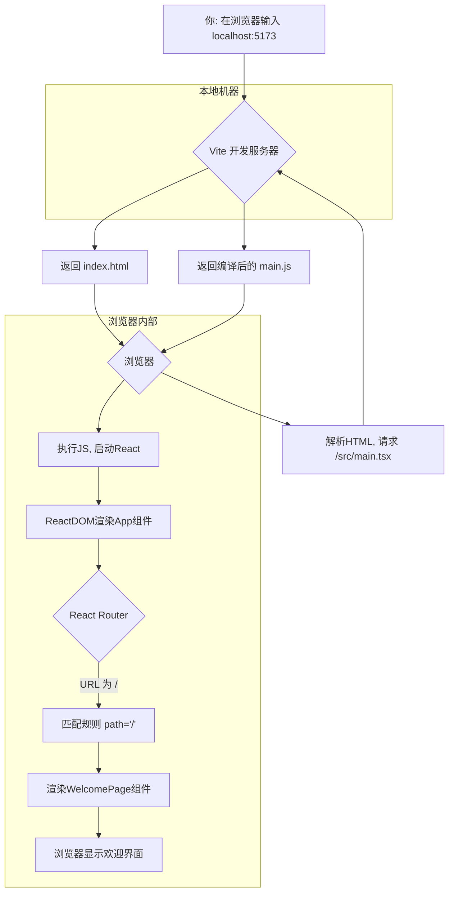

# 深入解析：从浏览器地址栏到 React 页面的奇妙旅程

这是一个非常好的问题！了解底层的工作原理对于成为一名出色的开发者至关重要。

当你用浏览器访问一个本地端口（例如 `http://localhost:5173`）时，能看到你用 React 实现的欢迎界面，这背后其实经历了一系列环环相扣的步骤。简单来说，是你的开发服务器（在这个项目里是 Vite）将你的源代码转换成了浏览器能懂的语言（HTML, CSS, JavaScript），并一步步引导浏览器最终渲染出你的 React 组件。

下面，我们就来完整地追溯一下这个过程。

## 1. 启动！一切始于 `npm run dev`

我们首先查看 `package.json` 文件，这里的 `scripts` 部分定义了项目的可执行命令：

```json
// ...
"scripts": {
  "dev": "vite",
  "build": "tsc && vite build",
  "lint": "eslint . --ext ts,tsx --report-unused-disable-directives --max-warnings 0",
  "preview": "vite preview"
},
// ...
```

当你执行 `npm run dev` 时，你实际上是在运行 `vite` 命令。Vite 是一个现代化的前端构建工具，它会为你启动一个高效的本地开发服务器。这个服务器会监听一个网络端口（Vite 默认是 5173），等待来自浏览器的请求。

## 2. 浏览器登门拜访：请求入口页面

当你在浏览器地址栏输入 `http://localhost:5173` 并敲下回车时，浏览器会向 Vite 开发服务器发送一个 HTTP GET 请求，请求的是网站的根路径 `/`。

Vite 服务器收到这个请求后，它的首要任务是找到并返回项目的"骨架"——也就是入口 HTML 文件。在你的项目中，这个文件就是根目录下的 `index.html`。

## 3. HTML 骨架：`index.html` 的秘密

我们来看看 `index.html` 文件的关键部分：

```html
<!DOCTYPE html>
<html lang="zh-CN">
  <head>
    <!-- ... meta tags and other head elements ... -->
    <title>微信商城 - 一站式电商解决方案</title>
  </head>
  <body>
    <div id="root"></div>
    <script type="module" src="/src/main.tsx"></script>
  </body>
</html>
```

这段 HTML 代码告诉了浏览器两件至关重要的事：
1.  页面中有一个空的 `<div>` 元素，它的 `id` 是 `root`。记住它，这块地方就是我们稍后整个 React 应用的"挂载点"。
2.  浏览器需要去加载并执行 `/src/main.tsx` 这个脚本文件。这是一个 TypeScript 文件，但别担心，Vite 开发服务器会在后台即时地将它编译成浏览器能够直接运行的纯 JavaScript。

## 4. 应用的起点：`src/main.tsx`

浏览器拿到了 `index.html` 后，就会按照指示去请求 `/src/main.tsx`。这个文件是你的 React 应用的真正入口。

```tsx
import React from 'react'
import ReactDOM from 'react-dom/client'
import { BrowserRouter } from 'react-router-dom'
import App from './App.tsx'
import './index.css'

ReactDOM.createRoot(document.getElementById('root')!).render(
  <React.StrictMode>
    <BrowserRouter>
      <App />
    </BrowserRouter>
  </React.StrictMode>,
)
```

这里的代码做了几件事：
-   它引入了 `react-dom/client`，这是 React 官方推荐的用于操作 DOM 的库。
-   `document.getElementById('root')!` 精准地找到了我们在 `index.html` 中预留的那个 `<div id="root">`。
-   `ReactDOM.createRoot(...).render(...)` 这个调用是 React 18 的标准启动方式。它告诉 React："请把 `<App />` 这个组件以及它所有的子组件，都渲染到那个 `id` 为 `root` 的 `div` 里面去。"
-   `<App />` 组件被 `<BrowserRouter>` 包裹，这说明你的应用启用了前端路由功能，由 `react-router-dom` 库提供支持。

## 5. 路由中枢：`App.tsx` 指明方向

现在，React 已经开始渲染 `<App />` 组件了。`<App />` 组件在这里扮演了一个"交通警察"的角色，它内部的路由配置会决定在不同的 URL 下应该显示哪个页面。

让我们看看 `src/App.tsx` 的实现：

```tsx
import React from 'react'
import { Routes, Route } from 'react-router-dom'
import WelcomePage from './pages/onboarding/WelcomePage'

function App() {
  return (
    <div className="App">
      <Routes>
        <Route path="/" element={<WelcomePage />} />
        <Route path="/welcome" element={<WelcomePage />} />
      </Routes>
    </div>
  )
}

export default App
```

谜底在这里揭晓！
-   `<Routes>` 和 `<Route>` 是 `react-router-dom` 提供的路由组件。
-   `<Route path="/" element={<WelcomePage />} />` 这行配置就是关键。它定义了一条路由规则，意思是：**如果当前浏览器的路径是根路径 `/`，那么就应该渲染 `<WelcomePage />` 这个组件。**

因为你访问的是 `http://localhost:5173`，其路径正是 `/`，所以 React Router 成功匹配到了这条规则。

App.tsx 中的这两行代码：
```tsx
<Route path="/" element={<WelcomePage />} />
<Route path="/welcome" element={<WelcomePage />} />
```
它的作用是为你的 <WelcomePage /> 组件设置了两个不同的访问路径。你可以把它理解为给同一个房间开了两扇门。
具体用法和效果是：
无论是用户在浏览器地址栏输入 http://localhost:5173/ ，还是输入 http://localhost:5173/welcome ，他们看到的都将是完全相同的 WelcomePage 页面。

## 总结与流程图

现在，我们可以将整个流程完整地串联起来：

1.  **启动**：你运行 `npm run dev`，启动 Vite 开发服务器。
2.  **请求**：浏览器访问 `http://localhost:5173`，向 Vite 服务器请求根路径 `/`。
3.  **HTML响应**：Vite 返回 `index.html`。
4.  **脚本加载**：浏览器解析 `index.html`，发现需要加载 `/src/main.tsx` 脚本，于是再次向 Vite 发送请求。
5.  **JS响应**：Vite 即时编译并返回 `main.tsx` 对应的 JavaScript 代码。
6.  **React初始化**：浏览器执行该脚本，运行 `ReactDOM.createRoot`，初始化 React 应用，准备渲染 `<App />` 组件到 `#root` div。
7.  **路由决策**：`<App />` 组件内的 React Router 开始工作，它检查到当前 URL 路径为 `/`。
8.  **组件匹配**：路由规则 `path="/"` 被成功匹配，决定渲染 `<WelcomePage />` 组件。
9.  **最终渲染**：React 将 `<WelcomePage />` 组件的内容转换成真实的 DOM 节点，并插入到页面中。

最终，你就在浏览器中看到了精心编写的欢迎界面。

为了更直观地展示这个流程，这里有一张流程图：



希望这个分解能帮助你清晰地理解现代前端应用是如何工作的！ 