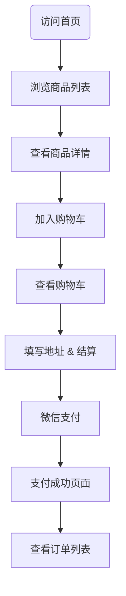

# 用户流程图

以下流程基于 MVP 核心功能，描述买家从进入商城到完成订单的主要路径。

```mermaid
flowchart TD
    Landing(访问首页) --> Browse[浏览商品列表]
    Browse --> ViewDetail[查看商品详情]
    ViewDetail --> AddCart[加入购物车]
    AddCart --> Cart[查看购物车]
    Cart --> Checkout[填写地址 & 结算]
    Checkout --> Pay[微信支付]
    Pay --> Success[支付成功页面]
    Success --> OrderList[查看订单列表]
```

> 若需 draw.io 版本，可在 draw.io 打开并粘贴以上 Mermaid 以生成可视化图表。 